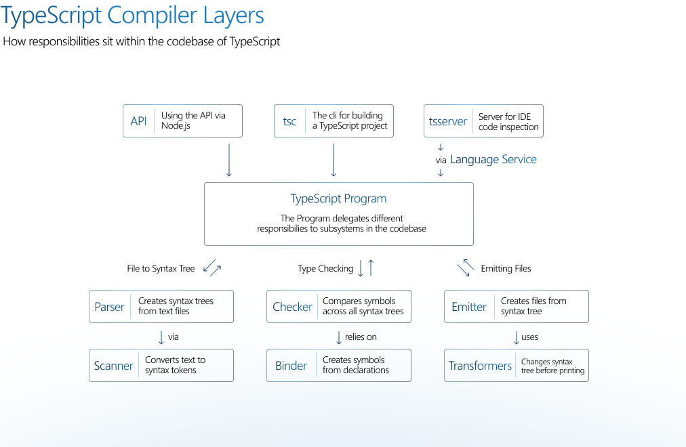
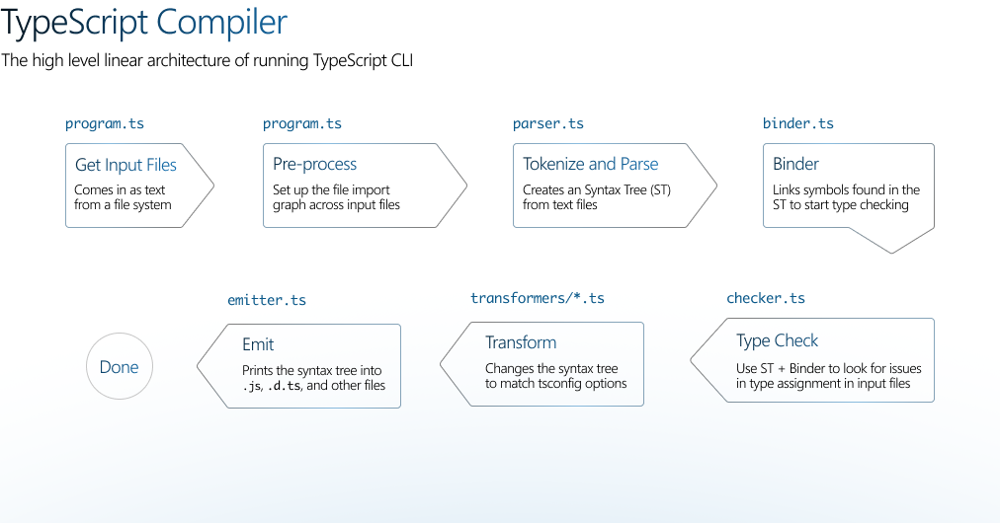

## The TypeScript Compiler

There's a lot to learn, and this document is going to try and give you a very high level overview of how the
TypeScript compiler works and how you can contribute to it.

Here are the key sections in this docs:

- [Getting set up](#getting-set-up)
- [What is in the TypeScript repo?](#what-is-in-the-typescript-repo)
- [The TypeScript Compiler](#the-typescript-compiler)
- [The TSServer](#the-tsserver)
- [Tips and Tricks](#tips-and-tricks)

## Getting set up

You need a modern version [of Node.js](https://nodejs.org/en/) installed and then:

- Clone the repo: `git clone https://github.com/microsoft/TypeScript` (optional: `--depth=1`)
- `cd TypeScript`
- `npm i` - installs dependencies
- `npm run gulp` - builds the TypeScript compiler
- `code .` then briefly come back to terminal to run:
- `npm test` which will verify everything works fine

With that done, you should have a copy of the compiler up and running with tests running in the background to
prove that everything is working correctly. This could take around 10m, you should see be a progress indicator in
your terminal.

As an alternative, this repository also includes a [development container](https://code.visualstudio.com/docs/remote/containers) that you can use to quickly create an isolated development environment with all the tools you need to start working on TypeScript. To get started with a dev container and VS Code, either:

- Clone the TypeScript repository locally and use the `Open Folder in Container` command.
- Use the `Clone Repository in Container Volume` command to clone the TypeScript repository into a new container.
The development container uses a Linux image so you will need to switch to Linux containers if you are using Docker for Windows.

### Build commands

You can use `npm run gulp -- --tasks --depth 1` to see all the possible build commands.

### What happened during setup

TypeScript is written in and built by TypeScript. The compiler uses a "last known good" version of the TypeScript build to bootstrap.
You can find this version in `/lib`. The command `npm run gulp` created a copy of the compiler at `built/local`.
The corresponding version of the `tsc` compiler used in the npm package is now available via:
`node built/local/tsc.js --help`.

TypeScript has a _comprehensive_ test suite, most of the tests are high level integration tests which you can find
at `tests/cases`. Given the scope and depth of a compiler like TypeScript, we use a lot of tests to ensure
improvements don't break old requirements.

### Configuring your editor

To get your VS Code environment working smoothly, set up the per-user config:

- Set up your `.vscode/launch.json` by running: `cp .vscode/launch.template.json .vscode/launch.json`
- Set up your `.vscode/settings.json` by running: `cp .vscode/settings.template.json .vscode/settings.json`


## What is in the TypeScript repo?

The TypeScript repo is a single codebase which creates a set of files which are released as the "typescript" npm
module:

- `typescript.js` - The compiler API
- `tsc.js` - The command line experience for using TypeScript, which uses `typescript.js`
- `typescriptServices.js` - A web server which responds to questions about TS/JS code from editors, which uses
  `typescript.js`
- `tsserver.js` - The command line wrapper for `typescriptServices.js`

You can consider there to be three main entry points into TypeScript: Directly via
`import * as ts from "typescript"`, the CLI and tsserver.



We'll be concentrating on an overview of these two parts: The TypeScript compiler and tsserver

### The TypeScript Compiler

The goal of the TypeScript compiler is to take a collection of `*.ts`/`*.js`/`*.json`/`*.d.ts` source files,
_optionally_ run a type checker over those files, and emit corresponding `*.js`/`*.d.ts`/`*.js.map` files.

Abstractly, you can think of the compiler as going through this linear process (in reality it gets a little more
complicated, but as an overview it's fine) to achieve its goal:



Let's go through these systems at a high level, indicating what sort of bugs or features might touch them.

#### Parsing text

The Parser is an object which controls a Scanner. The Scanner iterates (mostly) forwards through the source code's
text, dividing it into a sequence of words and punctuation.

For example:

```ts
function hello() {
  console.log("Hi");
}
```

Produces a scanner result of:
`FunctionKeyword, WhitespaceTrivia, Identifier, OpenParenToken, CloseParenToken, WhitespaceTrivia, OpenBraceToken, NewLineTrivia, WhitespaceTrivia, Identifier, DotToken, Identifier, OpenParenToken, StringLiteral, CloseParenToken, SemicolonToken, NewLineTrivia, CloseBraceToken, EndOfFileToken`.
You can use [this playground plugin](https://www.typescriptlang.org/play?install-plugin=playground-ts-scanner) to
see the tokens from a scanner for any TS/JS code.

The parser will take that set of syntax tokens and form a syntax tree which is a series of nested nodes starting
at a `SourceFile`:

```
SourceFile:
  - statements: [
    Function Declaration
      - name: Identifier
      - body: Block
        statements: [
          ExpressionStatement
            expression: CallExpress
              ...
        ]
  ]
```

This is the TypeScript syntax tree, and it is one of the core data models in the compiler as it represents the
structure of the code in memory. You can explore the TypeScript syntax tree in
[the Playground](https://www.typescriptlang.org/play/#code/GYVwdgxgLglg9mABACwKYBt1wBQEpEDeAUIohAgM5zqoB0WA5tgEQASMzuA3EQL5A)
(by turning on the "AST" setting) or in
[TypeScript AST Viewer](https://ts-ast-viewer.com/#code/GYVwdgxgLglg9mABACwKYBt1wBQEpEDeAUIohAgM5zqoB0WA5tgEQASMzuA3EQL5A).

The parser needs to be updated any time TypeScript needs to support new syntax for new type system features or new ECMAScript features.

#### Type checking

TypeScript's type system works by creating symbols when "something" is declared in a scope. That "something" could
be a variable, type, interface, function or more. A symbol has a set of flags that indicate what kind(s) of 
declaration(s) it's for. Symbols are then compared to each other during assignment and are used throughout the type system for
checking.

For example, this code:

```ts
function hello() {
  console.log("Hi");
}

hello;
```

creates one new symbol `hello` whose declaration is the function `hello`. The following flag is set:
`SymbolFlags.Function`. The compiler looks up this symbol whenever the name `hello` appears, like on the last line of the code. 
You can use [this playground plugin](https://www.typescriptlang.org/play?install-plugin=playground-ts-symbols) to see the
symbols generated for any TS/JS code.

Creating symbols is the responsibility of the binder, which is the first part of the type checking process.

Type checking in TypeScript happens in the file `checker.ts`, this is a 40k line function which does a huge amount
of work. The checker works primarily by recursively diving into, known as "walking", the syntax tree, and making assertions about the
nodes on its way through.

As a rough outline, using the syntax tree in [Parsing text](#parsing-text), the following functions in the checker would be called:

```
checkSourceFileWorker (for the root SourceFile)
 - checkSourceElementWorker (for each Statement)
  -  checkFunctionDeclaration (for the Function Declaration)
    - checkBlock (for the function's body Block)
      ...
```

Effectively each syntax node has its own type checking function, and that's usually a good place to start if you
want to add or amend a diagnostic which TypeScript raises.

Common changes to the type checker are PRs which revise, fix or create new error diagnostics around code patterns.

#### Emit

The code in `emitter.ts` creates output `.js`, `.d.ts`, `.map` files from `.js` or `.ts` files.

The emitter first uses a series of transformers to take the input file's syntax tree and convert that into a new
syntax tree which fits the constraints of the tsconfig. For example if your target was `es2015` then the
transformers for Class Fields, ESNext, ES2020, ES2019, ES2018, ES2017, ES2016, ES2015, and Generators would run.
You can use
[this playground plugin](https://www.typescriptlang.org/play?install-plugin=playground-transformer-timeline) to
see the individual transformations for any TS/JS code.

After the transforms are finished, the emitter recurses through the new syntax tree printing out nodes into a
new text file.

Common changes to the emitter are PRs which transform new TypeScript syntax, or new JavaScript features from TC39,
into JavaScript that works on older platforms.

## TSServer

The TSServer is responsible for providing information to text editors. The TSServer powers features like code
completion, refactoring tools, and go to definition. The TSServer protocol is similar to the language server protocol
but is older.

Common changes to the server generally include additions and fixes to things used by editor UI and commands, such as refactorings and completions.

## Tips and Tricks

### Start with 'backlog', 'good first issues' or 'help wanted' issues

There are thousands of issues on the TypeScript repo, and we triage them all. The issues which we have already
confirmed mean there is less need to have discussion ahead of time.

- [Good first issues](https://github.com/microsoft/TypeScript/issues?q=is%3Aissue+is%3Aopen+label%3A%22good+first+issue%22)
- [Help wanted](https://github.com/microsoft/TypeScript/issues?q=is%3Aissue+is%3Aopen+label%3A%22help+wanted%22)
- [Backlog](https://github.com/microsoft/TypeScript/milestone/29)

### Look for similar merged PRs

If your goal is to fix or amend an existing system, then it's quite likely that similar code has been created,
there have already been 10k merged PRs to TypeScript. Finding a similar PR can really help narrow down where your
existing change lives and how it can be tested.

### Starting with a diagnostic message

If you have an existing error message, and are looking to work around that area. All _english_ messages are stored
in `src/compiler/diagnosticInformationMap.generated.ts`, first find the message you are working from, then search
the codebase for the key in that file. E.g:

- Search `diagnosticInformationMap.generated.ts` for "Convert invalid character to its html entity code"
- Find the line
  `Convert_invalid_character_to_its_html_entity_code: diag(95100, DiagnosticCategory.Message, "Convert_invalid_character_to_its_html_entity_code_95100", "Convert invalid character to its html entity code")`
- Search the codebase for `Convert_invalid_character_to_its_html_entity_code` to find its usage

### Embrace the debugger

To ensure your debugger is set up, open up `src/compiler/checker.ts` find
`function checkSourceFileWorker(node: SourceFile) {` and add a `debugger` statement on the first line in the
function.

```diff
function checkSourceFileWorker(node: SourceFile) {
+   debugger
    const links = getNodeLinks(node);
```

Breakpoints in an editor like VS Code will work too.

If you open up `tests/cases/fourslash/getDeclarationDiagnostics.ts` and then run your new debugging launch task
`Mocha Tests (currently opened test)`. VS Code will switch into the debugging mode and hit the debugger statement
in your TypeScript.

You'll probably want to add the following to your watch section in VS Code:

- `node.__debugKind`
- `node.__debugGetText()`
- `source.symbol.declarations[0].__debugKind`
- `target.symbol.declarations[0].__debugKind`

This is really useful for keeping track of changing state, and it's pretty often that those are the names of
things you're looking for.


### Linter

TypeScript uses [eslint](https://eslint.org) to keep the codebase consistent, you can run `npm run gulp lint` to see how your code matches up to the lint styles. `npm run gulp lint -- --fix` will try to auto-fix issues for you.


### Testing your changes

There are three main testing systems in the compiler:

- **Baselines**: Baseline tests are file-based snapshot tests, each test verifies the compiler's output based on
  an input file. You can use comments starting with @ to set compiler flags in that test: `// @target: es5`.
- **Fourslash**: Fourslash tests are unit tests which set up a virtual file system in any comment with four
  slashes `////`. Then test has a custom set of functions which interact with that virtual file system like a text
  editor would.
- **Unit tests**: These are traditional mocha unit tests

You run tests via `gulp runtests`.

Flags worth knowing:

- `--failed` - re-runs the failed tests only
- `--no-lint` - don't run the linter when it completes
- `-i` - Use the inspector to debug

If you have a change to the in the baselines:

- `gulp diff` - to see the differences
- `gulp baseline-accept` to overwrite the current baseline snapshots


You can learn more about testing the compiler in [./CONTRIBUTING_TESTS.md](./CONTRIBUTING_TESTS.md).
