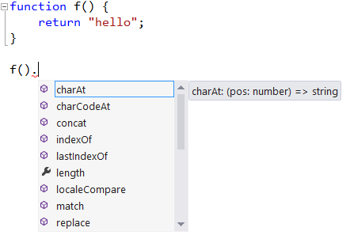
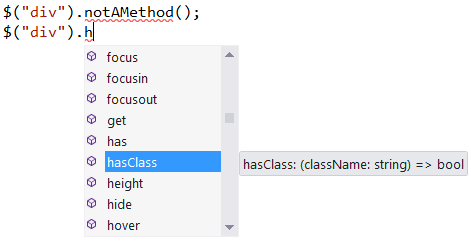
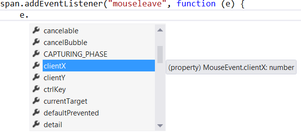

# TypeScript Language Specification

Version 1.8

January, 2016

<br/>

Microsoft is making this Specification available under the Open Web Foundation Final Specification Agreement Version 1.0 ("OWF 1.0") as of October 1, 2012. The OWF 1.0 is available at [http://www.openwebfoundation.org/legal/the-owf-1-0-agreements/owfa-1-0](http://www.openwebfoundation.org/legal/the-owf-1-0-agreements/owfa-1-0).

TypeScript is a trademark of Microsoft Corporation.

<br/>

## Table of Contents

* [1 Introduction](#1)
  * [1.1 Ambient Declarations](#1.1)
  * [1.2 Function Types](#1.2)
  * [1.3 Object Types](#1.3)
  * [1.4 Structural Subtyping](#1.4)
  * [1.5 Contextual Typing](#1.5)
  * [1.6 Classes](#1.6)
  * [1.7 Enum Types](#1.7)
  * [1.8 Overloading on String Parameters](#1.8)
  * [1.9 Generic Types and Functions](#1.9)
  * [1.10 Namespaces](#1.10)
  * [1.11 Modules](#1.11)
* [2 Basic Concepts](#2)
  * [2.1 Grammar Conventions](#2.1)
  * [2.2 Names](#2.2)
    * [2.2.1 Reserved Words](#2.2.1)
    * [2.2.2 Property Names](#2.2.2)
    * [2.2.3 Computed Property Names](#2.2.3)
  * [2.3 Declarations](#2.3)
  * [2.4 Scopes](#2.4)
* [3 Types](#3)
  * [3.1 The Any Type](#3.1)
  * [3.2 Primitive Types](#3.2)
    * [3.2.1 The Number Type](#3.2.1)
    * [3.2.2 The Boolean Type](#3.2.2)
    * [3.2.3 The String Type](#3.2.3)
    * [3.2.4 The Symbol Type](#3.2.4)
    * [3.2.5 The Void Type](#3.2.5)
    * [3.2.6 The Null Type](#3.2.6)
    * [3.2.7 The Undefined Type](#3.2.7)
    * [3.2.8 Enum Types](#3.2.8)
    * [3.2.9 String Literal Types](#3.2.9)
  * [3.3 Object Types](#3.3)
    * [3.3.1 Named Type References](#3.3.1)
    * [3.3.2 Array Types](#3.3.2)
    * [3.3.3 Tuple Types](#3.3.3)
    * [3.3.4 Function Types](#3.3.4)
    * [3.3.5 Constructor Types](#3.3.5)
    * [3.3.6 Members](#3.3.6)
  * [3.4 Union Types](#3.4)
  * [3.5 Intersection Types](#3.5)
  * [3.6 Type Parameters](#3.6)
    * [3.6.1 Type Parameter Lists](#3.6.1)
    * [3.6.2 Type Argument Lists](#3.6.2)
    * [3.6.3 This-types](#3.6.3)
  * [3.7 Named Types](#3.7)
  * [3.8 Specifying Types](#3.8)
    * [3.8.1 Predefined Types](#3.8.1)
    * [3.8.2 Type References](#3.8.2)
    * [3.8.3 Object Type Literals](#3.8.3)
    * [3.8.4 Array Type Literals](#3.8.4)
    * [3.8.5 Tuple Type Literals](#3.8.5)
    * [3.8.6 Union Type Literals](#3.8.6)
    * [3.8.7 Intersection Type Literals](#3.8.7)
    * [3.8.8 Function Type Literals](#3.8.8)
    * [3.8.9 Constructor Type Literals](#3.8.9)
    * [3.8.10 Type Queries](#3.8.10)
    * [3.8.11 This-Type References](#3.8.11)
  * [3.9 Specifying Members](#3.9)
    * [3.9.1 Property Signatures](#3.9.1)
    * [3.9.2 Call Signatures](#3.9.2)
    * [3.9.3 Construct Signatures](#3.9.3)
    * [3.9.4 Index Signatures](#3.9.4)
    * [3.9.5 Method Signatures](#3.9.5)
  * [3.10 Type Aliases](#3.10)
  * [3.11 Type Relationships](#3.11)
    * [3.11.1 Apparent Members](#3.11.1)
    * [3.11.2 Type and Member Identity](#3.11.2)
    * [3.11.3 Subtypes and Supertypes](#3.11.3)
    * [3.11.4 Assignment Compatibility](#3.11.4)
    * [3.11.5 Excess Properties](#3.11.5)
    * [3.11.6 Contextual Signature Instantiation](#3.11.6)
    * [3.11.7 Type Inference](#3.11.7)
    * [3.11.8 Recursive Types](#3.11.8)
  * [3.12 Widened Types](#3.12)
* [4 Expressions](#4)
  * [4.1 Values and References](#4.1)
  * [4.2 The this Keyword](#4.2)
  * [4.3 Identifiers](#4.3)
  * [4.4 Literals](#4.4)
  * [4.5 Object Literals](#4.5)
  * [4.6 Array Literals](#4.6)
  * [4.7 Template Literals](#4.7)
  * [4.8 Parentheses](#4.8)
  * [4.9 The super Keyword](#4.9)
    * [4.9.1 Super Calls](#4.9.1)
    * [4.9.2 Super Property Access](#4.9.2)
  * [4.10 Function Expressions](#4.10)
  * [4.11 Arrow Functions](#4.11)
  * [4.12 Class Expressions](#4.12)
  * [4.13 Property Access](#4.13)
  * [4.14 The new Operator](#4.14)
  * [4.15 Function Calls](#4.15)
    * [4.15.1 Overload Resolution](#4.15.1)
    * [4.15.2 Type Argument Inference](#4.15.2)
    * [4.15.3 Grammar Ambiguities](#4.15.3)
  * [4.16 Type Assertions](#4.16)
  * [4.17 JSX Expressions](#4.17)
  * [4.18 Unary Operators](#4.18)
    * [4.18.1 The ++ and -- operators](#4.18.1)
    * [4.18.2 The +, –, and ~ operators](#4.18.2)
    * [4.18.3 The ! operator](#4.18.3)
    * [4.18.4 The delete Operator](#4.18.4)
    * [4.18.5 The void Operator](#4.18.5)
    * [4.18.6 The typeof Operator](#4.18.6)
  * [4.19 Binary Operators](#4.19)
    * [4.19.1 The *, /, %, –, &lt;&lt;, >>, >>>, &, ^, and | operators](#4.19.1)
    * [4.19.2 The + operator](#4.19.2)
    * [4.19.3 The &lt;, >, &lt;=, >=, ==, !=, ===, and !== operators](#4.19.3)
    * [4.19.4 The instanceof operator](#4.19.4)
    * [4.19.5 The in operator](#4.19.5)
    * [4.19.6 The && operator](#4.19.6)
    * [4.19.7 The || operator](#4.19.7)
  * [4.20 The Conditional Operator](#4.20)
  * [4.21 Assignment Operators](#4.21)
    * [4.21.1 Destructuring Assignment](#4.21.1)
  * [4.22 The Comma Operator](#4.22)
  * [4.23 Contextually Typed Expressions](#4.23)
  * [4.24 Type Guards](#4.24)
* [5 Statements](#5)
  * [5.1 Blocks](#5.1)
  * [5.2 Variable Statements](#5.2)
    * [5.2.1 Simple Variable Declarations](#5.2.1)
    * [5.2.2 Destructuring Variable Declarations](#5.2.2)
    * [5.2.3 Implied Type](#5.2.3)
  * [5.3 Let and Const Declarations](#5.3)
  * [5.4 If, Do, and While Statements](#5.4)
  * [5.5 For Statements](#5.5)
  * [5.6 For-In Statements](#5.6)
  * [5.7 For-Of Statements](#5.7)
  * [5.8 Continue Statements](#5.8)
  * [5.9 Break Statements](#5.9)
  * [5.10 Return Statements](#5.10)
  * [5.11 With Statements](#5.11)
  * [5.12 Switch Statements](#5.12)
  * [5.13 Throw Statements](#5.13)
  * [5.14 Try Statements](#5.14)
* [6 Functions](#6)
  * [6.1 Function Declarations](#6.1)
  * [6.2 Function Overloads](#6.2)
  * [6.3 Function Implementations](#6.3)
  * [6.4 Destructuring Parameter Declarations](#6.4)
  * [6.5 Generic Functions](#6.5)
  * [6.6 Code Generation](#6.6)
  * [6.7 Generator Functions](#6.7)
  * [6.8 Asynchronous Functions](#6.8)
  * [6.9 Type Guard Functions](#6.9)
* [7 Interfaces](#7)
  * [7.1 Interface Declarations](#7.1)
  * [7.2 Declaration Merging](#7.2)
  * [7.3 Interfaces Extending Classes](#7.3)
  * [7.4 Dynamic Type Checks](#7.4)
* [8 Classes](#8)
  * [8.1 Class Declarations](#8.1)
    * [8.1.1 Class Heritage Specification](#8.1.1)
    * [8.1.2 Class Body](#8.1.2)
  * [8.2 Members](#8.2)
    * [8.2.1 Instance and Static Members](#8.2.1)
    * [8.2.2 Accessibility](#8.2.2)
    * [8.2.3 Inheritance and Overriding](#8.2.3)
    * [8.2.4 Class Types](#8.2.4)
    * [8.2.5 Constructor Function Types](#8.2.5)
  * [8.3 Constructor Declarations](#8.3)
    * [8.3.1 Constructor Parameters](#8.3.1)
    * [8.3.2 Super Calls](#8.3.2)
    * [8.3.3 Automatic Constructors](#8.3.3)
  * [8.4 Property Member Declarations](#8.4)
    * [8.4.1 Member Variable Declarations](#8.4.1)
    * [8.4.2 Member Function Declarations](#8.4.2)
    * [8.4.3 Member Accessor Declarations](#8.4.3)
    * [8.4.4 Dynamic Property Declarations](#8.4.4)
  * [8.5 Index Member Declarations](#8.5)
  * [8.6 Decorators](#8.6)
  * [8.7 Code Generation](#8.7)
    * [8.7.1 Classes Without Extends Clauses](#8.7.1)
    * [8.7.2 Classes With Extends Clauses](#8.7.2)
* [9 Enums](#9)
  * [9.1 Enum Declarations](#9.1)
  * [9.2 Enum Members](#9.2)
  * [9.3 Declaration Merging](#9.3)
  * [9.4 Constant Enum Declarations](#9.4)
  * [9.5 Code Generation](#9.5)
* [10 Namespaces](#10)
  * [10.1 Namespace Declarations](#10.1)
  * [10.2 Namespace Body](#10.2)
  * [10.3 Import Alias Declarations](#10.3)
  * [10.4 Export Declarations](#10.4)
  * [10.5 Declaration Merging](#10.5)
  * [10.6 Code Generation](#10.6)
* [11 Scripts and Modules](#11)
  * [11.1 Programs and Source Files](#11.1)
    * [11.1.1 Source Files Dependencies](#11.1.1)
  * [11.2 Scripts](#11.2)
  * [11.3 Modules](#11.3)
    * [11.3.1 Module Names](#11.3.1)
    * [11.3.2 Import Declarations](#11.3.2)
    * [11.3.3 Import Require Declarations](#11.3.3)
    * [11.3.4 Export Declarations](#11.3.4)
    * [11.3.5 Export Assignments](#11.3.5)
    * [11.3.6 CommonJS Modules](#11.3.6)
    * [11.3.7 AMD Modules](#11.3.7)
* [12 Ambients](#12)
  * [12.1 Ambient Declarations](#12.1)
    * [12.1.1 Ambient Variable Declarations](#12.1.1)
    * [12.1.2 Ambient Function Declarations](#12.1.2)
    * [12.1.3 Ambient Class Declarations](#12.1.3)
    * [12.1.4 Ambient Enum Declarations](#12.1.4)
    * [12.1.5 Ambient Namespace Declarations](#12.1.5)
  * [12.2 Ambient Module Declarations](#12.2)
* [A Grammar](#A)
  * [A.1 Types](#A.1)
  * [A.2 Expressions](#A.2)
  * [A.3 Statements](#A.3)
  * [A.4 Functions](#A.4)
  * [A.5 Interfaces](#A.5)
  * [A.6 Classes](#A.6)
  * [A.7 Enums](#A.7)
  * [A.8 Namespaces](#A.8)
  * [A.9 Scripts and Modules](#A.9)
  * [A.10 Ambients](#A.10)

<br/>

# <a name="1"/>1 Introduction

JavaScript applications such as web e-mail, maps, document editing, and collaboration tools are becoming an increasingly important part of the everyday computing. We designed TypeScript to meet the needs of the JavaScript programming teams that build and maintain large JavaScript programs. TypeScript helps programming teams to define interfaces between software components and to gain insight into the behavior of existing JavaScript libraries. TypeScript also enables teams to reduce naming conflicts by organizing their code into dynamically-loadable modules. TypeScript's optional type system enables JavaScript programmers to use highly-productive development tools and practices: static checking, symbol-based navigation, statement completion, and code refactoring.

TypeScript is a syntactic sugar for JavaScript. TypeScript syntax is a superset of ECMAScript 2015 (ES2015) syntax. Every JavaScript program is also a TypeScript program. The TypeScript compiler performs only file-local transformations on TypeScript programs and does not re-order variables declared in TypeScript. This leads to JavaScript output that closely matches the TypeScript input. TypeScript does not transform variable names, making tractable the direct debugging of emitted JavaScript. TypeScript optionally provides source maps, enabling source-level debugging. TypeScript tools typically emit JavaScript upon file save, preserving the test, edit, refresh cycle commonly used in JavaScript development.

TypeScript syntax includes all features of ECMAScript 2015, including classes and modules, and provides the ability to translate these features into ECMAScript 3 or 5 compliant code.

Classes enable programmers to express common object-oriented patterns in a standard way, making features like inheritance more readable and interoperable. Modules enable programmers to organize their code into components while avoiding naming conflicts. The TypeScript compiler provides module code generation options that support either static or dynamic loading of module contents.

TypeScript also provides to JavaScript programmers a system of optional type annotations. These type annotations are like the JSDoc comments found in the Closure system, but in TypeScript they are integrated directly into the language syntax. This integration makes the code more readable and reduces the maintenance cost of synchronizing type annotations with their corresponding variables.

The TypeScript type system enables programmers to express limits on the capabilities of JavaScript objects, and to use tools that enforce these limits. To minimize the number of annotations needed for tools to become useful, the TypeScript type system makes extensive use of type inference. For example, from the following statement, TypeScript will infer that the variable 'i' has the type number.

```TypeScript
var i = 0;
```

TypeScript will infer from the following function definition that the function f has return type string.

```TypeScript
function f() {  
    return "hello";  
}
```

To benefit from this inference, a programmer can use the TypeScript language service. For example, a code editor can incorporate the TypeScript language service and use the service to find the members of a string object as in the following screenshot.

&emsp;&emsp;

In this example, the programmer benefits from type inference without providing type annotations. Some beneficial tools, however, do require the programmer to provide type annotations. In TypeScript, we can express a parameter requirement as in the following code fragment.

```TypeScript
function f(s: string) {  
    return s;  
}

f({});       // Error  
f("hello");  // Ok
```

This optional type annotation on the parameter 's' lets the TypeScript type checker know that the programmer expects parameter 's' to be of type 'string'. Within the body of function 'f', tools can assume 's' is of type 'string' and provide operator type checking and member completion consistent with this assumption. Tools can also signal an error on the first call to 'f', because 'f' expects a string, not an object, as its parameter. For the function 'f', the TypeScript compiler will emit the following JavaScript code:

```TypeScript
function f(s) {  
    return s;  
}
```

In the JavaScript output, all type annotations have been erased. In general, TypeScript erases all type information before emitting JavaScript.

## <a name="1.1"/>1.1 Ambient Declarations

An ambient declaration introduces a variable into a TypeScript scope, but has zero impact on the emitted JavaScript program. Programmers can use ambient declarations to tell the TypeScript compiler that some other component will supply a variable. For example, by default the TypeScript compiler will print an error for uses of undefined variables. To add some of the common variables defined by browsers, a TypeScript programmer can use ambient declarations. The following example declares the 'document' object supplied by browsers. Because the declaration does not specify a type, the type 'any' is inferred. The type 'any' means that a tool can assume nothing about the shape or behavior of the document object. Some of the examples below will illustrate how programmers can use types to further characterize the expected behavior of an object.

```TypeScript
declare var document;  
document.title = "Hello";  // Ok because document has been declared
```

In the case of 'document', the TypeScript compiler automatically supplies a declaration, because TypeScript by default includes a file 'lib.d.ts' that provides interface declarations for the built-in JavaScript library as well as the Document Object Model.

The TypeScript compiler does not include by default an interface for jQuery, so to use jQuery, a programmer could supply a declaration such as:

```TypeScript
declare var $;
```

Section [1.3](#1.3) provides a more extensive example of how a programmer can add type information for jQuery and other libraries.

## <a name="1.2"/>1.2 Function Types

Function expressions are a powerful feature of JavaScript. They enable function definitions to create closures: functions that capture information from the lexical scope surrounding the function's definition. Closures are currently JavaScript's only way of enforcing data encapsulation. By capturing and using environment variables, a closure can retain information that cannot be accessed from outside the closure. JavaScript programmers often use closures to express event handlers and other asynchronous callbacks, in which another software component, such as the DOM, will call back into JavaScript through a handler function.

TypeScript function types make it possible for programmers to express the expected *signature* of a function. A function signature is a sequence of parameter types plus a return type. The following example uses function types to express the callback signature requirements of an asynchronous voting mechanism.

```TypeScript
function vote(candidate: string, callback: (result: string) => any) {  
   // ...  
}

vote("BigPig",  
     function(result: string) {  
         if (result === "BigPig") {  
            // ...  
         }  
     }  
);
```

In this example, the second parameter to 'vote' has the function type

```TypeScript
(result: string) => any
```

which means the second parameter is a function returning type 'any' that has a single parameter of type 'string' named 'result'.

Section [3.9.2](#3.9.2) provides additional information about function types.

## <a name="1.3"/>1.3 Object Types

TypeScript programmers use *object types* to declare their expectations of object behavior. The following code uses an *object type literal* to specify the return type of the 'MakePoint' function.

```TypeScript
var MakePoint: () => {  
    x: number; y: number;  
};
```

Programmers can give names to object types; we call named object types *interfaces*. For example, in the following code, an interface declares one required field (name) and one optional field (favoriteColor).

```TypeScript
interface Friend {  
    name: string;  
    favoriteColor?: string;  
}

function add(friend: Friend) {  
    var name = friend.name;  
}

add({ name: "Fred" });  // Ok  
add({ favoriteColor: "blue" });  // Error, name required  
add({ name: "Jill", favoriteColor: "green" });  // Ok
```

TypeScript object types model the diversity of behaviors that a JavaScript object can exhibit. For example, the jQuery library defines an object, '$', that has methods, such as 'get' (which sends an Ajax message), and fields, such as 'browser' (which gives browser vendor information). However, jQuery clients can also call '$' as a function. The behavior of this function depends on the type of parameters passed to the function.

The following code fragment captures a small subset of jQuery behavior, just enough to use jQuery in a simple way.

```TypeScript
interface JQuery {  
    text(content: string);  
}  
  
interface JQueryStatic {  
    get(url: string, callback: (data: string) => any);     
    (query: string): JQuery;  
}

declare var $: JQueryStatic;

$.get("http://mysite.org/divContent",  
      function (data: string) {  
          $("div").text(data);  
      }  
);
```

The 'JQueryStatic' interface references another interface: 'JQuery'. This interface represents a collection of one or more DOM elements. The jQuery library can perform many operations on such a collection, but in this example the jQuery client only needs to know that it can set the text content of each jQuery element in a collection by passing a string to the 'text' method. The 'JQueryStatic' interface also contains a method, 'get', that performs an Ajax get operation on the provided URL and arranges to invoke the provided callback upon receipt of a response.

Finally, the 'JQueryStatic' interface contains a bare function signature 

```TypeScript
(query: string): JQuery;
```

The bare signature indicates that instances of the interface are callable. This example illustrates that TypeScript function types are just special cases of TypeScript object types. Specifically, function types are object types that contain one or more call signatures. For this reason we can write any function type as an object type literal. The following example uses both forms to describe the same type.

```TypeScript
var f: { (): string; };  
var sameType: () => string = f;     // Ok  
var nope: () => number = sameType;  // Error: type mismatch
```

We mentioned above that the '$' function behaves differently depending on the type of its parameter. So far, our jQuery typing only captures one of these behaviors: return an object of type 'JQuery' when passed a string. To specify multiple behaviors, TypeScript supports *overloading* of function signatures in object types. For example, we can add an additional call signature to the 'JQueryStatic' interface.

```TypeScript
(ready: () => any): any;
```

This signature denotes that a function may be passed as the parameter of the '$' function. When a function is passed to '$', the jQuery library will invoke that function when a DOM document is ready. Because TypeScript supports overloading, tools can use TypeScript to show all available function signatures with their documentation tips and to give the correct documentation once a function has been called with a particular signature.

A typical client would not need to add any additional typing but could just use a community-supplied typing to discover (through statement completion with documentation tips) and verify (through static checking) correct use of the library, as in the following screenshot.

&emsp;&emsp;

Section [3.3](#3.3) provides additional information about object types.

## <a name="1.4"/>1.4 Structural Subtyping

Object types are compared *structurally*. For example, in the code fragment below, class 'CPoint' matches interface 'Point' because 'CPoint' has all of the required members of 'Point'. A class may optionally declare that it implements an interface, so that the compiler will check the declaration for structural compatibility. The example also illustrates that an object type can match the type inferred from an object literal, as long as the object literal supplies all of the required members.

```TypeScript
interface Point {  
    x: number;  
    y: number;  
}

function getX(p: Point) {  
    return p.x;  
}

class CPoint {  
    x: number;  
    y: number;  
    constructor(x: number,  y: number) {  
        this.x = x;  
        this.y = y;  
    }  
}

getX(new CPoint(0, 0));  // Ok, fields match

getX({ x: 0, y: 0, color: "red" });  // Extra fields Ok

getX({ x: 0 });  // Error: supplied parameter does not match
```

See section [3.11](#3.11) for more information about type comparisons.

## <a name="1.5"/>1.5 Contextual Typing

Ordinarily, TypeScript type inference proceeds "bottom-up": from the leaves of an expression tree to its root. In the following example, TypeScript infers 'number' as the return type of the function 'mul' by flowing type information bottom up in the return expression.

```TypeScript
function mul(a: number, b: number) {  
    return a * b;  
}
```

For variables and parameters without a type annotation or a default value, TypeScript infers type 'any', ensuring that compilers do not need non-local information about a function's call sites to infer the function's return type. Generally, this bottom-up approach provides programmers with a clear intuition about the flow of type information.

However, in some limited contexts, inference proceeds "top-down" from the context of an expression. Where this happens, it is called contextual typing. Contextual typing helps tools provide excellent information when a programmer is using a type but may not know all of the details of the type. For example, in the jQuery example, above, the programmer supplies a function expression as the second parameter to the 'get' method. During typing of that expression, tools can assume that the type of the function expression is as given in the 'get' signature and can provide a template that includes parameter names and types.

```TypeScript
$.get("http://mysite.org/divContent",  
      function (data) {  
          $("div").text(data);  // TypeScript infers data is a string  
      }  
);
```

Contextual typing is also useful for writing out object literals. As the programmer types the object literal, the contextual type provides information that enables tools to provide completion for object member names.

Section [4.23](#4.23) provides additional information about contextually typed expressions.

## <a name="1.6"/>1.6 Classes

JavaScript practice has two very common design patterns: the module pattern and the class pattern. Roughly speaking, the module pattern uses closures to hide names and to encapsulate private data, while the class pattern uses prototype chains to implement many variations on object-oriented inheritance mechanisms. Libraries such as 'prototype.js' are typical of this practice. TypeScript's namespaces are a formalization of the module pattern. (The term "module pattern" is somewhat unfortunate now that ECMAScript 2015 formally supports modules in a manner different from what the module pattern prescribes. For this reason, TypeScript uses the term "namespace" for its formalization of the module pattern.)

This section and the namespace section below will show how TypeScript emits consistent, idiomatic JavaScript when emitting ECMAScript 3 or 5 compliant code for classes and namespaces. The goal of TypeScript's translation is to emit exactly what a programmer would type when implementing a class or namespace unaided by a tool. This section will also describe how TypeScript infers a type for each class declaration. We'll start with a simple BankAccount class.

```TypeScript
class BankAccount {  
    balance = 0;  
    deposit(credit: number) {  
        this.balance += credit;  
        return this.balance;  
    }  
}  
```

This class generates the following JavaScript code.

```TypeScript
var BankAccount = (function () {  
    function BankAccount() {  
        this.balance = 0;  
    }  
    BankAccount.prototype.deposit = function(credit) {  
        this.balance += credit;  
        return this.balance;  
    };  
    return BankAccount;  
})();
```

This TypeScript class declaration creates a variable named 'BankAccount' whose value is the constructor function for 'BankAccount' instances. This declaration also creates an instance type of the same name. If we were to write this type as an interface it would look like the following.

```TypeScript
interface BankAccount {  
    balance: number;  
    deposit(credit: number): number;  
}
```

If we were to write out the function type declaration for the 'BankAccount' constructor variable, it would have the following form.

```TypeScript
var BankAccount: new() => BankAccount;
```

The function signature is prefixed with the keyword 'new' indicating that the 'BankAccount' function must be called as a constructor. It is possible for a function's type to have both call and constructor signatures. For example, the type of the built-in JavaScript Date object includes both kinds of signatures.

If we want to start our bank account with an initial balance, we can add to the 'BankAccount' class a constructor declaration.

```TypeScript
class BankAccount {  
    balance: number;  
    constructor(initially: number) {  
        this.balance = initially;  
    }  
    deposit(credit: number) {  
        this.balance += credit;  
        return this.balance;  
    }  
}
```

This version of the 'BankAccount' class requires us to introduce a constructor parameter and then assign it to the 'balance' field. To simplify this common case, TypeScript accepts the following shorthand syntax.

```TypeScript
class BankAccount {  
    constructor(public balance: number) {  
    }  
    deposit(credit: number) {  
        this.balance += credit;  
        return this.balance;  
    }  
}
```

The 'public' keyword denotes that the constructor parameter is to be retained as a field. Public is the default accessibility for class members, but a programmer can also specify private or protected accessibility for a class member. Accessibility is a design-time construct; it is enforced during static type checking but does not imply any runtime enforcement.

TypeScript classes also support inheritance, as in the following example.* *

```TypeScript
class CheckingAccount extends BankAccount {  
    constructor(balance: number) {  
        super(balance);  
    }  
    writeCheck(debit: number) {  
        this.balance -= debit;  
    }  
}
```

In this example, the class 'CheckingAccount' *derives* from class 'BankAccount'. The constructor for 'CheckingAccount' calls the constructor for class 'BankAccount' using the 'super' keyword. In the emitted JavaScript code, the prototype of 'CheckingAccount' will chain to the prototype of 'BankAccount'. 

TypeScript classes may also specify static members. Static class members become properties of the class constructor. 

Section [8](#8) provides additional information about classes.

## <a name="1.7"/>1.7 Enum Types

TypeScript enables programmers to summarize a set of numeric constants as an *enum type*. The example below creates an enum type to represent operators in a calculator application.

```TypeScript
const enum Operator {  
    ADD,  
    DIV,  
    MUL,  
    SUB  
}

function compute(op: Operator, a: number, b: number) {  
    console.log("the operator is" + Operator[op]);  
    // ...  
}
```

In this example, the compute function logs the operator 'op' using a feature of enum types: reverse mapping from the enum value ('op') to the string corresponding to that value. For example, the declaration of 'Operator' automatically assigns integers, starting from zero, to the listed enum members. Section [9](#9) describes how programmers can also explicitly assign integers to enum members, and can use any string to name an enum member.

When enums are declared with the `const` modifier, the TypeScript compiler will emit for an enum member a JavaScript constant corresponding to that member's assigned value (annotated with a comment). This improves performance on many JavaScript engines.

For example, the 'compute' function could contain a switch statement like the following.

```TypeScript
switch (op) {  
    case Operator.ADD:  
        // execute add  
        break;  
    case Operator.DIV:  
        // execute div  
        break;  
    // ...  
}
```

For this switch statement, the compiler will generate the following code.

```TypeScript
switch (op) {  
    case 0 /* Operator.ADD */:  
        // execute add  
        break;  
    case 1 /* Operator.DIV */:  
        // execute div  
        break;  
    // ...  
}
```

JavaScript implementations can use these explicit constants to generate efficient code for this switch statement, for example by building a jump table indexed by case value.

## <a name="1.8"/>1.8 Overloading on String Parameters

An important goal of TypeScript is to provide accurate and straightforward types for existing JavaScript programming patterns. To that end, TypeScript includes generic types, discussed in the next section, and *overloading on string parameters*, the topic of this section.

JavaScript programming interfaces often include functions whose behavior is discriminated by a string constant passed to the function. The Document Object Model makes heavy use of this pattern. For example, the following screenshot shows that the 'createElement' method of the 'document' object has multiple signatures, some of which identify the types returned when specific strings are passed into the method.

&emsp;&emsp;

The following code fragment uses this feature. Because the 'span' variable is inferred to have the type 'HTMLSpanElement', the code can reference without static error the 'isMultiline' property of 'span'.

```TypeScript
var span = document.createElement("span");  
span.isMultiLine = false;  // OK: HTMLSpanElement has isMultiline property
```

In the following screenshot, a programming tool combines information from overloading on string parameters with contextual typing to infer that the type of the variable 'e' is 'MouseEvent' and that therefore 'e' has a 'clientX' property.

&emsp;&emsp;

Section [3.9.2.4](#3.9.2.4) provides details on how to use string literals in function signatures.

## <a name="1.9"/>1.9 Generic Types and Functions

Like overloading on string parameters, *generic types* make it easier for TypeScript to accurately capture the behavior of JavaScript libraries. Because they enable type information to flow from client code, through library code, and back into client code, generic types may do more than any other TypeScript feature to support detailed API descriptions.

To illustrate this, let's take a look at part of the TypeScript interface for the built-in JavaScript array type. You can find this interface in the 'lib.d.ts' file that accompanies a TypeScript distribution.

```TypeScript
interface Array<T> {  
    reverse(): T[];  
    sort(compareFn?: (a: T, b: T) => number): T[];  
    // ...   
}
```

Interface definitions, like the one above, can have one or more *type parameters*. In this case the 'Array' interface has a single parameter, 'T', that defines the element type for the array. The 'reverse' method returns an array with the same element type. The sort method takes an optional parameter, 'compareFn', whose type is a function that takes two parameters of type 'T' and returns a number. Finally, sort returns an array with element type 'T'.

Functions can also have generic parameters. For example, the array interface contains a 'map' method, defined as follows:

```TypeScript
map<U>(func: (value: T, index: number, array: T[]) => U, thisArg?: any): U[];
```

The map method, invoked on an array 'a' with element type 'T', will apply function 'func' to each element of 'a', returning a value of type 'U'.

The TypeScript compiler can often infer generic method parameters, making it unnecessary for the programmer to explicitly provide them. In the following example, the compiler infers that parameter 'U' of the map method has type 'string', because the function passed to map returns a string.

```TypeScript
function numberToString(a: number[]) {  
    var stringArray = a.map(v => v.toString());  
    return stringArray;  
}
```

The compiler infers in this example that the 'numberToString' function returns an array of strings.

In TypeScript, classes can also have type parameters. The following code declares a class that implements a linked list of items of type 'T'. This code illustrates how programmers can *constrain* type parameters to extend a specific type. In this case, the items on the list must extend the type 'NamedItem'. This enables the programmer to implement the 'log' function, which logs the name of the item.

```TypeScript
interface NamedItem {  
    name: string;  
}

class List<T extends NamedItem> {  
    next: List<T> = null;

    constructor(public item: T) {  
    }

    insertAfter(item: T) {  
        var temp = this.next;  
        this.next = new List(item);  
        this.next.next = temp;  
    }

    log() {  
        console.log(this.item.name);  
    }

    // ...  
}
```

Section [3.7](#3.7) provides further information about generic types.

## <a name="1.10"/>1.10 Namespaces

Classes and interfaces support large-scale JavaScript development by providing a mechanism for describing how to use a software component that can be separated from that component's implementation. TypeScript enforces *encapsulation* of implementation in classes at design time (by restricting use of private and protected members), but cannot enforce encapsulation at runtime because all object properties are accessible at runtime. Future versions of JavaScript may provide *private names* which would enable runtime enforcement of private and protected members.

In JavaScript, a very common way to enforce encapsulation at runtime is to use the module pattern: encapsulate private fields and methods using closure variables. The module pattern is a natural way to provide organizational structure and dynamic loading options by drawing a boundary around a software component. The module pattern can also provide the ability to introduce namespaces, avoiding use of the global namespace for most software components. 

The following example illustrates the JavaScript module pattern.

```TypeScript
(function(exports) {  
    var key = generateSecretKey();  
    function sendMessage(message) {  
        sendSecureMessage(message, key);  
    }  
    exports.sendMessage = sendMessage;  
})(MessageModule);
```

This example illustrates the two essential elements of the module pattern: a *module closure* and a *module* *object*. The module closure is a function that encapsulates the module's implementation, in this case the variable 'key' and the function 'sendMessage'. The module object contains the exported variables and functions of the module. Simple modules may create and return the module object. The module above takes the module object as a parameter, 'exports', and adds the 'sendMessage' property to the module object. This *augmentation* approach simplifies dynamic loading of modules and also supports separation of module code into multiple files.

The example assumes that an outer lexical scope defines the functions 'generateSecretKey' and 'sendSecureMessage'; it also assumes that the outer scope has assigned the module object to the variable 'MessageModule'.

TypeScript namespaces provide a mechanism for succinctly expressing the module pattern. In TypeScript, programmers can combine the module pattern with the class pattern by nesting namespaces and classes within an outer namespace.

The following example shows the definition and use of a simple namespace.

```TypeScript
namespace M {  
    var s = "hello";  
    export function f() {  
        return s;  
    }  
}

M.f();  
M.s;  // Error, s is not exported
```

In this example, variable 's' is a private feature of the namespace, but function 'f' is exported from the namespace and accessible to code outside of the namespace. If we were to describe the effect of namespace 'M' in terms of interfaces and variables, we would write

```TypeScript
interface M {  
    f(): string;  
}

var M: M;
```

The interface 'M' summarizes the externally visible behavior of namespace 'M'. In this example, we can use the same name for the interface as for the initialized variable because in TypeScript type names and variable names do not conflict: each lexical scope contains a variable declaration space and type declaration space (see section [2.3](#2.3) for more details).

The TypeScript compiler emits the following JavaScript code for the namespace:

```TypeScript
var M;  
(function(M) {  
    var s = "hello";  
    function f() {  
        return s;  
    }  
    M.f = f;  
})(M || (M = {}));
```

In this case, the compiler assumes that the namespace object resides in global variable 'M', which may or may not have been initialized to the desired namespace object.

## <a name="1.11"/>1.11 Modules

TypeScript also supports ECMAScript 2015 modules, which are files that contain top-level *export* and *import* directives. For this type of module the TypeScript compiler can emit both ECMAScript 2015 compliant code and down-level ECMAScript 3 or 5 compliant code for a variety of module loading systems, including CommonJS, Asynchronous Module Definition (AMD), and Universal Module Definition (UMD).

<br/>

# <a name="2"/>2 Basic Concepts

The remainder of this document is the formal specification of the TypeScript programming language and is intended to be read as an adjunct to the [ECMAScript 2015 Language Specification](http://www.ecma-international.org/ecma-262/6.0/) (specifically, the ECMA-262 Standard, 6th Edition). This document describes the syntactic grammar added by TypeScript along with the compile-time processing and type checking performed by the TypeScript compiler, but it only minimally discusses the run-time behavior of programs since that is covered by the ECMAScript specification.

## <a name="2.1"/>2.1 Grammar Conventions

The syntactic grammar added by TypeScript language is specified throughout this document using the existing conventions and production names of the ECMAScript grammar. In places where TypeScript augments an existing grammar production it is so noted. For example:

&emsp;&emsp;*Declaration:*  *( Modified )*  
&emsp;&emsp;&emsp;…  
&emsp;&emsp;&emsp;*InterfaceDeclaration*  
&emsp;&emsp;&emsp;*TypeAliasDeclaration*  
&emsp;&emsp;&emsp;*EnumDeclaration*

The '*( Modified )*' annotation indicates that an existing grammar production is being replaced, and the '…' references the contents of the original grammar production.

Similar to the ECMAScript grammar, if the phrase "*[no LineTerminator here]*" appears in the right-hand side of a production of the syntactic grammar, it indicates that the production is not a match if a *LineTerminator* occurs in the input stream at the indicated position.

## <a name="2.2"/>2.2 Names

A core purpose of the TypeScript compiler is to track the named entities in a program and validate that they are used according to their designated meaning. Names in TypeScript can be written in several ways, depending on context. Specifically, a name can be written as

* an *IdentifierName*,
* a *StringLiteral* in a property name,
* a *NumericLiteral* in a property name, or
* a *ComputedPropertyName* that denotes a well-known symbol ([2.2.3](#2.2.3)).

Most commonly, names are written to conform with the *Identifier* production, which is any *IdentifierName* that isn't a reserved word.

### <a name="2.2.1"/>2.2.1 Reserved Words

The following keywords are reserved and cannot be used as an *Identifier*:

```TypeScript
break             case              catch             class  
const             continue          debugger          default  
delete            do                else              enum  
export            extends           false             finally  
for               function          if                import  
in                instanceof        new               null  
return            super             switch            this  
throw             true              try               typeof  
var               void              while             with
```

The following keywords cannot be used as identifiers in strict mode code, but are otherwise not restricted:

```TypeScript
implements        interface         let               package  
private           protected         public            static  
yield
```

The following keywords cannot be used as user defined type names, but are otherwise not restricted:

```TypeScript
any               boolean           number            string  
symbol
```

The following keywords have special meaning in certain contexts, but are valid identifiers:

```TypeScript
abstract          as                async             await  
constructor       declare           from              get  
is                module            namespace         of  
require           set               type
```

### <a name="2.2.2"/>2.2.2 Property Names

The *PropertyName* production from the ECMAScript grammar is reproduced below:

&emsp;&emsp;*PropertyName:*  
&emsp;&emsp;&emsp;*LiteralPropertyName*  
&emsp;&emsp;&emsp;*ComputedPropertyName*

&emsp;&emsp;*LiteralPropertyName:*  
&emsp;&emsp;&emsp;*IdentifierName*  
&emsp;&emsp;&emsp;*StringLiteral*  
&emsp;&emsp;&emsp;*NumericLiteral*

&emsp;&emsp;*ComputedPropertyName:*  
&emsp;&emsp;&emsp;`[`&emsp;*AssignmentExpression*&emsp;`]`

A property name can be any identifier (including a reserved word), a string literal, a numeric literal, or a computed property name. String literals may be used to give properties names that are not valid identifiers, such as names containing blanks. Numeric literal property names are equivalent to string literal property names with the string representation of the numeric literal, as defined in the ECMAScript specification.

### <a name="2.2.3"/>2.2.3 Computed Property Names

ECMAScript 2015 permits object literals and classes to declare members with computed property names. A computed property name specifies an expression that computes the actual property name at run-time. Because the final property name isn't known at compile-time, TypeScript can only perform limited checks for entities declared with computed property names. However, a subset of computed property names known as ***well-known symbols*** can be used anywhere a *PropertyName* is expected, including property names within types. A computed property name is a well-known symbol if it is of the form

```TypeScript
[ Symbol . xxx ]
```

In a well-known symbol, the identifier to the right of the dot must denote a property of the primitive type `symbol` in the type of the global variable 'Symbol', or otherwise an error occurs.

In a *PropertyName* that specifies a *ComputedPropertyName*, the computed property name is required to denote a well-known symbol unless the property name occurs in a property assignment of an object literal ([4.5](#4.5)) or a property member declaration in a non-ambient class ([8.4](#8.4)).

Below is an example of an interface that declares a property with a well-known symbol name:

```TypeScript
interface Iterable<T> {  
    [Symbol.iterator](): Iterator<T>;  
}
```

*TODO: Update to reflect treatment of [computed property names with literal expressions](https://github.com/Microsoft/TypeScript/pull/5535)*.

## <a name="2.3"/>2.3 Declarations

Declarations introduce names in their associated ***declaration spaces***. A name must be unique in its declaration space and can denote a ***value***, a ***type***, or a ***namespace***, or some combination thereof. Effectively, a single name can have as many as three distinct meanings. For example:

```TypeScript
var X: string;    // Value named X

type X = number;  // Type named X

namespace X {     // Namespace named X  
    type Y = string;  
}
```

A name that denotes a value has an associated type (section [3](#3)) and can be referenced in expressions (section [4.3](#4.3)). A name that denotes a type can be used by itself in a type reference or on the right hand side of a dot in a type reference ([3.8.2](#3.8.2)). A name that denotes a namespace can be used one the left hand side of a dot in a type reference.

When a name with multiple meanings is referenced, the context in which the reference occurs determines the meaning. For example:

```TypeScript
var n: X;        // X references type  
var s: X.Y = X;  // First X references namespace, second X references value
```

In the first line, X references the type X because it occurs in a type position. In the second line, the first X references the namespace X because it occurs before a dot in a type name, and the second X references the variable X because it occurs in an expression.

Declarations introduce the following meanings for the name they declare:

* A variable, parameter, function, generator, member variable, member function, member accessor, or enum member declaration introduces a value meaning.
* An interface, type alias, or type parameter declaration introduces a type meaning.
* A class declaration introduces a value meaning (the constructor function) and a type meaning (the class type).
* An enum declaration introduces a value meaning (the enum instance) and a type meaning (the enum type).
* A namespace declaration introduces a namespace meaning (the type and namespace container) and, if the namespace is instantiated (section [10.1](#10.1)), a value meaning (the namespace instance).
* An import or export declaration introduces the meaning(s) of the imported or exported entity.

Below are some examples of declarations that introduce multiple meanings for a name:

```TypeScript
class C {      // Value and type named C  
    x: string;  
}

namespace N {  // Value and namespace named N  
    export var x: string;  
}
```

Declaration spaces exist as follows:

* The global namespace, each module, and each declared namespace has a declaration space for its contained entities (whether local or exported).
* Each module has a declaration space for its exported entities. All export declarations in the module contribute to this declaration space.
* Each declared namespace has a declaration space for its exported entities. All export declarations in the namespace contribute to this declaration space. A declared namespace’s declaration space is shared with other declared namespaces that have the same root container and the same qualified name starting from that root container.
* Each class declaration has a declaration space for instance members and type parameters, and a declaration space for static members.
* Each interface declaration has a declaration space for members and type parameters. An interface's declaration space is shared with other interfaces that have the same root container and the same qualified name starting from that root container.
* Each enum declaration has a declaration space for its enum members. An enum's declaration space is shared with other enums that have the same root container and the same qualified name starting from that root container.
* Each type alias declaration has a declaration space for its type parameters.
* Each function-like declaration (including function declarations, constructor declarations, member function declarations, member accessor declarations, function expressions, and arrow functions) has a declaration space for locals and type parameters. This declaration space includes parameter declarations, all local var and function declarations, and local let, const, class, interface, type alias, and enum declarations that occur immediately within the function body and are not further nested in blocks.
* Each statement block has a declaration space for local let, const, class, interface, type alias, and enum declarations that occur immediately within that block.
* Each object literal has a declaration space for its properties.
* Each object type literal has a declaration space for its members.

Top-level declarations in a source file with no top-level import or export declarations belong to the ***global namespace***. Top-level declarations in a source file with one or more top-level import or export declarations belong to the ***module*** represented by that source file.

The ***container*** of an entity is defined as follows:

* The container of an entity declared in a namespace declaration is that namespace declaration.
* The container of an entity declared in a module is that module.
* The container of an entity declared in the global namespace is the global namespace.
* The container of a module is the global namespace.

The ***root container*** of an entity is defined as follows:

* The root container of a non-exported entity is the entity’s container.
* The root container of an exported entity is the root container of the entity's container.

Intuitively, the root container of an entity is the outermost module or namespace body from within which the entity is reachable.

Interfaces, enums, and namespaces are "open ended," meaning that interface, enum, and namespace declarations with the same qualified name relative to a common root are automatically merged. For further details, see sections [7.2](#7.2), [9.3](#9.3), and [10.5](#10.5).

Instance and static members in a class are in separate declaration spaces. Thus the following is permitted:

```TypeScript
class C {  
    x: number;          // Instance member  
    static x: string;   // Static member  
}
```

## <a name="2.4"/>2.4 Scopes

The ***scope*** of a name is the region of program text within which it is possible to refer to the entity declared by that name without qualification of the name. The scope of a name depends on the context in which the name is declared. The contexts are listed below in order from outermost to innermost:

* The scope of a name declared in the global namespace is the entire program text.
* The scope of a name declared in a module is the source file of that module.
* The scope of an exported name declared within a namespace declaration is the body of that namespace declaration and every namespace declaration with the same root and the same qualified name relative to that root.
* The scope of a non-exported name declared within a namespace declaration is the body of that namespace declaration.
* The scope of a type parameter name declared in a class or interface declaration is that entire declaration, including constraints, extends clause, implements clause, and declaration body, but not including static member declarations.
* The scope of a type parameter name declared in a type alias declaration is that entire type alias declaration.
* The scope of a member name declared in an enum declaration is the body of that declaration and every enum declaration with the same root and the same qualified name relative to that root.
* The scope of a type parameter name declared in a call or construct signature is that entire signature declaration, including constraints, parameter list, and return type. If the signature is part of a function implementation, the scope includes the function body.
* The scope of a parameter name declared in a call or construct signature is the remainder of the signature declaration. If the signature is part of a function-like declaration with a body (including a function declaration, constructor declaration, member function declaration, member accessor declaration, function expression, or arrow function), the scope includes the body of that function-like declaration.
* The scope of a local var or function name declared anywhere in the body of a function-like declaration is the body of that function-like declaration.
* The scope of a local let, const, class, interface, type alias, or enum declaration declared immediately within the body of a function-like declaration is the body of that function-like declaration.
* The scope of a local let, const, class, interface, type alias, or enum declaration declared immediately within a statement block is the body of that statement block.

Scopes may overlap, for example through nesting of namespaces and functions. When the scopes of two names overlap, the name with the innermost declaration takes precedence and access to the outer name is either not possible or only possible by qualification.

When an identifier is resolved as a *PrimaryExpression* (section [4.3](#4.3)), only names in scope with a value meaning are considered and other names are ignored.

When an identifier is resolved as a *TypeName* (section [3.8.2](#3.8.2)), only names in scope with a type meaning are considered and other names are ignored.

When an identifier is resolved as a *NamespaceName* (section [3.8.2](#3.8.2)), only names in scope with a namespace meaning are considered and other names are ignored.

*TODO: [Include specific rules for alias resolution](https://github.com/Microsoft/TypeScript/issues/3158)*.

Note that class and interface members are never directly in scope—they can only be accessed by applying the dot ('.') operator to a class or interface instance. This even includes members of the current instance in a constructor or member function, which are accessed by applying the dot operator to `this`.

As the rules above imply, locally declared entities in a namespace are closer in scope than exported entities declared in other namespace declarations for the same namespace. For example:

```TypeScript
var x = 1;  
namespace M {  
    export var x = 2;  
    console.log(x);     // 2  
}  
namespace M {  
    console.log(x);     // 2  
}  
namespace M {  
    var x = 3;  
    console.log(x);     // 3  
}
```

<br/>

# <a name="3"/>3 Types

TypeScript adds optional static types to JavaScript. Types are used to place static constraints on program entities such as functions, variables, and properties so that compilers and development tools can offer better verification and assistance during software development. TypeScript's *static* compile-time type system closely models the *dynamic* run-time type system of JavaScript, allowing programmers to accurately express the type relationships that are expected to exist when their programs run and have those assumptions pre-validated by the TypeScript compiler. TypeScript's type analysis occurs entirely at compile-time and adds no run-time overhead to program execution.

All types in TypeScript are subtypes of a single top type called the Any type. The `any` keyword references this type. The Any type is the one type that can represent *any* JavaScript value with no constraints. All other types are categorized as ***primitive types***, ***object types***, ***union types***, ***intersection types***, or ***type parameters***. These types introduce various static constraints on their values.

The primitive types are the Number, Boolean, String, Symbol, Void, Null, and Undefined types along with user defined enum types. The `number`, `boolean`, `string`, `symbol`, and `void` keywords reference the Number, Boolean, String, Symbol, and Void primitive types respectively. The Void type exists purely to indicate the absence of a value, such as in a function with no return value. It is not possible to explicitly reference the Null and Undefined types—only *values* of those types can be referenced, using the `null` and `undefined` literals.

The object types are all class, interface, array, tuple, function, and constructor types. Class and interface types are introduced through class and interface declarations and are referenced by the name given to them in their declarations. Class and interface types may be ***generic types*** which have one or more type parameters.

Union types represent values that have one of multiple types, and intersection types represent values that simultaneously have more than one type.

Declarations of classes, properties, functions, variables and other language entities associate types with those entities. The mechanism by which a type is formed and associated with a language entity depends on the particular kind of entity. For example, a namespace declaration associates the namespace with an anonymous type containing a set of properties corresponding to the exported variables and functions in the namespace, and a function declaration associates the function with an anonymous type containing a call signature corresponding to the parameters and return type of the function. Types can be associated with variables through explicit ***type annotations***, such as

```TypeScript
var x: number;
```

or through implicit ***type inference***, as in

```TypeScript
var x = 1;
```

which infers the type of 'x' to be the Number primitive type because that is the type of the value used to initialize 'x'.

## <a name="3.1"/>3.1 The Any Type

The Any type is used to represent any JavaScript value. A value of the Any type supports the same operations as a value in JavaScript and minimal static type checking is performed for operations on Any values. Specifically, properties of any name can be accessed through an Any value and Any values can be called as functions or constructors with any argument list.

The `any` keyword references the Any type. In general, in places where a type is not explicitly provided and TypeScript cannot infer one, the Any type is assumed.

The Any type is a supertype of all types, and is assignable to and from all types.

Some examples:

```TypeScript
var x: any;             // Explicitly typed  
var y;                  // Same as y: any  
var z: { a; b; };       // Same as z: { a: any; b: any; }

function f(x) {         // Same as f(x: any): void  
    console.log(x);  
}
```

## <a name="3.2"/>3.2 Primitive Types

The primitive types are the Number, Boolean, String, Symbol, Void, Null, and Undefined types and all user defined enum types.

### <a name="3.2.1"/>3.2.1 The Number Type

The Number primitive type corresponds to the similarly named JavaScript primitive type and represents double-precision 64-bit format IEEE 754 floating point values.

The `number` keyword references the Number primitive type and numeric literals may be used to write values of the Number primitive type.

For purposes of determining type relationships (section [3.11](#3.11)) and accessing properties (section [4.13](#4.13)), the Number primitive type behaves as an object type with the same properties as the global interface type 'Number'.

Some examples:

```TypeScript
var x: number;          // Explicitly typed  
var y = 0;              // Same as y: number = 0  
var z = 123.456;        // Same as z: number = 123.456  
var s = z.toFixed(2);   // Property of Number interface
```

### <a name="3.2.2"/>3.2.2 The Boolean Type

The Boolean primitive type corresponds to the similarly named JavaScript primitive type and represents logical values that are either true or false.

The `boolean` keyword references the Boolean primitive type and the `true` and `false` literals reference the two Boolean truth values.

For purposes of determining type relationships (section [3.11](#3.11)) and accessing properties (section [4.13](#4.13)), the Boolean primitive type behaves as an object type with the same properties as the global interface type 'Boolean'.

Some examples:

```TypeScript
var b: boolean;         // Explicitly typed  
var yes = true;         // Same as yes: boolean = true  
var no = false;         // Same as no: boolean = false
```

### <a name="3.2.3"/>3.2.3 The String Type

The String primitive type corresponds to the similarly named JavaScript primitive type and represents sequences of characters stored as Unicode UTF-16 code units.

The `string` keyword references the String primitive type and string literals may be used to write values of the String primitive type.

For purposes of determining type relationships (section [3.11](#3.11)) and accessing properties (section [4.13](#4.13)), the String primitive type behaves as an object type with the same properties as the global interface type 'String'.

Some examples:

```TypeScript
var s: string;          // Explicitly typed  
var empty = "";         // Same as empty: string = ""  
var abc = 'abc';        // Same as abc: string = "abc"  
var c = abc.charAt(2);  // Property of String interface
```

### <a name="3.2.4"/>3.2.4 The Symbol Type

The Symbol primitive type corresponds to the similarly named JavaScript primitive type and represents unique tokens that may be used as keys for object properties.

The `symbol` keyword references the Symbol primitive type. Symbol values are obtained using the global object 'Symbol' which has a number of methods and properties and can be invoked as a function. In particular, the global object 'Symbol' defines a number of well-known symbols ([2.2.3](#2.2.3)) that can be used in a manner similar to identifiers. Note that the 'Symbol' object is available only in ECMAScript 2015 environments.

For purposes of determining type relationships (section [3.11](#3.11)) and accessing properties (section [4.13](#4.13)), the Symbol primitive type behaves as an object type with the same properties as the global interface type 'Symbol'.

Some examples:

```TypeScript
var secretKey = Symbol();  
var obj = {};  
obj[secretKey] = "secret message";  // Use symbol as property key  
obj[Symbol.toStringTag] = "test";   // Use of well-known symbol
```

### <a name="3.2.5"/>3.2.5 The Void Type

The Void type, referenced by the `void` keyword, represents the absence of a value and is used as the return type of functions with no return value.

The only possible values for the Void type are `null` and `undefined`. The Void type is a subtype of the Any type and a supertype of the Null and Undefined types, but otherwise Void is unrelated to all other types.

*NOTE: We might consider disallowing declaring variables of type Void as they serve no useful purpose. However, because Void is permitted as a type argument to a generic type or function it is not feasible to disallow Void properties or parameters*.

### <a name="3.2.6"/>3.2.6 The Null Type

The Null type corresponds to the similarly named JavaScript primitive type and is the type of the `null` literal.

The `null` literal references the one and only value of the Null type. It is not possible to directly reference the Null type itself.

The Null type is a subtype of all types, except the Undefined type. This means that `null` is considered a valid value for all primitive types, object types, union types, intersection types, and type parameters, including even the Number and Boolean primitive types.

Some examples:

```TypeScript
var n: number = null;   // Primitives can be null  
var x = null;           // Same as x: any = null  
var e: Null;            // Error, can't reference Null type
```

### <a name="3.2.7"/>3.2.7 The Undefined Type

The Undefined type corresponds to the similarly named JavaScript primitive type and is the type of the `undefined` literal.

The `undefined` literal denotes the value given to all uninitialized variables and is the one and only value of the Undefined type. It is not possible to directly reference the Undefined type itself.

The undefined type is a subtype of all types. This means that `undefined` is considered a valid value for all primitive types, object types, union types, intersection types, and type parameters.

Some examples:

```TypeScript
var n: number;          // Same as n: number = undefined  
var x = undefined;      // Same as x: any = undefined  
var e: Undefined;       // Error, can't reference Undefined type
```

### <a name="3.2.8"/>3.2.8 Enum Types

Enum types are distinct user defined subtypes of the Number primitive type. Enum types are declared using enum declarations (section [9.1](#9.1)) and referenced using type references (section [3.8.2](#3.8.2)).

Enum types are assignable to the Number primitive type, and vice versa, but different enum types are not assignable to each other.

### <a name="3.2.9"/>3.2.9 String Literal Types

Specialized signatures (section [3.9.2.4](#3.9.2.4)) permit string literals to be used as types in parameter type annotations. String literal types are permitted only in that context and nowhere else.

All string literal types are subtypes of the String primitive type.

*TODO: Update to reflect [expanded support for string literal types](https://github.com/Microsoft/TypeScript/pull/5185)*.

## <a name="3.3"/>3.3 Object Types

Object types are composed from properties, call signatures, construct signatures, and index signatures, collectively called members.

Class and interface type references, array types, tuple types, function types, and constructor types are all classified as object types. Multiple constructs in the TypeScript language create object types, including:

* Object type literals (section [3.8.3](#3.8.3)).
* Array type literals (section [3.8.4](#3.8.4)).
* Tuple type literals (section [3.8.5](#3.8.5)).
* Function type literals (section [3.8.8](#3.8.8)).
* Constructor type literals (section [3.8.9](#3.8.9)).
* Object literals (section [4.5](#4.5)).
* Array literals (section [4.6](#4.6)).
* Function expressions (section [4.10](#4.10)) and function declarations ([6.1](#6.1)).
* Constructor function types created by class declarations (section [8.2.5](#8.2.5)).
* Namespace instance types created by namespace declarations (section [10.3](#10.3)).

### <a name="3.3.1"/>3.3.1 Named Type References

Type references (section [3.8.2](#3.8.2)) to class and interface types are classified as object types. Type references to generic class and interface types include type arguments that are substituted for the type parameters of the class or interface to produce an actual object type.

### <a name="3.3.2"/>3.3.2 Array Types

***Array types*** represent JavaScript arrays with a common element type. Array types are named type references created from the generic interface type 'Array' in the global namespace with the array element type as a type argument. Array type literals (section [3.8.4](#3.8.4)) provide a shorthand notation for creating such references.

The declaration of the 'Array' interface includes a property 'length' and a numeric index signature for the element type, along with other members:

```TypeScript
interface Array<T> {  
    length: number;  
    [x: number]: T;  
    // Other members  
}
```

Array literals (section [4.6](#4.6)) may be used to create values of array types. For example

```TypeScript
var a: string[] = ["hello", "world"];
```

A type is said to be an ***array-like type*** if it is assignable (section [3.11.4](#3.11.4)) to the type `any[]`.

### <a name="3.3.3"/>3.3.3 Tuple Types

***Tuple types*** represent JavaScript arrays with individually tracked element types. Tuple types are written using tuple type literals (section [3.8.5](#3.8.5)). A tuple type combines a set of numerically named properties with the members of an array type. Specifically, a tuple type

```TypeScript
[ T0, T1, ..., Tn ]
```

combines the set of properties

```TypeScript
{  
    0: T0;  
    1: T1;  
    ...  
    n: Tn;  
}
```

with the members of an array type whose element type is the union type (section [3.4](#3.4)) of the tuple element types.

Array literals (section [4.6](#4.6)) may be used to create values of tuple types. For example:

```TypeScript
var t: [number, string] = [3, "three"];  
var n = t[0];  // Type of n is number  
var s = t[1];  // Type of s is string  
var i: number;  
var x = t[i];  // Type of x is number | string
```

Named tuple types can be created by declaring interfaces that derive from Array&lt;T> and introduce numerically named properties. For example:

```TypeScript
interface KeyValuePair<K, V> extends Array<K | V> { 0: K; 1: V; }

var x: KeyValuePair<number, string> = [10, "ten"];
```

A type is said to be a ***tuple-like type*** if it has a property with the numeric name '0'.

### <a name="3.3.4"/>3.3.4 Function Types

An object type containing one or more call signatures is said to be a ***function type***. Function types may be written using function type literals (section [3.8.8](#3.8.8)) or by including call signatures in object type literals.

### <a name="3.3.5"/>3.3.5 Constructor Types

An object type containing one or more construct signatures is said to be a ***constructor type***. Constructor types may be written using constructor type literals (section [3.8.9](#3.8.9)) or by including construct signatures in object type literals.

### <a name="3.3.6"/>3.3.6 Members

Every object type is composed from zero or more of the following kinds of members:

* ***Properties***, which define the names and types of the properties of objects of the given type. Property names are unique within their type.
* ***Call signatures***, which define the possible parameter lists and return types associated with applying call operations to objects of the given type.
* ***Construct signatures***, which define the possible parameter lists and return types associated with applying the `new` operator to objects of the given type.
* ***Index signatures***, which define type constraints for properties in the given type. An object type can have at most one string index signature and one numeric index signature.

Properties are either ***public***, ***private***, or ***protected*** and are either ***required*** or ***optional***:

* Properties in a class declaration may be designated public, private, or protected, while properties declared in other contexts are always considered public. Private members are only accessible within their declaring class, as described in section [8.2.2](#8.2.2), and private properties match only themselves in subtype and assignment compatibility checks, as described in section [3.11](#3.11). Protected members are only accessible within their declaring class and classes derived from it, as described in section [8.2.2](#8.2.2), and protected properties match only themselves and overrides in subtype and assignment compatibility checks, as described in section [3.11](#3.11).
* Properties in an object type literal or interface declaration may be designated required or optional, while properties declared in other contexts are always considered required. Properties that are optional in the target type of an assignment may be omitted from source objects, as described in section [3.11.4](#3.11.4).

Call and construct signatures may be ***specialized*** (section [3.9.2.4](#3.9.2.4)) by including parameters with string literal types. Specialized signatures are used to express patterns where specific string values for some parameters cause the types of other parameters or the function result to become further specialized.

## <a name="3.4"/>3.4 Union Types

***Union types*** represent values that may have one of several distinct representations. A value of a union type *A* | *B* is a value that is *either* of type *A* or type *B*. Union types are written using union type literals (section [3.8.6](#3.8.6)).

A union type encompasses an ordered set of constituent types. While it is generally true that *A* | *B* is equivalent to *B* | *A*, the order of the constituent types may matter when determining the call and construct signatures of the union type.

Union types have the following subtype relationships:

* A union type *U* is a subtype of a type *T* if each type in *U* is a subtype of *T*.
* A type *T* is a subtype of a union type *U* if *T* is a subtype of any type in *U*.

Similarly, union types have the following assignability relationships:

* A union type *U* is assignable to a type *T* if each type in *U* is assignable to *T*.
* A type *T* is assignable to a union type *U* if *T* is assignable to any type in *U*.

The || and conditional operators (section [4.19.7](#4.19.7) and [4.20](#4.20)) may produce values of union types, and array literals (section [4.6](#4.6)) may produce array values that have union types as their element types.

Type guards (section [4.24](#4.24)) may be used to narrow a union type to a more specific type. In particular, type guards are useful for narrowing union type values to a non-union type values.

In the example

```TypeScript
var x: string | number;  
var test: boolean;  
x = "hello";            // Ok  
x = 42;                 // Ok  
x = test;               // Error, boolean not assignable  
x = test ? 5 : "five";  // Ok  
x = test ? 0 : false;   // Error, number | boolean not assignable
```

it is possible to assign 'x' a value of type `string`, `number`, or the union type `string | number`, but not any other type. To access a value in 'x', a type guard can be used to first narrow the type of 'x' to either `string` or `number`:

```TypeScript
var n = typeof x === "string" ? x.length : x;  // Type of n is number
```

For purposes of property access and function calls, the apparent members (section [3.11.1](#3.11.1)) of a union type are those that are present in every one of its constituent types, with types that are unions of the respective apparent members in the constituent types. The following example illustrates the merging of member types that occurs when union types are created from object types.

```TypeScript
interface A {  
    a: string;  
    b: number;  
}

interface B {  
    a: number;  
    b: number;  
    c: number;  
}

var x: A | B;  
var a = x.a;  // a has type string | number  
var b = x.b;  // b has type number  
var c = x.c;  // Error, no property c in union type
```

Note that 'x.a' has a union type because the type of 'a' is different in 'A' and 'B', whereas 'x.b' simply has type number because that is the type of 'b' in both 'A' and 'B'. Also note that there is no property 'x.c' because only 'B' has a property 'c'.

When used as a contextual type (section [4.23](#4.23)), a union type has those members that are present in any of its constituent types, with types that are unions of the respective members in the constituent types. Specifically, a union type used as a contextual type has the apparent members defined in section [3.11.1](#3.11.1), except that a particular member need only be present in one or more constituent types instead of all constituent types.

## <a name="3.5"/>3.5 Intersection Types

***Intersection types*** represent values that simultaneously have multiple types. A value of an intersection type *A* & *B* is a value that is *both* of type *A* and type *B*. Intersection types are written using intersection type literals (section [3.8.7](#3.8.7)).

An intersection type encompasses an ordered set of constituent types. While it is generally true that *A* & *B* is equivalent to *B* & *A*, the order of the constituent types may matter when determining the call and construct signatures of the intersection type.

Intersection types have the following subtype relationships:

* An intersection type *I* is a subtype of a type *T* if any type in *I* is a subtype of *T*.
* A type *T* is a subtype of an intersection type *I* if *T* is a subtype of each type in *I*.

Similarly, intersection types have the following assignability relationships:

* An intersection type *I* is assignable to a type *T* if any type in *I* is assignable to *T*.
* A type *T* is assignable to an intersection type *I* if *T* is assignable to each type in *I*.

For purposes of property access and function calls, the apparent members (section [3.11.1](#3.11.1)) of an intersection type are those that are present in one or more of its constituent types, with types that are intersections of the respective apparent members in the constituent types. The following examples illustrate the merging of member types that occurs when intersection types are created from object types.

```TypeScript
interface A { a: number }  
interface B { b: number }

var ab: A & B = { a: 1, b: 1 };  
var a: A = ab;  // A & B assignable to A  
var b: B = ab;  // A & B assignable to B

interface X { p: A }  
interface Y { p: B }

var xy: X & Y = { p: ab };  // X & Y has property p of type A & B

type F1 = (a: string, b: string) => void;  
type F2 = (a: number, b: number) => void;

var f: F1 & F2 = (a: string | number, b: string | number) => { };  
f("hello", "world");  // Ok  
f(1, 2);              // Ok  
f(1, "test");         // Error
```

The union and intersection type operators can be applied to type parameters. This capability can for example be used to model functions that merge objects:

```TypeScript
function extend<T, U>(first: T, second: U): T & U {  
    // Extend first with properties of second  
}

var x = extend({ a: "hello" }, { b: 42 });  
var s = x.a;  
var n = x.b;
```

It is possible to create intersection types for which no values other than null or undefined are possible. For example, intersections of primitive types such as `string & number` fall into this category.

## <a name="3.6"/>3.6 Type Parameters

A type parameter represents an actual type that the parameter is bound to in a generic type reference or a generic function call. Type parameters have constraints that establish upper bounds for their actual type arguments.

Since a type parameter represents a multitude of different type arguments, type parameters have certain restrictions compared to other types. In particular, a type parameter cannot be used as a base class or interface.

### <a name="3.6.1"/>3.6.1 Type Parameter Lists

Class, interface, type alias, and function declarations may optionally include lists of type parameters enclosed in &lt; and > brackets. Type parameters are also permitted in call signatures of object, function, and constructor type literals.

&emsp;&emsp;*TypeParameters:*  
&emsp;&emsp;&emsp;`<`&emsp;*TypeParameterList*&emsp;`>`

&emsp;&emsp;*TypeParameterList:*  
&emsp;&emsp;&emsp;*TypeParameter*  
&emsp;&emsp;&emsp;*TypeParameterList*&emsp;`,`&emsp;*TypeParameter*

&emsp;&emsp;*TypeParameter:*  
&emsp;&emsp;&emsp;*BindingIdentifier*&emsp;*Constraint<sub>opt</sub>*

&emsp;&emsp;*Constraint:*  
&emsp;&emsp;&emsp;`extends`&emsp;*Type*

Type parameter names must be unique. A compile-time error occurs if two or more type parameters in the same *TypeParameterList* have the same name.

The scope of a type parameter extends over the entire declaration with which the type parameter list is associated, with the exception of static member declarations in classes.

A type parameter may have an associated type parameter ***constraint*** that establishes an upper bound for type arguments. Type parameters may be referenced in type parameter constraints within the same type parameter list, including even constraint declarations that occur to the left of the type parameter.

The ***base constraint*** of a type parameter *T* is defined as follows:

* If *T* has no declared constraint, *T*'s base constraint is the empty object type `{}`.
* If *T*'s declared constraint is a type parameter, *T*'s base constraint is that of the type parameter.
* Otherwise, *T*'s base constraint is *T*'s declared constraint.

In the example

```TypeScript
interface G<T, U extends V, V extends Function> { }
```

the base constraint of 'T' is the empty object type and the base constraint of 'U' and 'V' is 'Function'.

For purposes of determining type relationships (section [3.11](#3.11)), type parameters appear to be subtypes of their base constraint. Likewise, in property accesses (section [4.13](#4.13)), `new` operations (section [4.14](#4.14)), and function calls (section [4.15](#4.15)), type parameters appear to have the members of their base constraint, but no other members.

It is an error for a type parameter to directly or indirectly be a constraint for itself. For example, both of the following declarations are invalid:

```TypeScript
interface A<T extends T> { }

interface B<T extends U, U extends T> { }
```

### <a name="3.6.2"/>3.6.2 Type Argument Lists

A type reference (section [3.8.2](#3.8.2)) to a generic type must include a list of type arguments enclosed in angle brackets and separated by commas. Similarly, a call (section [4.15](#4.15)) to a generic function may explicitly include a type argument list instead of relying on type inference.

&emsp;&emsp;*TypeArguments:*  
&emsp;&emsp;&emsp;`<`&emsp;*TypeArgumentList*&emsp;`>`

&emsp;&emsp;*TypeArgumentList:*  
&emsp;&emsp;&emsp;*TypeArgument*  
&emsp;&emsp;&emsp;*TypeArgumentList*&emsp;`,`&emsp;*TypeArgument*

&emsp;&emsp;*TypeArgument:*  
&emsp;&emsp;&emsp;*Type*

Type arguments correspond one-to-one with type parameters of the generic type or function being referenced. A type argument list is required to specify exactly one type argument for each corresponding type parameter, and each type argument for a constrained type parameter is required to ***satisfy*** the constraint of that type parameter. A type argument satisfies a type parameter constraint if the type argument is assignable to (section [3.11.4](#3.11.4)) the constraint type once type arguments are substituted for type parameters.

Given the declaration

```TypeScript
interface G<T, U extends Function> { }
```

a type reference of the form 'G&lt;A, B>' places no requirements on 'A' but requires 'B' to be assignable to 'Function'.

The process of substituting type arguments for type parameters in a generic type or generic signature is known as ***instantiating*** the generic type or signature. Instantiation of a generic type or signature can fail if the supplied type arguments do not satisfy the constraints of their corresponding type parameters.

### <a name="3.6.3"/>3.6.3 This-types

Every class and interface has a ***this-type*** that represents the actual type of instances of the class or interface within the declaration of the class or interface. The this-type is referenced using the keyword `this` in a type position. Within instance methods and constructors of a class, the type of the expression `this` (section [4.2](#4.2)) is the this-type of the class.

Classes and interfaces support inheritance and therefore the instance represented by `this` in a method isn't necessarily an instance of the containing class—it may in fact be an instance of a derived class or interface. To model this relationship, the this-type of a class or interface is classified as a type parameter. Unlike other type parameters, it is not possible to explicitly pass a type argument for a this-type. Instead, in a type reference to a class or interface type, the type reference *itself* is implicitly passed as a type argument for the this-type. For example:

```TypeScript
class A {  
    foo() {  
        return this;  
    }  
}

class B extends A {  
    bar() {  
        return this;  
    }  
}

let b: B;  
let x = b.foo().bar();  // Fluent pattern works, type of x is B
```

In the declaration of `b` above, the type reference `B` is itself passed as a type argument for B's this-type. Thus, the referenced type is an instantiation of class `B` where all occurrences of the type `this` are replaced with `B`, and for that reason the `foo` method of `B` actually returns `B` (as opposed to `A`).

The this-type of a given class or interface type *C* implicitly has a constraint consisting of a type reference to *C* with *C*'s own type parameters passed as type arguments and with that type reference passed as the type argument for the this-type.

## <a name="3.7"/>3.7 Named Types

Classes, interfaces, enums, and type aliases are ***named types*** that are introduced through class declarations (section [8.1](#8.1)), interface declarations (section [7.1](#7.1)), enum declarations ([9.1](#9.1)), and type alias declarations (section [3.10](#3.10)). Classes, interfaces, and type aliases may have type parameters and are then called ***generic types***. Conversely, named types without type parameters are called ***non-generic types***.

Interface declarations only introduce named types, whereas class declarations introduce named types *and* constructor functions that create instances of implementations of those named types. The named types introduced by class and interface declarations have only minor differences (classes can't declare optional members and interfaces can't declare private or protected members) and are in most contexts interchangeable. In particular, class declarations with only public members introduce named types that function exactly like those created by interface declarations.

Named types are referenced through ***type references*** (section [3.8.2](#3.8.2)) that specify a type name and, if applicable, the type arguments to be substituted for the type parameters of the named type.

Named types are technically not types—only *references* to named types are. This distinction is particularly evident with generic types: Generic types are "templates" from which multiple *actual* types can be created by writing type references that supply type arguments to substitute in place of the generic type's type parameters. This substitution process is known as ***instantiating*** a generic type. Only once a generic type is instantiated does it denote an actual type.

TypeScript has a structural type system, and therefore an instantiation of a generic type is indistinguishable from an equivalent manually written expansion. For example, given the declaration

```TypeScript
interface Pair<T1, T2> { first: T1; second: T2; }
```

the type reference

```TypeScript
Pair<string, Entity>
```

is indistinguishable from the type

```TypeScript
{ first: string; second: Entity; }
```

## <a name="3.8"/>3.8 Specifying Types

Types are specified either by referencing their keyword or name, or by writing object type literals, array type literals, tuple type literals, function type literals, constructor type literals, or type queries.

&emsp;&emsp;*Type:*  
&emsp;&emsp;&emsp;*UnionOrIntersectionOrPrimaryType*  
&emsp;&emsp;&emsp;*FunctionType*  
&emsp;&emsp;&emsp;*ConstructorType*

&emsp;&emsp;*UnionOrIntersectionOrPrimaryType:*  
&emsp;&emsp;&emsp;*UnionType*  
&emsp;&emsp;&emsp;*IntersectionOrPrimaryType*

&emsp;&emsp;*IntersectionOrPrimaryType:*  
&emsp;&emsp;&emsp;*IntersectionType*  
&emsp;&emsp;&emsp;*PrimaryType*

&emsp;&emsp;*PrimaryType:*  
&emsp;&emsp;&emsp;*ParenthesizedType*  
&emsp;&emsp;&emsp;*PredefinedType*  
&emsp;&emsp;&emsp;*TypeReference*  
&emsp;&emsp;&emsp;*ObjectType*  
&emsp;&emsp;&emsp;*ArrayType*  
&emsp;&emsp;&emsp;*TupleType*  
&emsp;&emsp;&emsp;*TypeQuery*  
&emsp;&emsp;&emsp;*ThisType*

&emsp;&emsp;*ParenthesizedType:*  
&emsp;&emsp;&emsp;`(`&emsp;*Type*&emsp;`)`

Parentheses are required around union, intersection, function, or constructor types when they are used as array element types; around union, function, or constructor types in intersection types; and around function or constructor types in union types. For example:

```TypeScript
(string | number)[]  
((x: string) => string) | ((x: number) => number)  
(A | B) & (C | D)
```

The different forms of type notations are described in the following sections.

### <a name="3.8.1"/>3.8.1 Predefined Types

The `any`, `number`, `boolean`, `string`, `symbol` and `void` keywords reference the Any type and the Number, Boolean, String, Symbol, and Void primitive types respectively.

&emsp;&emsp;*PredefinedType:*  
&emsp;&emsp;&emsp;`any`  
&emsp;&emsp;&emsp;`number`  
&emsp;&emsp;&emsp;`boolean`  
&emsp;&emsp;&emsp;`string`  
&emsp;&emsp;&emsp;`symbol`  
&emsp;&emsp;&emsp;`void`

The predefined type keywords are reserved and cannot be used as names of user defined types.

### <a name="3.8.2"/>3.8.2 Type References

A type reference references a named type or type parameter through its name and, in the case of a generic type, supplies a type argument list.

&emsp;&emsp;*TypeReference:*  
&emsp;&emsp;&emsp;*TypeName*&emsp;*[no LineTerminator here]*&emsp;*TypeArguments<sub>opt</sub>*

&emsp;&emsp;*TypeName:*  
&emsp;&emsp;&emsp;*IdentifierReference*  
&emsp;&emsp;&emsp;*NamespaceName*&emsp;`.`&emsp;*IdentifierReference*

&emsp;&emsp;*NamespaceName:*  
&emsp;&emsp;&emsp;*IdentifierReference*  
&emsp;&emsp;&emsp;*NamespaceName*&emsp;`.`&emsp;*IdentifierReference*

A *TypeReference* consists of a *TypeName* that a references a named type or type parameter. A reference to a generic type must be followed by a list of *TypeArguments* (section [3.6.2](#3.6.2)).

A *TypeName* is either a single identifier or a sequence of identifiers separated by dots. In a type name, all identifiers but the last one refer to namespaces and the last identifier refers to a named type.

Resolution of a *TypeName* consisting of a single identifier is described in section [2.4](#2.4).

Resolution of a *TypeName* of the form *N.X*, where *N* is a *NamespaceName* and *X* is an *IdentifierReference*, proceeds by first resolving the namespace name *N*. If the resolution of *N* is successful and the export member set (sections [10.4](#10.4) and [11.3.4.4](#11.3.4.4)) of the resulting namespace contains a named type *X*, then *N.X* refers to that member. Otherwise, *N.X* is undefined.

Resolution of a *NamespaceName* consisting of a single identifier is described in section [2.4](#2.4). Identifiers declared in namespace declarations (section [10.1](#10.1)) or import declarations (sections [10.3](#10.3), [11.3.2](#11.3.2), and [11.3.3](#11.3.3)) may be classified as namespaces.

Resolution of a *NamespaceName* of the form *N.X*, where *N* is a *NamespaceName* and *X* is an *IdentifierReference*, proceeds by first resolving the namespace name *N*. If the resolution of *N* is successful and the export member set (sections [10.4](#10.4) and [11.3.4.4](#11.3.4.4)) of the resulting namespace contains an exported namespace member *X*, then *N.X* refers to that member. Otherwise, *N.X* is undefined.

A type reference to a generic type is required to specify exactly one type argument for each type parameter of the referenced generic type, and each type argument must be assignable to (section [3.11.4](#3.11.4)) the constraint of the corresponding type parameter or otherwise an error occurs. An example:

```TypeScript
interface A { a: string; }

interface B extends A { b: string; }

interface C extends B { c: string; }

interface G<T, U extends B> {  
    x: T;  
    y: U;  
}

var v1: G<A, C>;               // Ok  
var v2: G<{ a: string }, C>;   // Ok, equivalent to G<A, C>  
var v3: G<A, A>;               // Error, A not valid argument for U  
var v4: G<G<A, B>, C>;         // Ok  
var v5: G<any, any>;           // Ok  
var v6: G<any>;                // Error, wrong number of arguments  
var v7: G;                     // Error, no arguments
```

A type argument is simply a *Type* and may itself be a type reference to a generic type, as demonstrated by 'v4' in the example above.

As described in section [3.7](#3.7), a type reference to a generic type *G* designates a type wherein all occurrences of *G*'s type parameters have been replaced with the actual type arguments supplied in the type reference. For example, the declaration of 'v1' above is equivalent to:

```TypeScript
var v1: {  
    x: { a: string; }  
    y: { a: string; b: string; c: string };  
};
```

### <a name="3.8.3"/>3.8.3 Object Type Literals

An object type literal defines an object type by specifying the set of members that are statically considered to be present in instances of the type. Object type literals can be given names using interface declarations but are otherwise anonymous.

&emsp;&emsp;*ObjectType:*  
&emsp;&emsp;&emsp;`{`&emsp;*TypeBody<sub>opt</sub>*&emsp;`}`

&emsp;&emsp;*TypeBody:*  
&emsp;&emsp;&emsp;*TypeMemberList*&emsp;`;`*<sub>opt</sub>*  
&emsp;&emsp;&emsp;*TypeMemberList*&emsp;`,`*<sub>opt</sub>*

&emsp;&emsp;*TypeMemberList:*  
&emsp;&emsp;&emsp;*TypeMember*  
&emsp;&emsp;&emsp;*TypeMemberList*&emsp;`;`&emsp;*TypeMember*  
&emsp;&emsp;&emsp;*TypeMemberList*&emsp;`,`&emsp;*TypeMember*

&emsp;&emsp;*TypeMember:*  
&emsp;&emsp;&emsp;*PropertySignature*  
&emsp;&emsp;&emsp;*CallSignature*  
&emsp;&emsp;&emsp;*ConstructSignature*  
&emsp;&emsp;&emsp;*IndexSignature*  
&emsp;&emsp;&emsp;*MethodSignature*

The members of an object type literal are specified as a combination of property, call, construct, index, and method signatures. Object type members are described in section [3.9](#3.9).

### <a name="3.8.4"/>3.8.4 Array Type Literals

An array type literal is written as an element type followed by an open and close square bracket.

&emsp;&emsp;*ArrayType:*  
&emsp;&emsp;&emsp;*PrimaryType*&emsp;*[no LineTerminator here]*&emsp;`[`&emsp;`]`

An array type literal references an array type (section [3.3.2](#3.3.2)) with the given element type. An array type literal is simply shorthand notation for a reference to the generic interface type 'Array' in the global namespace with the element type as a type argument.

When union, intersection, function, or constructor types are used as array element types they must be enclosed in parentheses. For example:

```TypeScript
(string | number)[]  
(() => string)[]
```

Alternatively, array types can be written using the 'Array&lt;T>' notation. For example, the types above are equivalent to

```TypeScript
Array<string | number>  
Array<() => string>
```

### <a name="3.8.5"/>3.8.5 Tuple Type Literals

A tuple type literal is written as a sequence of element types, separated by commas and enclosed in square brackets.

&emsp;&emsp;*TupleType:*  
&emsp;&emsp;&emsp;`[`&emsp;*TupleElementTypes*&emsp;`]`

&emsp;&emsp;*TupleElementTypes:*  
&emsp;&emsp;&emsp;*TupleElementType*  
&emsp;&emsp;&emsp;*TupleElementTypes*&emsp;`,`&emsp;*TupleElementType*

&emsp;&emsp;*TupleElementType:*  
&emsp;&emsp;&emsp;*Type*

A tuple type literal references a tuple type (section [3.3.3](#3.3.3)).

### <a name="3.8.6"/>3.8.6 Union Type Literals

A union type literal is written as a sequence of types separated by vertical bars.

&emsp;&emsp;*UnionType:*  
&emsp;&emsp;&emsp;*UnionOrIntersectionOrPrimaryType*&emsp;`|`&emsp;*IntersectionOrPrimaryType*

A union type literal references a union type (section [3.4](#3.4)).

### <a name="3.8.7"/>3.8.7 Intersection Type Literals

An intersection type literal is written as a sequence of types separated by ampersands.

&emsp;&emsp;*IntersectionType:*  
&emsp;&emsp;&emsp;*IntersectionOrPrimaryType*&emsp;`&`&emsp;*PrimaryType*

An intersection type literal references an intersection type (section [3.5](#3.5)).

### <a name="3.8.8"/>3.8.8 Function Type Literals

A function type literal specifies the type parameters, regular parameters, and return type of a call signature.

&emsp;&emsp;*FunctionType:*  
&emsp;&emsp;&emsp;*TypeParameters<sub>opt</sub>*&emsp;`(`&emsp;*ParameterList<sub>opt</sub>*&emsp;`)`&emsp;`=>`&emsp;*Type*

A function type literal is shorthand for an object type containing a single call signature. Specifically, a function type literal of the form

```TypeScript
< T1, T2, ... > ( p1, p2, ... ) => R
```

is exactly equivalent to the object type literal

```TypeScript
{ < T1, T2, ... > ( p1, p2, ... ) : R }
```

Note that function types with multiple call or construct signatures cannot be written as function type literals but must instead be written as object type literals.

### <a name="3.8.9"/>3.8.9 Constructor Type Literals

A constructor type literal specifies the type parameters, regular parameters, and return type of a construct signature.

&emsp;&emsp;*ConstructorType:*  
&emsp;&emsp;&emsp;`new`&emsp;*TypeParameters<sub>opt</sub>*&emsp;`(`&emsp;*ParameterList<sub>opt</sub>*&emsp;`)`&emsp;`=>`&emsp;*Type*

A constructor type literal is shorthand for an object type containing a single construct signature. Specifically, a constructor type literal of the form

```TypeScript
new < T1, T2, ... > ( p1, p2, ... ) => R
```

is exactly equivalent to the object type literal

```TypeScript
{ new < T1, T2, ... > ( p1, p2, ... ) : R }
```

Note that constructor types with multiple construct signatures cannot be written as constructor type literals but must instead be written as object type literals.

### <a name="3.8.10"/>3.8.10 Type Queries

A type query obtains the type of an expression.

&emsp;&emsp;*TypeQuery:*  
&emsp;&emsp;&emsp;`typeof`&emsp;*TypeQueryExpression*

&emsp;&emsp;*TypeQueryExpression:*  
&emsp;&emsp;&emsp;*IdentifierReference*  
&emsp;&emsp;&emsp;*TypeQueryExpression*&emsp;`.`&emsp;*IdentifierName*

A type query consists of the keyword `typeof` followed by an expression. The expression is restricted to a single identifier or a sequence of identifiers separated by periods. The expression is processed as an identifier expression (section [4.3](#4.3)) or property access expression (section [4.13](#4.13)), the widened type (section [3.12](#3.12)) of which becomes the result. Similar to other static typing constructs, type queries are erased from the generated JavaScript code and add no run-time overhead.

Type queries are useful for capturing anonymous types that are generated by various constructs such as object literals, function declarations, and namespace declarations. For example:

```TypeScript
var a = { x: 10, y: 20 };  
var b: typeof a;
```

Above, 'b' is given the same type as 'a', namely `{ x: number; y: number; }`.

If a declaration includes a type annotation that references the entity being declared through a circular path of type queries or type references containing type queries, the resulting type is the Any type. For example, all of the following variables are given the type Any:

```TypeScript
var c: typeof c;  
var d: typeof e;  
var e: typeof d;  
var f: Array<typeof f>;
```

However, if a circular path of type queries includes at least one *ObjectType*, *FunctionType* or *ConstructorType*, the construct denotes a recursive type:

```TypeScript
var g: { x: typeof g; };  
var h: () => typeof h;
```

Here, 'g' and 'g.x' have the same recursive type, and likewise 'h' and 'h()' have the same recursive type.

### <a name="3.8.11"/>3.8.11 This-Type References

The `this` keyword is used to reference the this-type (section [3.6.3](#3.6.3)) of a class or interface.

&emsp;&emsp;*ThisType:*  
&emsp;&emsp;&emsp;`this`

The meaning of a *ThisType* depends on the closest enclosing *FunctionDeclaration*, *FunctionExpression*, *PropertyDefinition*, *ClassElement*, or *TypeMember*, known as the root declaration of the *ThisType*, as follows:

* When the root declaration is an instance member or constructor of a class, the *ThisType* references the this-type of that class.
* When the root declaration is a member of an interface type, the *ThisType* references the this-type of that interface.
* Otherwise, the *ThisType* is an error.

Note that in order to avoid ambiguities it is not possible to reference the this-type of a class or interface in a nested object type literal. In the example

```TypeScript
interface ListItem {  
    getHead(): this;  
    getTail(): this;  
    getHeadAndTail(): { head: this, tail: this };  // Error  
}
```

the `this` references on the last line are in error because their root declarations are not members of a class or interface. The recommended way to reference the this-type of an outer class or interface in an object type literal is to declare an intermediate generic type and pass `this` as a type argument. For example:

```TypeScript
type HeadAndTail<T> = { head: T, tail: T };

interface ListItem {  
    getHead(): this;  
    getTail(): this;  
    getHeadAndTail(): HeadAndTail<this>;  
}
```

## <a name="3.9"/>3.9 Specifying Members

The members of an object type literal (section [3.8.3](#3.8.3)) are specified as a combination of property, call, construct, index, and method signatures. 

### <a name="3.9.1"/>3.9.1 Property Signatures

A property signature declares the name and type of a property member.

&emsp;&emsp;*PropertySignature:*  
&emsp;&emsp;&emsp;*PropertyName*&emsp;`?`*<sub>opt</sub>*&emsp;*TypeAnnotation<sub>opt</sub>*

&emsp;&emsp;*TypeAnnotation:*  
&emsp;&emsp;&emsp;`:`&emsp;*Type*

The *PropertyName* ([2.2.2](#2.2.2)) of a property signature must be unique within its containing type, and must denote a well-known symbol if it is a computed property name ([2.2.3](#2.2.3)). If the property name is followed by a question mark, the property is optional. Otherwise, the property is required.

If a property signature omits a *TypeAnnotation*, the Any type is assumed.

### <a name="3.9.2"/>3.9.2 Call Signatures

A call signature defines the type parameters, parameter list, and return type associated with applying a call operation (section [4.15](#4.15)) to an instance of the containing type. A type may ***overload*** call operations by defining multiple different call signatures.

&emsp;&emsp;*CallSignature:*  
&emsp;&emsp;&emsp;*TypeParameters<sub>opt</sub>*&emsp;`(`&emsp;*ParameterList<sub>opt</sub>*&emsp;`)`&emsp;*TypeAnnotation<sub>opt</sub>*

A call signature that includes *TypeParameters* (section [3.6.1](#3.6.1)) is called a ***generic call signature***. Conversely, a call signature with no *TypeParameters* is called a non-generic call signature.

As well as being members of object type literals, call signatures occur in method signatures (section [3.9.5](#3.9.5)), function expressions (section [4.10](#4.10)), and function declarations (section [6.1](#6.1)).

An object type containing call signatures is said to be a ***function type***.

#### <a name="3.9.2.1"/>3.9.2.1 Type Parameters

Type parameters (section [3.6.1](#3.6.1)) in call signatures provide a mechanism for expressing the relationships of parameter and return types in call operations. For example, a signature might introduce a type parameter and use it as both a parameter type and a return type, in effect describing a function that returns a value of the same type as its argument.

Type parameters may be referenced in parameter types and return type annotations, but not in type parameter constraints, of the call signature in which they are introduced.

Type arguments (section [3.6.2](#3.6.2)) for call signature type parameters may be explicitly specified in a call operation or may, when possible, be inferred (section [4.15.2](#4.15.2)) from the types of the regular arguments in the call. An ***instantiation*** of a generic call signature for a particular set of type arguments is the call signature formed by replacing each type parameter with its corresponding type argument.

Some examples of call signatures with type parameters follow below.

A function taking an argument of any type, returning a value of that same type:

```TypeScript
<T>(x: T): T
```

A function taking two values of the same type, returning an array of that type:

```TypeScript
<T>(x: T, y: T): T[]
```

A function taking two arguments of different types, returning an object with properties 'x' and 'y' of those types:

```TypeScript
<T, U>(x: T, y: U): { x: T; y: U; }
```

A function taking an array of one type and a function argument, returning an array of another type, where the function argument takes a value of the first array element type and returns a value of the second array element type:

```TypeScript
<T, U>(a: T[], f: (x: T) => U): U[]
```

#### <a name="3.9.2.2"/>3.9.2.2 Parameter List

A signature's parameter list consists of zero or more required parameters, followed by zero or more optional parameters, finally followed by an optional rest parameter.

&emsp;&emsp;*ParameterList:*  
&emsp;&emsp;&emsp;*RequiredParameterList*  
&emsp;&emsp;&emsp;*OptionalParameterList*  
&emsp;&emsp;&emsp;*RestParameter*  
&emsp;&emsp;&emsp;*RequiredParameterList*&emsp;`,`&emsp;*OptionalParameterList*  
&emsp;&emsp;&emsp;*RequiredParameterList*&emsp;`,`&emsp;*RestParameter*  
&emsp;&emsp;&emsp;*OptionalParameterList*&emsp;`,`&emsp;*RestParameter*  
&emsp;&emsp;&emsp;*RequiredParameterList*&emsp;`,`&emsp;*OptionalParameterList*&emsp;`,`&emsp;*RestParameter*

&emsp;&emsp;*RequiredParameterList:*  
&emsp;&emsp;&emsp;*RequiredParameter*  
&emsp;&emsp;&emsp;*RequiredParameterList*&emsp;`,`&emsp;*RequiredParameter*

&emsp;&emsp;*RequiredParameter:*  
&emsp;&emsp;&emsp;*AccessibilityModifier<sub>opt</sub>*&emsp;*BindingIdentifierOrPattern*&emsp;*TypeAnnotation<sub>opt</sub>*  
&emsp;&emsp;&emsp;*BindingIdentifier*&emsp;`:`&emsp;*StringLiteral*

&emsp;&emsp;*AccessibilityModifier:*  
&emsp;&emsp;&emsp;`public`  
&emsp;&emsp;&emsp;`private`  
&emsp;&emsp;&emsp;`protected`

&emsp;&emsp;*BindingIdentifierOrPattern:*  
&emsp;&emsp;&emsp;*BindingIdentifier*  
&emsp;&emsp;&emsp;*BindingPattern*

&emsp;&emsp;*OptionalParameterList:*  
&emsp;&emsp;&emsp;*OptionalParameter*  
&emsp;&emsp;&emsp;*OptionalParameterList*&emsp;`,`&emsp;*OptionalParameter*

&emsp;&emsp;*OptionalParameter:*  
&emsp;&emsp;&emsp;*AccessibilityModifier<sub>opt</sub>*&emsp;*BindingIdentifierOrPattern*&emsp;`?`&emsp;*TypeAnnotation<sub>opt</sub>*  
&emsp;&emsp;&emsp;*AccessibilityModifier<sub>opt</sub>*&emsp;*BindingIdentifierOrPattern*&emsp;*TypeAnnotation<sub>opt</sub>*&emsp;*Initializer*  
&emsp;&emsp;&emsp;*BindingIdentifier*&emsp;`?`&emsp;`:`&emsp;*StringLiteral*

&emsp;&emsp;*RestParameter:*  
&emsp;&emsp;&emsp;`...`&emsp;*BindingIdentifier*&emsp;*TypeAnnotation<sub>opt</sub>*

A parameter declaration may specify either an identifier or a binding pattern ([5.2.2](#5.2.2)). The identifiers specified in parameter declarations and binding patterns in a parameter list must be unique within that parameter list.

The type of a parameter in a signature is determined as follows:

* If the declaration includes a type annotation, the parameter is of that type.
* Otherwise, if the declaration includes an initializer expression (which is permitted only when the parameter list occurs in conjunction with a function body), the parameter type is the widened form (section [3.12](#3.12)) of the type of the initializer expression.
* Otherwise, if the declaration specifies a binding pattern, the parameter type is the implied type of that binding pattern (section [5.2.3](#5.2.3)).
* Otherwise, if the parameter is a rest parameter, the parameter type is `any[]`.
* Otherwise, the parameter type is `any`.

A parameter is permitted to include a `public`, `private`, or `protected` modifier only if it occurs in the parameter list of a *ConstructorImplementation* (section [8.3.1](#8.3.1)) and only if it doesn't specify a *BindingPattern*.

A type annotation for a rest parameter must denote an array type.

When a parameter type annotation specifies a string literal type, the containing signature is a specialized signature (section [3.9.2.4](#3.9.2.4)). Specialized signatures are not permitted in conjunction with a function body, i.e. the *FunctionExpression*, *FunctionImplementation*, *MemberFunctionImplementation*, and *ConstructorImplementation* grammar productions do not permit parameters with string literal types.

A parameter can be marked optional by following its name or binding pattern with a question mark (`?`) or by including an initializer. Initializers (including binding property or element initializers) are permitted only when the parameter list occurs in conjunction with a function body, i.e. only in a *FunctionExpression*, *FunctionImplementation*, *MemberFunctionImplementation*, or *ConstructorImplementation* grammar production.

*TODO: Update to reflect [binding parameter cannot be optional in implementation signature](https://github.com/Microsoft/TypeScript/issues/2797)*.

*TODO: Update to reflect [required parameters support initializers](https://github.com/Microsoft/TypeScript/pull/4022)*.

#### <a name="3.9.2.3"/>3.9.2.3 Return Type

If present, a call signature's return type annotation specifies the type of the value computed and returned by a call operation. A `void` return type annotation is used to indicate that a function has no return value.

When a call signature with no return type annotation occurs in a context without a function body, the return type is assumed to be the Any type.

When a call signature with no return type annotation occurs in a context that has a function body (specifically, a function implementation, a member function implementation, or a member accessor declaration), the return type is inferred from the function body as described in section [6.3](#6.3).

#### <a name="3.9.2.4"/>3.9.2.4 Specialized Signatures

When a parameter type annotation specifies a string literal type (section [3.2.9](#3.2.9)), the containing signature is considered a specialized signature. Specialized signatures are used to express patterns where specific string values for some parameters cause the types of other parameters or the function result to become further specialized. For example, the declaration

```TypeScript
interface Document {  
    createElement(tagName: "div"): HTMLDivElement;   
    createElement(tagName: "span"): HTMLSpanElement;  
    createElement(tagName: "canvas"): HTMLCanvasElement;  
    createElement(tagName: string): HTMLElement;  
}
```

states that calls to 'createElement' with the string literals "div", "span", and "canvas" return values of type 'HTMLDivElement', 'HTMLSpanElement', and 'HTMLCanvasElement' respectively, and that calls with all other string expressions return values of type 'HTMLElement'.

When writing overloaded declarations such as the one above it is important to list the non-specialized signature last. This is because overload resolution (section [4.15.1](#4.15.1)) processes the candidates in declaration order and picks the first one that matches.

Every specialized call or construct signature in an object type must be assignable to at least one non-specialized call or construct signature in the same object type (where a call signature *A* is considered assignable to another call signature *B* if an object type containing only *A* would be assignable to an object type containing only *B*). For example, the 'createElement' property in the example above is of a type that contains three specialized signatures, all of which are assignable to the non-specialized signature in the type.

### <a name="3.9.3"/>3.9.3 Construct Signatures

A construct signature defines the parameter list and return type associated with applying the `new` operator (section [4.14](#4.14)) to an instance of the containing type. A type may overload `new` operations by defining multiple construct signatures with different parameter lists.

&emsp;&emsp;*ConstructSignature:*  
&emsp;&emsp;&emsp;`new`&emsp;*TypeParameters<sub>opt</sub>*&emsp;`(`&emsp;*ParameterList<sub>opt</sub>*&emsp;`)`&emsp;*TypeAnnotation<sub>opt</sub>*

The type parameters, parameter list, and return type of a construct signature are subject to the same rules as a call signature.

A type containing construct signatures is said to be a ***constructor type***.

### <a name="3.9.4"/>3.9.4 Index Signatures

An index signature defines a type constraint for properties in the containing type.

&emsp;&emsp;*IndexSignature:*  
&emsp;&emsp;&emsp;`[`&emsp;*BindingIdentifier*&emsp;`:`&emsp;`string`&emsp;`]`&emsp;*TypeAnnotation*  
&emsp;&emsp;&emsp;`[`&emsp;*BindingIdentifier*&emsp;`:`&emsp;`number`&emsp;`]`&emsp;*TypeAnnotation*

There are two kinds of index signatures:

* ***String index signatures***, specified using index type `string`, define type constraints for all properties and numeric index signatures in the containing type. Specifically, in a type with a string index signature of type *T*, all properties and numeric index signatures must have types that are assignable to *T*.
* ***Numeric index signatures***, specified using index type `number`, define type constraints for all numerically named properties in the containing type. Specifically, in a type with a numeric index signature of type *T*, all numerically named properties must have types that are assignable to *T*.

A ***numerically named property*** is a property whose name is a valid numeric literal. Specifically, a property with a name *N* for which ToString(ToNumber(*N*)) is identical to *N*, where ToString and ToNumber are the abstract operations defined in ECMAScript specification.

An object type can contain at most one string index signature and one numeric index signature.

Index signatures affect the determination of the type that results from applying a bracket notation property access to an instance of the containing type, as described in section [4.13](#4.13).

### <a name="3.9.5"/>3.9.5 Method Signatures

A method signature is shorthand for declaring a property of a function type.

&emsp;&emsp;*MethodSignature:*  
&emsp;&emsp;&emsp;*PropertyName*&emsp;`?`*<sub>opt</sub>*&emsp;*CallSignature*

If the *PropertyName* is a computed property name ([2.2.3](#2.2.3)), it must specify a well-known symbol. If the *PropertyName* is followed by a question mark, the property is optional. Otherwise, the property is required. Only object type literals and interfaces can declare optional properties.

A method signature of the form

```TypeScript
f < T1, T2, ... > ( p1, p2, ... ) : R
```

is equivalent to the property declaration

```TypeScript
f : { < T1, T2, ... > ( p1, p2, ... ) : R }
```

A literal type may ***overload*** a method by declaring multiple method signatures with the same name but differing parameter lists. Overloads must either all be required (question mark omitted) or all be optional (question mark included). A set of overloaded method signatures correspond to a declaration of a single property with a type composed from an equivalent set of call signatures. Specifically

```TypeScript
f < T1, T2, ... > ( p1, p2, ... ) : R ;  
f < U1, U2, ... > ( q1, q2, ... ) : S ;  
...
```

is equivalent to

```TypeScript
f : {  
    < T1, T2, ... > ( p1, p2, ... ) : R ;  
    < U1, U2, ... > ( q1, q2, ... ) : S ;  
    ...  
} ;
```

In the following example of an object type

```TypeScript
{  
    func1(x: number): number;         // Method signature  
    func2: (x: number) => number;     // Function type literal  
    func3: { (x: number): number };   // Object type literal  
}
```

the properties 'func1', 'func2', and 'func3' are all of the same type, namely an object type with a single call signature taking a number and returning a number. Likewise, in the object type

```TypeScript
{  
    func4(x: number): number;  
    func4(s: string): string;  
    func5: {  
        (x: number): number;  
        (s: string): string;  
    };  
}
```

the properties 'func4' and 'func5' are of the same type, namely an object type with two call signatures taking and returning number and string respectively.

## <a name="3.10"/>3.10 Type Aliases

A type alias declaration introduces a ***type alias*** in the containing declaration space.

&emsp;&emsp;*TypeAliasDeclaration:*  
&emsp;&emsp;&emsp;`type`&emsp;*BindingIdentifier*&emsp;*TypeParameters<sub>opt</sub>*&emsp;`=`&emsp;*Type*&emsp;`;`

A type alias serves as an alias for the type specified in the type alias declaration. Unlike an interface declaration, which always introduces a named object type, a type alias declaration can introduce a name for any kind of type, including primitive, union, and intersection types.

A type alias may optionally have type parameters (section [3.6.1](#3.6.1)) that serve as placeholders for actual types to be provided when the type alias is referenced in type references. A type alias with type parameters is called a ***generic type alias***. The type parameters of a generic type alias declaration are in scope and may be referenced in the aliased *Type*.

Type aliases are referenced using type references ([3.8.2](#3.8.2)). Type references to generic type aliases produce instantiations of the aliased type with the given type arguments. Writing a reference to a non-generic type alias has exactly the same effect as writing the aliased type itself, and writing a reference to a generic type alias has exactly the same effect as writing the resulting instantiation of the aliased type.

The *BindingIdentifier* of a type alias declaration may not be one of the predefined type names (section [3.8.1](#3.8.1)).

It is an error for the type specified in a type alias to depend on that type alias. Types have the following dependencies:

* A type alias *directly depends on* the type it aliases.
* A type reference *directly depends on* the referenced type and each of the type arguments, if any.
* A union or intersection type *directly depends on* each of the constituent types.
* An array type *directly depends on* its element type.
* A tuple type *directly depends on* each of its element types.
* A type query *directly depends on* the type of the referenced entity.

Given this definition, the complete set of types upon which a type depends is the transitive closure of the *directly depends on* relationship. Note that object type literals, function type literals, and constructor type literals do not depend on types referenced within them and are therefore permitted to circularly reference themselves through type aliases.

Some examples of type alias declarations:

```TypeScript
type StringOrNumber = string | number;  
type Text = string | { text: string };  
type NameLookup = Dictionary<string, Person>;  
type ObjectStatics = typeof Object;  
type Callback<T> = (data: T) => void;  
type Pair<T> = [T, T];  
type Coordinates = Pair<number>;  
type Tree<T> = T | { left: Tree<T>, right: Tree<T> };
```

Interface types have many similarities to type aliases for object type literals, but since interface types offer more capabilities they are generally preferred to type aliases. For example, the interface type

```TypeScript
interface Point {  
    x: number;  
    y: number;  
}
```

could be written as the type alias

```TypeScript
type Point = {  
    x: number;  
    y: number;  
};
```

However, doing so means the following capabilities are lost:

* An interface can be named in an extends or implements clause, but a type alias for an object type literal cannot.
* An interface can have multiple merged declarations, but a type alias for an object type literal cannot.

## <a name="3.11"/>3.11 Type Relationships

Types in TypeScript have identity, subtype, supertype, and assignment compatibility relationships as defined in the following sections.

### <a name="3.11.1"/>3.11.1 Apparent Members

The ***apparent members*** of a type are the members observed in subtype, supertype, and assignment compatibility relationships, as well as in the type checking of property accesses (section [4.13](#4.13)), `new` operations (section [4.14](#4.14)), and function calls (section [4.15](#4.15)). The apparent members of a type are determined as follows:

* The apparent members of the primitive type Number and all enum types are the apparent members of the global interface type 'Number'.
* The apparent members of the primitive type Boolean are the apparent members of the global interface type 'Boolean'.
* The apparent members of the primitive type String and all string literal types are the apparent members of the global interface type 'String'.
* The apparent members of a type parameter are the apparent members of the constraint (section [3.6.1](#3.6.1)) of that type parameter.
* The apparent members of an object type *T* are the combination of the following:
  * The declared and/or inherited members of *T*.
  * The properties of the global interface type 'Object' that aren't hidden by properties with the same name in *T*.
  * If *T* has one or more call or construct signatures, the properties of the global interface type 'Function' that aren't hidden by properties with the same name in *T*.
* The apparent members of a union type *U* are determined as follows:
  * When all constituent types of *U* have an apparent property named *N*, *U* has an apparent property named *N* of a union type of the respective property types.
  * When all constituent types of *U* have an apparent call signature with a parameter list *P*, *U* has an apparent call signature with the parameter list *P* and a return type that is a union of the respective return types. The call signatures appear in the same order as in the first constituent type.
  * When all constituent types of *U* have an apparent construct signature with a parameter list *P*, *U* has an apparent construct signature with the parameter list *P* and a return type that is a union of the respective return types. The construct signatures appear in the same order as in the first constituent type.
  * When all constituent types of *U* have an apparent string index signature, *U* has an apparent string index signature of a union type of the respective string index signature types.
  * When all constituent types of *U* have an apparent numeric index signature, *U* has an apparent numeric index signature of a union type of the respective numeric index signature types.
* The apparent members of an intersection type *I* are determined as follows:
  * When one of more constituent types of *I* have an apparent property named *N*, *I* has an apparent property named *N* of an intersection type of the respective property types.
  * When one or more constituent types of *I* have a call signature *S*, *I* has the apparent call signature *S*. The signatures are ordered as a concatenation of the signatures of each constituent type in the order of the constituent types within *I*.
  * When one or more constituent types of *I* have a construct signature *S*, *I* has the apparent construct signature *S*. The signatures are ordered as a concatenation of the signatures of each constituent type in the order of the constituent types within *I*.
  * When one or more constituent types of *I* have an apparent string index signature, *I* has an apparent string index signature of an intersection type of the respective string index signature types.
  * When one or more constituent types of *I* have an apparent numeric index signature, *I* has an apparent numeric index signature of an intersection type of the respective numeric index signature types.

If a type is not one of the above, it is considered to have no apparent members.

In effect, a type's apparent members make it a subtype of the 'Object' or 'Function' interface unless the type defines members that are incompatible with those of the 'Object' or 'Function' interface—which, for example, occurs if the type defines a property with the same name as a property in the 'Object' or 'Function' interface but with a type that isn't a subtype of that in the 'Object' or 'Function' interface.

Some examples:

```TypeScript
var o: Object = { x: 10, y: 20 };         // Ok  
var f: Function = (x: number) => x * x;   // Ok  
var err: Object = { toString: 0 };        // Error
```

The last assignment is an error because the object literal has a 'toString' method that isn't compatible with that of 'Object'.

### <a name="3.11.2"/>3.11.2 Type and Member Identity

Two types are considered ***identical*** when

* they are both the Any type,
* they are the same primitive type,
* they are the same type parameter,
* they are union types with identical sets of constituent types, or
* they are intersection types with identical sets of constituent types, or
* they are object types with identical sets of members.

Two members are considered identical when

* they are public properties with identical names, optionality, and types,
* they are private or protected properties originating in the same declaration and having identical types,
* they are identical call signatures,
* they are identical construct signatures, or
* they are index signatures of identical kind with identical types.

Two call or construct signatures are considered identical when they have the same number of type parameters with identical type parameter constraints and, after substituting type Any for the type parameters introduced by the signatures, identical number of parameters with identical kind (required, optional or rest) and types, and identical return types.

Note that, except for primitive types and classes with private or protected members, it is structure, not naming, of types that determines identity. Also, note that parameter names are not significant when determining identity of signatures.

Private and protected properties match only if they originate in the same declaration and have identical types. Two distinct types might contain properties that originate in the same declaration if the types are separate parameterized references to the same generic class. In the example

```TypeScript
class C<T> { private x: T; }

interface X { f(): string; }

interface Y { f(): string; }

var a: C<X>;  
var b: C<Y>;
```

the variables 'a' and 'b' are of identical types because the two type references to 'C' create types with a private member 'x' that originates in the same declaration, and because the two private 'x' members have types with identical sets of members once the type arguments 'X' and 'Y' are substituted.

### <a name="3.11.3"/>3.11.3 Subtypes and Supertypes

*S* is a ***subtype*** of a type *T*, and *T* is a ***supertype*** of *S*, if *S* has no excess properties with respect to *T* ([3.11.5](#3.11.5)) and one of the following is true:

* *S* and *T* are identical types.
* *T* is the Any type.
* *S* is the Undefined type.
* *S* is the Null type and *T* is not the Undefined type.
* *S* is an enum type and *T* is the primitive type Number.
* *S* is a string literal type and *T* is the primitive type String.
* *S* is a union type and each constituent type of *S* is a subtype of *T*.
* *S* is an intersection type and at least one constituent type of *S* is a subtype of *T*.
* *T* is a union type and *S* is a subtype of at least one constituent type of *T*.
* *T* is an intersection type and *S* is a subtype of each constituent type of *T*.
* *S* is a type parameter and the constraint of *S* is a subtype of *T*.
* *S* is an object type, an intersection type, an enum type, or the Number, Boolean, or String primitive type, *T* is an object type, and for each member *M* in *T*, one of the following is true:
  * *M* is a property and *S* has an apparent property *N* where
    * *M* and *N* have the same name,
    * the type of *N* is a subtype of that of *M*,
    * if *M* is a required property, *N* is also a required property, and
    * *M* and *N* are both public, *M* and *N* are both private and originate in the same declaration, *M* and *N* are both protected and originate in the same declaration, or *M* is protected and *N* is declared in a class derived from the class in which *M* is declared.
  * *M* is a non-specialized call or construct signature and *S* has an apparent call or construct signature *N* where, when *M* and *N* are instantiated using type Any as the type argument for all type parameters declared by *M* and *N* (if any),
    * the signatures are of the same kind (call or construct),
    * *M* has a rest parameter or the number of non-optional parameters in *N* is less than or equal to the total number of parameters in *M*,
    * for parameter positions that are present in both signatures, each parameter type in *N* is a subtype or supertype of the corresponding parameter type in *M*, and
    * the result type of *M* is Void, or the result type of *N* is a subtype of that of *M*.
  * *M* is a string index signature of type *U*, and *U* is the Any type or *S* has an apparent string index signature of a type that is a subtype of *U*.
  * *M* is a numeric index signature of type *U*, and *U* is the Any type or *S* has an apparent string or numeric index signature of a type that is a subtype of *U*.

When comparing call or construct signatures, parameter names are ignored and rest parameters correspond to an unbounded expansion of optional parameters of the rest parameter element type.

Note that specialized call and construct signatures (section [3.9.2.4](#3.9.2.4)) are not significant when determining subtype and supertype relationships.

Also note that type parameters are not considered object types. Thus, the only subtypes of a type parameter *T* are *T* itself and other type parameters that are directly or indirectly constrained to *T*.

### <a name="3.11.4"/>3.11.4 Assignment Compatibility

Types are required to be assignment compatible in certain circumstances, such as expression and variable types in assignment statements and argument and parameter types in function calls.

*S* is ***assignable to*** a type *T*, and *T* is ***assignable from*** *S*, if *S* has no excess properties with respect to *T* ([3.11.5](#3.11.5)) and one of the following is true:

* *S* and *T* are identical types.
* *S* or *T* is the Any type.
* *S* is the Undefined type.
* *S* is the Null type and *T* is not the Undefined type.
* *S* or *T* is an enum type and the other is the primitive type Number.
* *S* is a string literal type and *T* is the primitive type String.
* *S* is a union type and each constituent type of *S* is assignable to *T*.
* *S* is an intersection type and at least one constituent type of *S* is assignable to *T*.
* *T* is a union type and *S* is assignable to at least one constituent type of *T*.
* *T* is an intersection type and *S* is assignable to each constituent type of *T*.
* *S* is a type parameter and the constraint of *S* is assignable to *T*.
* *S* is an object type, an intersection type, an enum type, or the Number, Boolean, or String primitive type, *T* is an object type, and for each member *M* in *T*, one of the following is true:
  * *M* is a property and *S* has an apparent property *N* where
    * *M* and *N* have the same name,
    * the type of *N* is assignable to that of *M*,
    * if *M* is a required property, *N* is also a required property, and
    * *M* and *N* are both public, *M* and *N* are both private and originate in the same declaration, *M* and *N* are both protected and originate in the same declaration, or *M* is protected and *N* is declared in a class derived from the class in which *M* is declared.
  * *M* is an optional property and *S* has no apparent property of the same name as *M*.
  * *M* is a non-specialized call or construct signature and *S* has an apparent call or construct signature *N* where, when *M* and *N* are instantiated using type Any as the type argument for all type parameters declared by *M* and *N* (if any),
    * the signatures are of the same kind (call or construct),
    * *M* has a rest parameter or the number of non-optional parameters in *N* is less than or equal to the total number of parameters in *M*,
    * for parameter positions that are present in both signatures, each parameter type in *N* is assignable to or from the corresponding parameter type in *M*, and
    * the result type of *M* is Void, or the result type of *N* is assignable to that of *M*.
  * *M* is a string index signature of type *U*, and *U* is the Any type or *S* has an apparent string index signature of a type that is assignable to *U*.
  * *M* is a numeric index signature of type *U*, and *U* is the Any type or *S* has an apparent string or numeric index signature of a type that is assignable to *U*.

When comparing call or construct signatures, parameter names are ignored and rest parameters correspond to an unbounded expansion of optional parameters of the rest parameter element type.

Note that specialized call and construct signatures (section [3.9.2.4](#3.9.2.4)) are not significant when determining assignment compatibility.

The assignment compatibility and subtyping rules differ only in that

* the Any type is assignable to, but not a subtype of, all types,
* the primitive type Number is assignable to, but not a subtype of, all enum types, and
* an object type without a particular property is assignable to an object type in which that property is optional.

The assignment compatibility rules imply that, when assigning values or passing parameters, optional properties must either be present and of a compatible type, or not be present at all. For example:

```TypeScript
function foo(x: { id: number; name?: string; }) { }

foo({ id: 1234 });                 // Ok  
foo({ id: 1234, name: "hello" });  // Ok  
foo({ id: 1234, name: false });    // Error, name of wrong type  
foo({ name: "hello" });            // Error, id required but missing
```

### <a name="3.11.5"/>3.11.5 Excess Properties

The subtype and assignment compatibility relationships require that source types have no excess properties with respect to their target types. The purpose of this check is to detect excess or misspelled properties in object literals.

A source type *S* is considered to have excess properties with respect to a target type *T* if

* *S* is a fresh object literal type, as defined below, and
* *S* has one or more properties that aren't expected in *T*.

A property *P* is said to be expected in a type *T* if one of the following is true:

* *T* is not an object, union, or intersection type.
* *T* is an object type and
  * *T* has a property with the same name as *P*,
  * *T* has a string or numeric index signature,
  * *T* has no properties, or
  * *T* is the global type 'Object'.
* *T* is a union or intersection type and *P* is expected in at least one of the constituent types of *T*.

The type inferred for an object literal (as described in section [4.5](#4.5)) is considered a ***fresh object literal type***. The freshness disappears when an object literal type is widened ([3.12](#3.12)) or is the type of the expression in a type assertion ([4.16](#4.16)).

Consider the following example:

```TypeScript
interface CompilerOptions {  
    strict?: boolean;  
    sourcePath?: string;  
    targetPath?: string;  
}

var options: CompilerOptions = {  
    strict: true,  
    sourcepath: "./src",  // Error, excess or misspelled property  
    targetpath: "./bin"   // Error, excess or misspelled property  
};
```

The 'CompilerOptions' type contains only optional properties, so without the excess property check, *any* object literal would be assignable to the 'options' variable (because a misspelled property would just be considered an excess property of a different name).

In cases where excess properties are expected, an index signature can be added to the target type as an indicator of intent:

```TypeScript
interface InputElement {  
    name: string;  
    visible?: boolean;  
    [x: string]: any;            // Allow additional properties of any type  
}

var address: InputElement = {  
    name: "Address",  
    visible: true,  
    help: "Enter address here",  // Allowed because of index signature  
    shortcut: "Alt-A"            // Allowed because of index signature  
};
```

### <a name="3.11.6"/>3.11.6 Contextual Signature Instantiation

During type argument inference in a function call (section [4.15.2](#4.15.2)) it is in certain circumstances necessary to instantiate a generic call signature of an argument expression in the context of a non-generic call signature of a parameter such that further inferences can be made. A generic call signature *A* is ***instantiated in the context of*** non-generic call signature *B* as follows:

* Using the process described in [3.11.7](#3.11.7), inferences for *A*'s type parameters are made from each parameter type in *B* to the corresponding parameter type in *A* for those parameter positions that are present in both signatures, where rest parameters correspond to an unbounded expansion of optional parameters of the rest parameter element type.
* The inferred type argument for each type parameter is the union type of the set of inferences made for that type parameter. However, if the union type does not satisfy the constraint of the type parameter, the inferred type argument is instead the constraint.

### <a name="3.11.7"/>3.11.7 Type Inference

In certain contexts, inferences for a given set of type parameters are made *from* a type *S*, in which those type parameters do not occur, *to* another type *T*, in which those type parameters do occur. Inferences consist of a set of candidate type arguments collected for each of the type parameters. The inference process recursively relates *S* and *T* to gather as many inferences as possible:

* If *T* is one of the type parameters for which inferences are being made, *S* is added to the set of inferences for that type parameter.
* Otherwise, if *S* and *T* are references to the same generic type, inferences are made from each type argument in *S* to each corresponding type argument in *T*.
* Otherwise, if *S* and *T* are tuple types with the same number of elements, inferences are made from each element type in *S* to each corresponding element type in *T*.
* Otherwise, if *T* is a union or intersection type:
  * First, inferences are made from *S* to each constituent type in *T* that isn't simply one of the type parameters for which inferences are being made.
  * If the first step produced no inferences then if T is a union type and exactly one constituent type in *T* is simply a type parameter for which inferences are being made, inferences are made from *S* to that type parameter.
* Otherwise, if *S* is a union or intersection type, inferences are made from each constituent type in *S* to *T*.
* Otherwise, if *S* and *T* are object types, then for each member *M* in *T*:
  * If *M* is a property and *S* contains a property *N* with the same name as *M*, inferences are made from the type of *N* to the type of *M*.
  * If *M* is a call signature and a corresponding call signature *N* exists in *S*, *N* is instantiated with the Any type as an argument for each type parameter (if any) and inferences are made from parameter types in *N* to the corresponding parameter types in *M* for positions that are present in both signatures, and from the return type of *N* to the return type of *M*.
  * If *M* is a construct signature and a corresponding construct signature *N* exists in *S*, *N* is instantiated with the Any type as an argument for each type parameter (if any) and inferences are made from parameter types in *N* to the corresponding parameter types in *M* for positions that are present in both signatures, and from the return type of *N* to the return type of *M*.
  * If *M* is a string index signature and *S* contains a string index signature *N*, inferences are made from the type of *N* to the type of *M*.
  * If *M* is a numeric index signature and *S* contains a numeric index signature *N*, inferences are made from the type of *N* to the type of *M*.
  * If *M* is a numeric index signature and *S* contains a string index signature *N*, inferences are made from the type of *N* to the type of *M*.

When comparing call or construct signatures, signatures in *S* correspond to signatures of the same kind in *T* pairwise in declaration order. If *S* and *T* have different numbers of a given kind of signature, the excess *first* signatures in declaration order of the longer list are ignored.

*TODO: Update to reflect [improved union and intersection type inference](https://github.com/Microsoft/TypeScript/pull/5738)*.

### <a name="3.11.8"/>3.11.8 Recursive Types

Classes and interfaces can reference themselves in their internal structure, in effect creating recursive types with infinite nesting. For example, the type

```TypeScript
interface A { next: A; }
```

contains an infinitely nested sequence of 'next' properties. Types such as this are perfectly valid but require special treatment when determining type relationships. Specifically, when comparing types *S* and *T* for a given relationship (identity, subtype, or assignability), the relationship in question is assumed to be true for every directly or indirectly nested occurrence of the same *S* and the same *T* (where same means originating in the same declaration and, if applicable, having identical type arguments). For example, consider the identity relationship between 'A' above and 'B' below:

```TypeScript
interface B { next: C; }

interface C { next: D; }

interface D { next: B; }
```

To determine whether 'A' and 'B' are identical, first the 'next' properties of type 'A' and 'C' are compared. That leads to comparing the 'next' properties of type 'A' and 'D', which leads to comparing the 'next' properties of type 'A' and 'B'. Since 'A' and 'B' are already being compared this relationship is by definition true. That in turn causes the other comparisons to be true, and therefore the final result is true.

When this same technique is used to compare generic type references, two type references are considered the same when they originate in the same declaration and have identical type arguments.

In certain circumstances, generic types that directly or indirectly reference themselves in a recursive fashion can lead to infinite series of distinct instantiations. For example, in the type

```TypeScript
interface List<T> {  
    data: T;  
    next: List<T>;  
    owner: List<List<T>>;  
}
```

'List&lt;T>' has a member 'owner' of type 'List&lt;List&lt;T>>', which has a member 'owner' of type 'List&lt;List&lt;List&lt;T>>>', which has a member 'owner' of type 'List&lt;List&lt;List&lt;List&lt;T>>>>' and so on, ad infinitum. Since type relationships are determined structurally, possibly exploring the constituent types to their full depth, in order to determine type relationships involving infinitely expanding generic types it may be necessary for the compiler to terminate the recursion at some point with the assumption that no further exploration will change the outcome.

## <a name="3.12"/>3.12 Widened Types

In several situations TypeScript infers types from context, alleviating the need for the programmer to explicitly specify types that appear obvious. For example

```TypeScript
var name = "Steve";
```

infers the type of 'name' to be the String primitive type since that is the type of the value used to initialize it. When inferring the type of a variable, property or function result from an expression, the ***widened*** form of the source type is used as the inferred type of the target. The widened form of a type is the type in which all occurrences of the Null and Undefined types have been replaced with the type `any`.

The following example shows the results of widening types to produce inferred variable types.

```TypeScript
var a = null;                 // var a: any  
var b = undefined;            // var b: any  
var c = { x: 0, y: null };    // var c: { x: number, y: any }  
var d = [ null, undefined ];  // var d: any[]
```

<br/>

# <a name="4"/>4 Expressions

This chapter describes the manner in which TypeScript provides type inference and type checking for JavaScript expressions. TypeScript's type analysis occurs entirely at compile-time and adds no run-time overhead to expression evaluation.

TypeScript's typing rules define a type for every expression construct. For example, the type of the literal 123 is the Number primitive type, and the type of the object literal { a: 10, b: "hello" } is { a: number; b: string; }. The sections in this chapter describe these rules in detail.

In addition to type inference and type checking, TypeScript augments JavaScript expressions with the following constructs:

* Optional parameter and return type annotations in function expressions and arrow functions.
* Type arguments in function calls.
* Type assertions.

Unless otherwise noted in the sections that follow, TypeScript expressions and the JavaScript expressions generated from them are identical.

## <a name="4.1"/>4.1 Values and References

Expressions are classified as ***values*** or ***references***. References are the subset of expressions that are permitted as the target of an assignment. Specifically, references are combinations of identifiers (section [4.3](#4.3)), parentheses (section [4.8](#4.8)), and property accesses (section [4.13](#4.13)). All other expression constructs described in this chapter are classified as values.

## <a name="4.2"/>4.2 The this Keyword

The type of `this` in an expression depends on the location in which the reference takes place:

* In a constructor, instance member function, instance member accessor, or instance member variable initializer, `this` is of the this-type (section [3.6.3](#3.6.3)) of the containing class.
* In a static member function or static member accessor, the type of `this` is the constructor function type of the containing class.
* In a function declaration or a function expression, `this` is of type Any.
* In the global namespace, `this` is of type Any.

In all other contexts it is a compile-time error to reference `this`.

Note that an arrow function (section [4.11](#4.11)) has no `this` parameter but rather preserves the `this` of its enclosing context.

## <a name="4.3"/>4.3 Identifiers

When an expression is an *IdentifierReference*, the expression refers to the most nested namespace, class, enum, function, variable, or parameter with that name whose scope (section [2.4](#2.4)) includes the location of the reference. The type of such an expression is the type associated with the referenced entity:

* For a namespace, the object type associated with the namespace instance.
* For a class, the constructor type associated with the constructor function object.
* For an enum, the object type associated with the enum object.
* For a function, the function type associated with the function object.
* For a variable, the type of the variable.
* For a parameter, the type of the parameter.

An identifier expression that references a variable or parameter is classified as a reference. An identifier expression that references any other kind of entity is classified as a value (and therefore cannot be the target of an assignment).

## <a name="4.4"/>4.4 Literals

Literals are typed as follows:

* The type of the `null` literal is the Null primitive type.
* The type of the literals `true` and `false` is the Boolean primitive type.
* The type of numeric literals is the Number primitive type.
* The type of string literals is the String primitive type.
* The type of regular expression literals is the global interface type 'RegExp'.

## <a name="4.5"/>4.5 Object Literals

Object literals are extended to support type annotations in methods and get and set accessors.

&emsp;&emsp;*PropertyDefinition:*  *( Modified )*  
&emsp;&emsp;&emsp;*IdentifierReference*  
&emsp;&emsp;&emsp;*CoverInitializedName*  
&emsp;&emsp;&emsp;*PropertyName*&emsp;`:`&emsp;*AssignmentExpression*  
&emsp;&emsp;&emsp;*PropertyName*&emsp;*CallSignature*&emsp;`{`&emsp;*FunctionBody*&emsp;`}`  
&emsp;&emsp;&emsp;*GetAccessor*  
&emsp;&emsp;&emsp;*SetAccessor*

&emsp;&emsp;*GetAccessor:*  
&emsp;&emsp;&emsp;`get`&emsp;*PropertyName*&emsp;`(`&emsp;`)`&emsp;*TypeAnnotation<sub>opt</sub>*&emsp;`{`&emsp;*FunctionBody*&emsp;`}`

&emsp;&emsp;*SetAccessor:*  
&emsp;&emsp;&emsp;`set`&emsp;*PropertyName*&emsp;`(`&emsp;*BindingIdentifierOrPattern*&emsp;*TypeAnnotation<sub>opt</sub>*&emsp;`)`&emsp;`{`&emsp;*FunctionBody*&emsp;`}`

The type of an object literal is an object type with the set of properties specified by the property assignments in the object literal. A get and set accessor may specify the same property name, but otherwise it is an error to specify multiple property assignments for the same property.

A shorthand property assignment of the form

```TypeScript
prop
```

is equivalent to

```TypeScript
prop : prop
```

Likewise, a property assignment of the form

```TypeScript
f ( ... ) { ... }
```

is equivalent to

```TypeScript
f : function ( ... ) { ... }
```

Each property assignment in an object literal is processed as follows:

* If the object literal is contextually typed and the contextual type contains a property with a matching name, the property assignment is contextually typed by the type of that property.
* Otherwise, if the object literal is contextually typed, if the contextual type contains a numeric index signature, and if the property assignment specifies a numeric property name, the property assignment is contextually typed by the type of the numeric index signature.
* Otherwise, if the object literal is contextually typed and the contextual type contains a string index signature, the property assignment is contextually typed by the type of the string index signature.
* Otherwise, the property assignment is processed without a contextual type.

The type of a property introduced by a property assignment of the form *Name* `:` *Expr* is the type of *Expr*.

A get accessor declaration is processed in the same manner as an ordinary function declaration (section [6.1](#6.1)) with no parameters. A set accessor declaration is processed in the same manner as an ordinary function declaration with a single parameter and a Void return type. When both a get and set accessor is declared for a property:

* If both accessors include type annotations, the specified types must be identical.
* If only one accessor includes a type annotation, the other behaves as if it had the same type annotation.
* If neither accessor includes a type annotation, the inferred return type of the get accessor becomes the parameter type of the set accessor.

If a get accessor is declared for a property, the return type of the get accessor becomes the type of the property. If only a set accessor is declared for a property, the parameter type (which may be type Any if no type annotation is present) of the set accessor becomes the type of the property.

When an object literal is contextually typed by a type that includes a string index signature, the resulting type of the object literal includes a string index signature with the union type of the types of the properties declared in the object literal, or the Undefined type if the object literal is empty. Likewise, when an object literal is contextually typed by a type that includes a numeric index signature, the resulting type of the object literal includes a numeric index signature with the union type of the types of the numerically named properties (section [3.9.4](#3.9.4)) declared in the object literal, or the Undefined type if the object literal declares no numerically named properties.

If the *PropertyName* of a property assignment is a computed property name that doesn't denote a well-known symbol ([2.2.3](#2.2.3)), the construct is considered a ***dynamic property assignment***. The following rules apply to dynamic property assignments:

* A dynamic property assignment does not introduce a property in the type of the object literal.
* The property name expression of a dynamic property assignment must be of type Any or the String, Number, or Symbol primitive type.
* The name associated with a dynamic property assignment is considered to be a numeric property name if the property name expression is of type Any or the Number primitive type.

## <a name="4.6"/>4.6 Array Literals

An array literal

```TypeScript
[ expr1, expr2, ..., exprN ]
```

denotes a value of an array type (section [3.3.2](#3.3.2)) or a tuple type (section [3.3.3](#3.3.3)) depending on context.

Each element expression in a non-empty array literal is processed as follows:

* If the array literal contains no spread elements, and if the array literal is contextually typed (section [4.23](#4.23)) by a type *T* and *T* has a property with the numeric name *N*, where *N* is the index of the element expression in the array literal, the element expression is contextually typed by the type of that property.
* Otherwise, if the array literal is contextually typed by a type *T* with a numeric index signature, the element expression is contextually typed by the type of the numeric index signature.
* Otherwise, the element expression is not contextually typed.

The resulting type an array literal expression is determined as follows:

* If the array literal is empty, the resulting type is an array type with the element type Undefined.
* Otherwise, if the array literal contains no spread elements and is contextually typed by a tuple-like type (section [3.3.3](#3.3.3)), the resulting type is a tuple type constructed from the types of the element expressions.
* Otherwise, if the array literal contains no spread elements and is an array assignment pattern in a destructuring assignment (section [4.21.1](#4.21.1)), the resulting type is a tuple type constructed from the types of the element expressions.
* Otherwise, the resulting type is an array type with an element type that is the union of the types of the non-spread element expressions and the numeric index signature types of the spread element expressions.

A spread element must specify an expression of an array-like type (section [3.3.2](#3.3.2)), or otherwise an error occurs.

*TODO: The compiler currently doesn't support applying the spread operator to a string (to spread the individual characters of a string into a string array). This will eventually be allowed, but only when the code generation target is ECMAScript 2015 or later*.

*TODO: Document spreading an [iterator](https://github.com/Microsoft/TypeScript/pull/2498) into an array literal*.

The rules above mean that an array literal is always of an array type, unless it is contextually typed by a tuple-like type. For example

```TypeScript
var a = [1, 2];                          // number[]  
var b = ["hello", true];                 // (string | boolean)[]  
var c: [number, string] = [3, "three"];  // [number, string]
```

When the output target is ECMAScript 3 or 5, array literals containing spread elements are rewritten to invocations of the `concat` method. For example, the assignments

```TypeScript
var a = [2, 3, 4];  
var b = [0, 1, ...a, 5, 6];
```

are rewritten to

```TypeScript
var a = [2, 3, 4];  
var b = [0, 1].concat(a, [5, 6]);
```

## <a name="4.7"/>4.7 Template Literals

*TODO: [Template literals](https://github.com/Microsoft/TypeScript/pull/960)*.

## <a name="4.8"/>4.8 Parentheses

A parenthesized expression

```TypeScript
( expr )
```

has the same type and classification as the contained expression itself. Specifically, if the contained expression is classified as a reference, so is the parenthesized expression.

## <a name="4.9"/>4.9 The super Keyword

The `super` keyword can be used in expressions to reference base class properties and the base class constructor.

### <a name="4.9.1"/>4.9.1 Super Calls

Super calls consist of the keyword `super` followed by an argument list enclosed in parentheses. Super calls are only permitted in constructors of derived classes, as described in section [8.3.2](#8.3.2).

A super call invokes the constructor of the base class on the instance referenced by `this`. A super call is processed as a function call (section [4.15](#4.15)) using the construct signatures of the base class constructor function type as the initial set of candidate signatures for overload resolution. Type arguments cannot be explicitly specified in a super call. If the base class is a generic class, the type arguments used to process a super call are always those specified in the `extends` clause that references the base class.

The type of a super call expression is Void.

The JavaScript code generated for a super call is specified in section [8.7.2](#8.7.2).

### <a name="4.9.2"/>4.9.2 Super Property Access

A super property access consists of the keyword `super` followed by a dot and an identifier. Super property accesses are used to access base class member functions from derived classes and are permitted in contexts where `this` (section [4.2](#4.2)) references a derived class instance or a derived class constructor function. Specifically:

* In a constructor, instance member function, instance member accessor, or instance member variable initializer where `this` references a derived class instance, a super property access is permitted and must specify a public instance member function of the base class.
* In a static member function or static member accessor where `this` references the constructor function object of a derived class, a super property access is permitted and must specify a public static member function of the base class.

Super property accesses are not permitted in other contexts, and it is not possible to access other kinds of base class members in a super property access. Note that super property accesses are not permitted inside function expressions nested in the above constructs because `this` is of type Any in such function expressions.

Super property accesses are typically used to access overridden base class member functions from derived class member functions. For an example of this, see section [8.4.2](#8.4.2).

The JavaScript code generated for a super property access is specified in section [8.7.2](#8.7.2).

*TODO: Update section to include [bracket notation in super property access](https://github.com/Microsoft/TypeScript/issues/3970)*.

## <a name="4.10"/>4.10 Function Expressions

Function expressions are extended from JavaScript to optionally include parameter and return type annotations.

&emsp;&emsp;*FunctionExpression:*  *( Modified )*  
&emsp;&emsp;&emsp;`function`&emsp;*BindingIdentifier<sub>opt</sub>*&emsp;*CallSignature*&emsp;`{`&emsp;*FunctionBody*&emsp;`}`

The descriptions of function declarations provided in chapter [6](#6) apply to function expressions as well, except that function expressions do not support overloading.

The type of a function expression is an object type containing a single call signature with parameter and return types inferred from the function expression's signature and body.

When a function expression with no type parameters and no parameter type annotations is contextually typed (section [4.23](#4.23)) by a type *T* and a contextual signature *S* can be extracted from *T*, the function expression is processed as if it had explicitly specified parameter type annotations as they exist in *S*. Parameters are matched by position and need not have matching names. If the function expression has fewer parameters than *S*, the additional parameters in *S* are ignored. If the function expression has more parameters than *S*, the additional parameters are all considered to have type Any.

Likewise, when a function expression with no return type annotation is contextually typed (section [4.23](#4.23)) by a function type *T* and a contextual signature *S* can be extracted from *T*, expressions in contained return statements (section [5.10](#5.10)) are contextually typed by the return type of *S*.

A contextual signature *S* is extracted from a function type *T* as follows:

* If *T* is a function type with exactly one call signature, and if that call signature is non-generic, *S* is that signature.
* If *T* is a union type, let *U* be the set of element types in *T* that have call signatures. If each type in *U* has exactly one call signature and that call signature is non-generic, and if all of the signatures are identical ignoring return types, then *S* is a signature with the same parameters and a union of the return types.
* Otherwise, no contextual signature can be extracted from *T*.

In the example

```TypeScript
var f: (s: string) => string = function (s) {  
    return s.toLowerCase();  
};
```

the function expression is contextually typed by the type of 'f', and since the function expression has no type parameters or type annotations its parameter type information is extracted from the contextual type, thus inferring the type of 's' to be the String primitive type.

## <a name="4.11"/>4.11 Arrow Functions

Arrow functions are extended from JavaScript to optionally include parameter and return type annotations.

&emsp;&emsp;*ArrowFormalParameters:*  *( Modified )*  
&emsp;&emsp;&emsp;*CallSignature*

The descriptions of function declarations provided in chapter [6](#6) apply to arrow functions as well, except that arrow functions do not support overloading.

The type of an arrow function is determined in the same manner as a function expression (section [4.10](#4.10)). Likewise, parameters of an arrow function and return statements in the body of an arrow function are contextually typed in the same manner as for function expressions.

When an arrow function with an expression body and no return type annotation is contextually typed (section [4.23](#4.23)) by a function type *T* and a contextual signature *S* can be extracted from *T*, the expression body is contextually typed by the return type of *S*.

An arrow function expression of the form

```TypeScript
( ... ) => expr
```

is exactly equivalent to

```TypeScript
( ... ) => { return expr ; }
```

Furthermore, arrow function expressions of the forms

```TypeScript
id => { ... }  
id => expr
```

are exactly equivalent to

```TypeScript
( id ) => { ... }  
( id ) => expr
```

Thus, the following examples are all equivalent:

```TypeScript
(x) => { return Math.sin(x); }  
(x) => Math.sin(x)  
x => { return Math.sin(x); }  
x => Math.sin(x)
```

A function expression introduces a new dynamically bound `this`, whereas an arrow function expression preserves the `this` of its enclosing context. Arrow function expressions are particularly useful for writing callbacks, which otherwise often have an undefined or unexpected `this`.

In the example

```TypeScript
class Messenger {  
    message = "Hello World";  
    start() {  
        setTimeout(() => alert(this.message), 3000);  
    }  
};

var messenger = new Messenger();  
messenger.start();
```

the use of an arrow function expression causes the callback to have the same `this` as the surrounding 'start' method. Writing the callback as a standard function expression it becomes necessary to manually arrange access to the surrounding `this`, for example by copying it into a local variable:

```TypeScript
class Messenger {  
    message = "Hello World";  
    start() {  
        var _this = this;  
        setTimeout(function() { alert(_this.message); }, 3000);  
    }  
};

var messenger = new Messenger();  
messenger.start();
```

The TypeScript compiler applies this type of transformation to rewrite arrow function expressions into standard function expressions.

A construct of the form

```TypeScript
< T > ( ... ) => { ... }
```

could be parsed as an arrow function expression with a type parameter or a type assertion applied to an arrow function with no type parameter. It is resolved as the former, but parentheses can be used to select the latter meaning:

```TypeScript
< T > ( ( ... ) => { ... } )
```

## <a name="4.12"/>4.12 Class Expressions

*TODO: Document [class expressions](https://github.com/Microsoft/TypeScript/issues/497)*.

## <a name="4.13"/>4.13 Property Access

A property access uses either dot notation or bracket notation. A property access expression is always classified as a reference.

A dot notation property access of the form

```TypeScript
object . name
```

where *object* is an expression and *name* is an identifier (including, possibly, a reserved word), is used to access the property with the given name on the given object. A dot notation property access is processed as follows at compile-time:

* If *object* is of type Any, any *name* is permitted and the property access is of type Any.
* Otherwise, if *name* denotes an accessible apparent property (section [3.11.1](#3.11.1)) in the widened type (section [3.12](#3.12)) of *object*, the property access is of the type of that property. Public members are always accessible, but private and protected members of a class have restricted accessibility, as described in [8.2.2](#8.2.2).
* Otherwise, the property access is invalid and a compile-time error occurs.

A bracket notation property access of the form

```TypeScript
object [ index ]
```

where *object* and *index* are expressions, is used to access the property with the name computed by the index expression on the given object. A bracket notation property access is processed as follows at compile-time:

* If *index* is a string literal or a numeric literal and *object* has an apparent property (section [3.11.1](#3.11.1)) with the name given by that literal (converted to its string representation in the case of a numeric literal), the property access is of the type of that property.
* Otherwise, if *object* has an apparent numeric index signature and *index* is of type Any, the Number primitive type, or an enum type, the property access is of the type of that index signature.
* Otherwise, if *object* has an apparent string index signature and *index* is of type Any, the String or Number primitive type, or an enum type, the property access is of the type of that index signature.
* Otherwise, if *index* is of type Any, the String or Number primitive type, or an enum type, the property access is of type Any.
* Otherwise, the property access is invalid and a compile-time error occurs.

*TODO: Indexing with [symbols](https://github.com/Microsoft/TypeScript/pull/1978)*.

The rules above mean that properties are strongly typed when accessed using bracket notation with the literal representation of their name. For example:

```TypeScript
var type = {  
    name: "boolean",  
    primitive: true  
};

var s = type["name"];       // string  
var b = type["primitive"];  // boolean
```

Tuple types assign numeric names to each of their elements and elements are therefore strongly typed when accessed using bracket notation with a numeric literal:

```TypeScript
var data: [string, number] = ["five", 5];  
var s = data[0];  // string  
var n = data[1];  // number
```

## <a name="4.14"/>4.14 The new Operator

A `new` operation has one of the following forms:

```TypeScript
new C  
new C ( ... )  
new C < ... > ( ... )
```

where *C* is an expression. The first form is equivalent to supplying an empty argument list. *C* must be of type Any or of an object type with one or more construct or call signatures. The operation is processed as follows at compile-time:

* If *C* is of type Any, any argument list is permitted and the result of the operation is of type Any.
* If *C* has one or more apparent construct signatures (section [3.11.1](#3.11.1)), the expression is processed in the same manner as a function call, but using the construct signatures as the initial set of candidate signatures for overload resolution. The result type of the function call becomes the result type of the operation.
* If *C* has no apparent construct signatures but one or more apparent call signatures, the expression is processed as a function call. A compile-time error occurs if the result of the function call is not Void. The type of the result of the operation is Any.

## <a name="4.15"/>4.15 Function Calls

Function calls are extended from JavaScript to support optional type arguments.

&emsp;&emsp;*Arguments:*  *( Modified )*  
&emsp;&emsp;&emsp;*TypeArguments<sub>opt</sub>*&emsp;`(`&emsp;*ArgumentList<sub>opt</sub>*&emsp;`)`

A function call takes one of the forms

```TypeScript
func ( ... )  
func < ... > ( ... )
```

where *func* is an expression of a function type or of type Any. The function expression is followed by an optional type argument list (section [3.6.2](#3.6.2)) and an argument list.

If *func* is of type Any, or of an object type that has no call or construct signatures but is a subtype of the Function interface, the call is an ***untyped function call***. In an untyped function call no type arguments are permitted, argument expressions can be of any type and number, no contextual types are provided for the argument expressions, and the result is always of type Any.

If *func* has apparent call signatures (section [3.11.1](#3.11.1)) the call is a ***typed function call***. TypeScript employs ***overload resolution*** in typed function calls in order to support functions with multiple call signatures. Furthermore, TypeScript may perform ***type argument inference*** to automatically determine type arguments in generic function calls.

### <a name="4.15.1"/>4.15.1 Overload Resolution

The purpose of overload resolution in a function call is to ensure that at least one signature is applicable, to provide contextual types for the arguments, and to determine the result type of the function call, which could differ between the multiple applicable signatures. Overload resolution has no impact on the run-time behavior of a function call. Since JavaScript doesn't support function overloading, all that matters at run-time is the name of the function.

*TODO: Describe use of [wildcard function types](https://github.com/Microsoft/TypeScript/issues/3970) in overload resolution*.

The compile-time processing of a typed function call consists of the following steps:

* First, a list of candidate signatures is constructed from the call signatures in the function type in declaration order. For classes and interfaces, inherited signatures are considered to follow explicitly declared signatures in `extends` clause order.
  * A non-generic signature is a candidate when
    * the function call has no type arguments, and
    * the signature is applicable with respect to the argument list of the function call.
  * A generic signature is a candidate in a function call without type arguments when
    * type inference (section [4.15.2](#4.15.2)) succeeds for each type parameter,
    * once the inferred type arguments are substituted for their associated type parameters, the signature is applicable with respect to the argument list of the function call.
  * A generic signature is a candidate in a function call with type arguments when
    * The signature has the same number of type parameters as were supplied in the type argument list,
    * the type arguments satisfy their constraints, and
    * once the type arguments are substituted for their associated type parameters, the signature is applicable with respect to the argument list of the function call.
* If the list of candidate signatures is empty, the function call is an error.
* Otherwise, if the candidate list contains one or more signatures for which the type of each argument expression is a subtype of each corresponding parameter type, the return type of the first of those signatures becomes the return type of the function call.
* Otherwise, the return type of the first signature in the candidate list becomes the return type of the function call.

A signature is said to be an ***applicable signature*** with respect to an argument list when

* the number of arguments is not less than the number of required parameters,
* the number of arguments is not greater than the number of parameters, and
* for each argument expression *e* and its corresponding parameter *P,* when *e* is contextually typed (section [4.23](#4.23)) by the type of *P*, no errors ensue and the type of *e* is assignable to (section [3.11.4](#3.11.4)) the type of *P*.

*TODO: [Spread operator in function calls](https://github.com/Microsoft/TypeScript/pull/1931) and spreading an [iterator](https://github.com/Microsoft/TypeScript/pull/2498) into a function call*.

### <a name="4.15.2"/>4.15.2 Type Argument Inference

Given a signature &lt; *T<sub>1</sub>* , *T<sub>2</sub>* , … , *T<sub>n</sub>* > ( *p<sub>1</sub>* : *P<sub>1</sub>* , *p<sub>2</sub>* : *P<sub>2</sub>* , … , *p<sub>m</sub>* : *P<sub>m</sub>* ), where each parameter type *P* references zero or more of the type parameters *T*, and an argument list ( *e<sub>1</sub>* , *e<sub>2</sub>* , … , *e<sub>m</sub>* ), the task of type argument inference is to find a set of type arguments *A<sub>1</sub>*…*A<sub>n</sub>* to substitute for *T<sub>1</sub>*…*T<sub>n</sub>* such that the argument list becomes an applicable signature.

*TODO: Update [type argument inference and overload resolution rules](https://github.com/Microsoft/TypeScript/issues/1186)*.

Type argument inference produces a set of candidate types for each type parameter. Given a type parameter *T* and set of candidate types, the actual inferred type argument is determined as follows:

* If the set of candidate argument types is empty, the inferred type argument for *T* is *T*'s constraint.
* Otherwise, if at least one of the candidate types is a supertype of all of the other candidate types, let *C* denote the widened form (section [3.12](#3.12)) of the first such candidate type. If *C* satisfies *T*'s constraint, the inferred type argument for *T* is *C*. Otherwise, the inferred type argument for *T* is *T*'s constraint.
* Otherwise, if no candidate type is a supertype of all of the other candidate types, type inference has fails and no type argument is inferred for *T*.

In order to compute candidate types, the argument list is processed as follows:

* Initially all inferred type arguments are considered ***unfixed*** with an empty set of candidate types.
* Proceeding from left to right, each argument expression *e* is ***inferentially typed*** by its corresponding parameter type *P*, possibly causing some inferred type arguments to become ***fixed***, and candidate type inferences (section [3.11.7](#3.11.7)) are made for unfixed inferred type arguments from the type computed for *e* to *P*.

The process of inferentially typing an expression *e* by a type *T* is the same as that of contextually typing *e* by *T*, with the following exceptions:

* Where expressions contained within *e* would be contextually typed, they are instead inferentially typed.
* When a function expression is inferentially typed (section [4.10](#4.10)) and a type assigned to a parameter in that expression references type parameters for which inferences are being made, the corresponding inferred type arguments to become ***fixed*** and no further candidate inferences are made for them.
* If *e* is an expression of a function type that contains exactly one generic call signature and no other members, and *T* is a function type with exactly one non-generic call signature and no other members, then any inferences made for type parameters referenced by the parameters of *T*'s call signature are ***fixed***, and *e*'s type is changed to a function type with *e*'s call signature instantiated in the context of *T*'s call signature (section [3.11.6](#3.11.6)).

An example:

```TypeScript
function choose<T>(x: T, y: T): T {  
    return Math.random() < 0.5 ? x : y;  
}

var x = choose(10, 20);     // Ok, x of type number  
var y = choose("Five", 5);  // Error
```

In the first call to 'choose', two inferences are made from 'number' to 'T', one for each parameter. Thus, 'number' is inferred for 'T' and the call is equivalent to

```TypeScript
var x = choose<number>(10, 20);
```

In the second call to 'choose', an inference is made from type 'string' to 'T' for the first parameter and an inference is made from type 'number' to 'T' for the second parameter. Since neither 'string' nor 'number' is a supertype of the other, type inference fails. That in turn means there are no applicable signatures and the function call is an error.

In the example

```TypeScript
function map<T, U>(a: T[], f: (x: T) => U): U[] {  
    var result: U[] = [];  
    for (var i = 0; i < a.length; i++) result.push(f(a[i]));  
    return result;  
}

var names = ["Peter", "Paul", "Mary"];  
var lengths = map(names, s => s.length);
```

inferences for 'T' and 'U' in the call to 'map' are made as follows: For the first parameter, inferences are made from the type 'string[]' (the type of 'names') to the type 'T[]', inferring 'string' for 'T'. For the second parameter, inferential typing of the arrow expression 's => s.length' causes 'T' to become fixed such that the inferred type 'string' can be used for the parameter 's'. The return type of the arrow expression can then be determined, and inferences are made from the type '(s: string) => number' to the type '(x: T) => U', inferring 'number' for 'U'. Thus the call to 'map' is equivalent to

```TypeScript
var lengths = map<string, number>(names, s => s.length);
```

and the resulting type of 'lengths' is therefore 'number[]'.

In the example

```TypeScript
function zip<S, T, U>(x: S[], y: T[], combine: (x: S) => (y: T) => U): U[] {  
    var len = Math.max(x.length, y.length);  
    var result: U[] = [];  
    for (var i = 0; i < len; i++) result.push(combine(x[i])(y[i]));  
    return result;  
}

var names = ["Peter", "Paul", "Mary"];  
var ages = [7, 9, 12];  
var pairs = zip(names, ages, s => n => ({ name: s, age: n }));
```

inferences for 'S', 'T' and 'U' in the call to 'zip' are made as follows: Using the first two parameters, inferences of 'string' for 'S' and 'number' for 'T' are made. For the third parameter, inferential typing of the outer arrow expression causes 'S' to become fixed such that the inferred type 'string' can be used for the parameter 's'. When a function expression is inferentially typed, its return expression(s) are also inferentially typed. Thus, the inner arrow function is inferentially typed, causing 'T' to become fixed such that the inferred type 'number' can be used for the parameter 'n'. The return type of the inner arrow function can then be determined, which in turn determines the return type of the function returned from the outer arrow function, and inferences are made from the type '(s: string) => (n: number) => { name: string; age: number }' to the type '(x: S) => (y: T) => R', inferring '{ name: string; age: number }' for 'R'. Thus the call to 'zip' is equivalent to

```TypeScript
var pairs = zip<string, number, { name: string; age: number }>(  
    names, ages, s => n => ({ name: s, age: n }));
```

and the resulting type of 'pairs' is therefore '{ name: string; age: number }[]'.

### <a name="4.15.3"/>4.15.3 Grammar Ambiguities

The inclusion of type arguments in the *Arguments* production (section [4.15](#4.15)) gives rise to certain ambiguities in the grammar for expressions. For example, the statement

```TypeScript
f(g<A, B>(7));
```

could be interpreted as  a call to 'f' with two arguments, 'g &lt; A' and 'B > (7)'. Alternatively, it could be interpreted as a call to 'f' with one argument, which is a call to a generic function 'g' with two type arguments and one regular argument.

The grammar ambiguity is resolved as follows: In a context where one possible interpretation of a sequence of tokens is an *Arguments* production, if the initial sequence of tokens forms a syntactically correct *TypeArguments* production and is followed by a '`(`' token, then the sequence of tokens is processed an *Arguments* production, and any other possible interpretation is discarded. Otherwise, the sequence of tokens is not considered an *Arguments* production.

This rule means that the call to 'f' above is interpreted as a call with one argument, which is a call to a generic function 'g' with two type arguments and one regular argument. However, the statements

```TypeScript
f(g < A, B > 7);  
f(g < A, B > +(7));
```

are both interpreted as calls to 'f' with two arguments.

## <a name="4.16"/>4.16 Type Assertions

TypeScript extends the JavaScript expression grammar with the ability to assert a type for an expression:

&emsp;&emsp;*UnaryExpression:*  *( Modified )*  
&emsp;&emsp;&emsp;…  
&emsp;&emsp;&emsp;`<`&emsp;*Type*&emsp;`>`&emsp;*UnaryExpression*

A type assertion expression consists of a type enclosed in `<` and `>` followed by a unary expression. Type assertion expressions are purely a compile-time construct. Type assertions are *not* checked at run-time and have no impact on the emitted JavaScript (and therefore no run-time cost). The type and the enclosing `<` and `>` are simply removed from the generated code.

In a type assertion expression of the form &lt; *T* > *e*, *e* is contextually typed (section [4.23](#4.23)) by *T* and the resulting type of* e* is required to be assignable to *T*, or *T* is required to be assignable to the widened form of the resulting type of *e*, or otherwise a compile-time error occurs. The type of the result is *T*.

Type assertions check for assignment compatibility in both directions. Thus, type assertions allow type conversions that *might* be correct, but aren't *known* to be correct. In the example

```TypeScript
class Shape { ... }

class Circle extends Shape { ... }

function createShape(kind: string): Shape {  
    if (kind === "circle") return new Circle();  
    ...  
}

var circle = <Circle> createShape("circle");
```

the type annotations indicate that the 'createShape' function *might* return a 'Circle' (because 'Circle' is a subtype of 'Shape'), but isn't *known* to do so (because its return type is 'Shape'). Therefore, a type assertion is needed to treat the result as a 'Circle'.

As mentioned above, type assertions are not checked at run-time and it is up to the programmer to guard against errors, for example using the `instanceof` operator:

```TypeScript
var shape = createShape(shapeKind);  
if (shape instanceof Circle) {  
    var circle = <Circle> shape;  
    ...  
}
```

*TODO: Document [as operator](https://github.com/Microsoft/TypeScript/pull/3564)*.

## <a name="4.17"/>4.17 JSX Expressions

*TODO: Document [JSX expressions](https://github.com/Microsoft/TypeScript/issues/3203)*.

## <a name="4.18"/>4.18 Unary Operators

The subsections that follow specify the compile-time processing rules of the unary operators. In general, if the operand of a unary operator does not meet the stated requirements, a compile-time error occurs and the result of the operation defaults to type Any in further processing.

### <a name="4.18.1"/>4.18.1 The ++ and -- operators

These operators, in prefix or postfix form, require their operand to be of type Any, the Number primitive type, or an enum type, and classified as a reference (section [4.1](#4.1)). They produce a result of the Number primitive type.

### <a name="4.18.2"/>4.18.2 The +, –, and ~ operators

These operators permit their operand to be of any type and produce a result of the Number primitive type.

The unary + operator can conveniently be used to convert a value of any type to the Number primitive type:

```TypeScript
function getValue() { ... }

var n = +getValue();
```

The example above converts the result of 'getValue()' to a number if it isn't a number already. The type inferred for 'n' is the Number primitive type regardless of the return type of 'getValue'.

### <a name="4.18.3"/>4.18.3 The ! operator

The ! operator permits its operand to be of any type and produces a result of the Boolean primitive type.

Two unary ! operators in sequence can conveniently be used to convert a value of any type to the Boolean primitive type:

```TypeScript
function getValue() { ... }

var b = !!getValue();
```

The example above converts the result of 'getValue()' to a Boolean if it isn't a Boolean already. The type inferred for 'b' is the Boolean primitive type regardless of the return type of 'getValue'.

### <a name="4.18.4"/>4.18.4 The delete Operator

The 'delete' operator takes an operand of any type and produces a result of the Boolean primitive type.

### <a name="4.18.5"/>4.18.5 The void Operator

The 'void' operator takes an operand of any type and produces the value 'undefined'. The type of the result is the Undefined type ([3.2.7](#3.2.7)).

### <a name="4.18.6"/>4.18.6 The typeof Operator

The 'typeof' operator takes an operand of any type and produces a value of the String primitive type. In positions where a type is expected, 'typeof' can also be used in a type query (section [3.8.10](#3.8.10)) to produce the type of an expression.

```TypeScript
var x = 5;  
var y = typeof x;  // Use in an expression  
var z: typeof x;   // Use in a type query
```

In the example above, 'x' is of type 'number', 'y' is of type 'string' because when used in an expression, 'typeof' produces a value of type string (in this case the string "number"), and 'z' is of type 'number' because when used in a type query, 'typeof' obtains the type of an expression.

## <a name="4.19"/>4.19 Binary Operators

The subsections that follow specify the compile-time processing rules of the binary operators. In general, if the operands of a binary operator do not meet the stated requirements, a compile-time error occurs and the result of the operation defaults to type any in further processing. Tables that summarize the compile-time processing rules for operands of the Any type, the Boolean, Number, and String primitive types, and all other types (the Other column in the tables) are provided.

### <a name="4.19.1"/>4.19.1 The *, /, %, –, &lt;&lt;, >>, >>>, &, ^, and | operators

These operators require their operands to be of type Any, the Number primitive type, or an enum type. Operands of an enum type are treated as having the primitive type Number. If one operand is the `null` or `undefined` value, it is treated as having the type of the other operand. The result is always of the Number primitive type.

||Any|Boolean|Number|String|Other|
|:---:|:---:|:---:|:---:|:---:|:---:|
|Any|Number||Number|||
|Boolean||||||
|Number|Number||Number|||
|String||||||
|Other||||||

*TODO: Document the [exponentation operator](https://github.com/Microsoft/TypeScript/issues/4812)*.

### <a name="4.19.2"/>4.19.2 The + operator

The binary + operator requires both operands to be of the Number primitive type or an enum type, or at least one of the operands to be of type Any or the String primitive type. Operands of an enum type are treated as having the primitive type Number. If one operand is the `null` or `undefined` value, it is treated as having the type of the other operand. If both operands are of the Number primitive type, the result is of the Number primitive type. If one or both operands are of the String primitive type, the result is of the String primitive type. Otherwise, the result is of type Any.

||Any|Boolean|Number|String|Other|
|:---:|:---:|:---:|:---:|:---:|:---:|
|Any|Any|Any|Any|String|Any|
|Boolean|Any|||String||
|Number|Any||Number|String||
|String|String|String|String|String|String|
|Other|Any|||String||

A value of any type can converted to the String primitive type by adding an empty string:

```TypeScript
function getValue() { ... }

var s = getValue() + "";
```

The example above converts the result of 'getValue()' to a string if it isn't a string already. The type inferred for 's' is the String primitive type regardless of the return type of 'getValue'.

### <a name="4.19.3"/>4.19.3 The &lt;, >, &lt;=, >=, ==, !=, ===, and !== operators

These operators require one or both of the operand types to be assignable to the other. The result is always of the Boolean primitive type.

||Any|Boolean|Number|String|Other|
|:---:|:---:|:---:|:---:|:---:|:---:|
|Any|Boolean|Boolean|Boolean|Boolean|Boolean|
|Boolean|Boolean|Boolean||||
|Number|Boolean||Boolean|||
|String|Boolean|||Boolean||
|Other|Boolean||||Boolean|

### <a name="4.19.4"/>4.19.4 The instanceof operator

The `instanceof` operator requires the left operand to be of type Any, an object type, or a type parameter type, and the right operand to be of type Any or a subtype of the 'Function' interface type. The result is always of the Boolean primitive type.

Note that object types containing one or more call or construct signatures are automatically subtypes of the 'Function' interface type, as described in section [3.3](#3.3).

### <a name="4.19.5"/>4.19.5 The in operator

The `in` operator requires the left operand to be of type Any, the String primitive type, or the Number primitive type, and the right operand to be of type Any, an object type, or a type parameter type. The result is always of the Boolean primitive type.

### <a name="4.19.6"/>4.19.6 The && operator

The && operator permits the operands to be of any type and produces a result of the same type as the second operand.

||Any|Boolean|Number|String|Other|
|:---:|:---:|:---:|:---:|:---:|:---:|
|Any|Any|Boolean|Number|String|Other|
|Boolean|Any|Boolean|Number|String|Other|
|Number|Any|Boolean|Number|String|Other|
|String|Any|Boolean|Number|String|Other|
|Other|Any|Boolean|Number|String|Other|

### <a name="4.19.7"/>4.19.7 The || operator

The || operator permits the operands to be of any type.

If the || expression is contextually typed (section [4.23](#4.23)), the operands are contextually typed by the same type. Otherwise, the left operand is not contextually typed and the right operand is contextually typed by the type of the left operand. 

The type of the result is the union type of the two operand types.

||Any|Boolean|Number|String|Other|
|:---:|:---:|:---:|:---:|:---:|:---:|
|Any|Any|Any|Any|Any|Any|
|Boolean|Any|Boolean|N | B|S | B|B | O|
|Number|Any|N | B|Number|S | N|N | O|
|String|Any|S | B|S | N|String|S | O|
|Other|Any|B | O|N | O|S | O|Other|

## <a name="4.20"/>4.20 The Conditional Operator

In a conditional expression of the form

```TypeScript
test ? expr1 : expr2
```

the *test* expression may be of any type.

If the conditional expression is contextually typed (section [4.23](#4.23)), *expr1* and *expr2* are contextually typed by the same type. Otherwise, *expr1* and *expr2* are not contextually typed.

The type of the result is the union type of the types of *expr1* and *expr2*.

## <a name="4.21"/>4.21 Assignment Operators

An assignment of the form

```TypeScript
v = expr
```

requires *v* to be classified as a reference (section [4.1](#4.1)) or as an assignment pattern (section [4.21.1](#4.21.1)). The *expr* expression is contextually typed (section [4.23](#4.23)) by the type of *v*, and the type of *expr* must be assignable to (section [3.11.4](#3.11.4)) the type of *v*, or otherwise a compile-time error occurs. The result is a value with the type of *expr*.

A compound assignment of the form

```TypeScript
v ??= expr
```

where ??= is one of the compound assignment operators

```TypeScript
*=   /=   %=   +=   -=   <<=   >>=   >>>=   &=   ^=   |=
```

is subject to the same requirements, and produces a value of the same type, as the corresponding non-compound operation. A compound assignment furthermore requires *v* to be classified as a reference (section [4.1](#4.1)) and the type of the non-compound operation to be assignable to the type of *v*. Note that *v* is not permitted to be an assignment pattern in a compound assignment.

### <a name="4.21.1"/>4.21.1 Destructuring Assignment

A ***destructuring assignment*** is an assignment operation in which the left hand operand is a destructuring assignment pattern as defined by the *AssignmentPattern* production in the ECMAScript 2015 specification.

In a destructuring assignment expression, the type of the expression on the right must be assignable to the assignment target on the left. An expression of type *S* is considered assignable to an assignment target *V* if one of the following is true:

* *V* is variable and *S* is assignable to the type of *V*.
* *V* is an object assignment pattern and, for each assignment property *P* in *V*,
  * *S* is the type Any, or
  * *S* has an apparent property with the property name specified in *P* of a type that is assignable to the target given in *P*, or
  * *P* specifies a numeric property name and *S* has a numeric index signature of a type that is assignable to the target given in *P*, or
  * *S* has a string index signature of a type that is assignable to the target given in *P*. 
* *V* is an array assignment pattern, *S* is the type Any or an array-like type (section [3.3.2](#3.3.2)), and, for each assignment element *E* in *V*,
  * *S* is the type Any, or
  * *S* is a tuple-like type (section [3.3.3](#3.3.3)) with a property named *N* of a type that is assignable to the target given in *E*, where *N* is the numeric index of *E* in the array assignment pattern, or
  * *S* is not a tuple-like type and the numeric index signature type of *S* is assignable to the target given in *E*.

*TODO: [Update to specify behavior when assignment element E is a rest element](https://github.com/Microsoft/TypeScript/issues/2713)*.

In an assignment property or element that includes a default value, the type of the default value must be assignable to the target given in the assignment property or element.

When the output target is ECMAScript 2015 or higher, destructuring variable assignments remain unchanged in the emitted JavaScript code. When the output target is ECMAScript 3 or 5, destructuring variable assignments are rewritten to series of simple assignments. For example, the destructuring assignment

```TypeScript
var x = 1;  
var y = 2;  
[x, y] = [y, x];
```

is rewritten to the simple variable assignments

```TypeScript
var x = 1;  
var y = 2;  
_a = [y, x], x = _a[0], y = _a[1];  
var _a;
```

## <a name="4.22"/>4.22 The Comma Operator

The comma operator permits the operands to be of any type and produces a result that is of the same type as the second operand.

## <a name="4.23"/>4.23 Contextually Typed Expressions

Type checking of an expression is improved in several contexts by factoring in the type of the destination of the value computed by the expression. In such situations, the expression is said to be ***contextually typed*** by the type of the destination. An expression is contextually typed in the following circumstances:

* In a variable, parameter, binding property, binding element, or member declaration, an initializer expression is contextually typed by
  * the type given in the declaration's type annotation, if any, or otherwise
  * for a parameter, the type provided by a contextual signature (section [4.10](#4.10)), if any, or otherwise
  * the type implied by the binding pattern in the declaration (section [5.2.3](#5.2.3)), if any.
* In the body of a function declaration, function expression, arrow function, method declaration, or get accessor declaration that has a return type annotation, return expressions are contextually typed by the type given in the return type annotation.
* In the body of a function expression or arrow function that has no return type annotation, if the function expression or arrow function is contextually typed by a function type with exactly one call signature, and if that call signature is non-generic, return expressions are contextually typed by the return type of that call signature.
* In the body of a constructor declaration, return expressions are contextually typed by the containing class type.
* In the body of a get accessor with no return type annotation, if a matching set accessor exists and that set accessor has a parameter type annotation, return expressions are contextually typed by the type given in the set accessor's parameter type annotation.
* In a typed function call, argument expressions are contextually typed by their corresponding parameter types.
* In a contextually typed object literal, each property value expression is contextually typed by
  * the type of the property with a matching name in the contextual type, if any, or otherwise
  * for a numerically named property, the numeric index type of the contextual type, if any, or otherwise
  * the string index type of the contextual type, if any. 
* In a contextually typed array literal expression containing no spread elements, an element expression at index *N* is contextually typed by
  * the type of the property with the numeric name *N* in the contextual type, if any, or otherwise
  * the numeric index type of the contextual type, if any.
* In a contextually typed array literal expression containing one or more spread elements, an element expression at index *N* is contextually typed by the numeric index type of the contextual type, if any.
* In a contextually typed parenthesized expression, the contained expression is contextually typed by the same type.
* In a type assertion, the expression is contextually typed by the indicated type. 
* In a || operator expression, if the expression is contextually typed, the operands are contextually typed by the same type. Otherwise, the right expression is contextually typed by the type of the left expression.
* In a contextually typed conditional operator expression, the operands are contextually typed by the same type.
* In an assignment expression, the right hand expression is contextually typed by the type of the left hand expression.

In the following example

```TypeScript
interface EventObject {  
    x: number;  
    y: number;  
}

interface EventHandlers {  
    mousedown?: (event: EventObject) => void;  
    mouseup?: (event: EventObject) => void;  
    mousemove?: (event: EventObject) => void;  
}

function setEventHandlers(handlers: EventHandlers) { ... }

setEventHandlers({  
    mousedown: e => { startTracking(e.x, e.y); },  
    mouseup: e => { endTracking(); }  
});
```

the object literal passed to 'setEventHandlers' is contextually typed to the 'EventHandlers' type. This causes the two property assignments to be contextually typed to the unnamed function type '(event: EventObject) => void', which in turn causes the 'e' parameters in the arrow function expressions to automatically be typed as 'EventObject'.

## <a name="4.24"/>4.24 Type Guards

Type guards are particular expression patterns involving the 'typeof' and 'instanceof' operators that cause the types of variables or parameters to be ***narrowed*** to more specific types. For example, in the code below, knowledge of the static type of 'x' in combination with a 'typeof' check makes it safe to narrow the type of 'x' to string in the first branch of the 'if' statement and number in the second branch of the 'if' statement.

```TypeScript
function foo(x: number | string) {  
    if (typeof x === "string") {  
        return x.length;  // x has type string here  
    }  
    else {  
        return x + 1;     // x has type number here  
    }  
}
```

The type of a variable or parameter is narrowed in the following situations:

* In the true branch statement of an 'if' statement, the type of a variable or parameter is *narrowed* by a type guard in the 'if' condition *when true*, provided no part of the 'if' statement contains assignments to the variable or parameter.
* In the false branch statement of an 'if' statement, the type of a variable or parameter is *narrowed* by a type guard in the 'if' condition *when false*, provided no part of the 'if' statement contains assignments to the variable or parameter.
* In the true expression of a conditional expression, the type of a variable or parameter is *narrowed* by a type guard in the condition *when true*, provided no part of the conditional expression contains assignments to the variable or parameter.
* In the false expression of a conditional expression, the type of a variable or parameter is *narrowed* by a type guard in the condition *when false*, provided no part of the conditional expression contains assignments to the variable or parameter.
* In the right operand of a && operation, the type of a variable or parameter is *narrowed* by a type guard in the left operand *when true*, provided neither operand contains assignments to the variable or parameter.
* In the right operand of a || operation, the type of a variable or parameter is *narrowed* by a type guard in the left operand *when false*, provided neither operand contains assignments to the variable or parameter.

A type guard is simply an expression that follows a particular pattern. The process of narrowing the type of a variable *x* by a type guard *when true* or *when false* depends on the type guard as follows:

* A type guard of the form `x instanceof C`, where *x* is not of type Any, *C* is of a subtype of the global type 'Function', and *C* has a property named 'prototype'
  * *when true*, narrows the type of *x* to the type of the 'prototype' property in *C* provided it is a subtype of the type of *x*, or, if the type of *x* is a union type, removes from the type of *x* all constituent types that aren't subtypes of the type of the 'prototype' property in *C*, or
  * *when false*, has no effect on the type of *x*.
* A type guard of the form `typeof x === s`, where *s* is a string literal with the value 'string', 'number', or 'boolean',
  * *when true*, narrows the type of *x* to the given primitive type provided it is a subtype of the type of *x*, or, if the type of *x* is a union type, removes from the type of *x* all constituent types that aren't subtypes of the given primitive type, or
  * *when false*, removes the primitive type from the type of *x*.
* A type guard of the form `typeof x === s`, where *s* is a string literal with any value but 'string', 'number', or 'boolean',
  * *when true*, if *x* is a union type, removes from the type of *x* all constituent types that are subtypes of the string, number, or boolean primitive type, or
  * *when false*, has no effect on the type of *x*.
* A type guard of the form `typeof x !== s`, where *s* is a string literal,
  * *when true*, narrows the type of x by `typeof x === s` *when false*, or
  * *when false*, narrows the type of x by `typeof x === s` *when true*.
* A type guard of the form `!expr`
  * *when true*, narrows the type of *x* by *expr* *when false*, or
  * *when false*, narrows the type of *x* by *expr* *when true*.
* A type guard of the form `expr1 && expr2`
  * *when true*, narrows the type of *x* by *expr<sub>1</sub>* *when true* and then by *expr<sub>2</sub>* *when true*, or
  * *when false*, narrows the type of *x* to *T<sub>1</sub>* | *T<sub>2</sub>*, where *T<sub>1</sub>* is the type of *x* narrowed by *expr<sub>1</sub>* *when false*, and *T<sub>2</sub>* is the type of *x* narrowed by *expr<sub>1</sub>* *when true* and then by *expr<sub>2</sub>* *when false*.
* A type guard of the form `expr1 || expr2`
  * *when true*, narrows the type of *x* to *T<sub>1</sub>* | *T<sub>2</sub>*, where *T<sub>1</sub>* is the type of *x* narrowed by *expr<sub>1</sub>* *when true*, and *T<sub>2</sub>* is the type of *x* narrowed by *expr<sub>1</sub>* *when false* and then by *expr<sub>2</sub>* *when true*, or
  * *when false*, narrows the type of *x* by *expr<sub>1</sub>* *when false* and then by *expr<sub>2</sub>* *when false*.
* A type guard of any other form has no effect on the type of *x*.

In the rules above, when a narrowing operation would remove all constituent types from a union type, the operation has no effect on the union type.

Note that type guards affect types of variables and parameters only and have no effect on members of objects such as properties. Also note that it is possible to defeat a type guard by calling a function that changes the type of the guarded variable.

*TODO: Document [user defined type guard functions](https://github.com/Microsoft/TypeScript/issues/1007)*.

In the example

```TypeScript
function isLongString(obj: any) {  
    return typeof obj === "string" && obj.length > 100;  
}
```

the `obj` parameter has type `string` in the right operand of the && operator.

In the example

```TypeScript
function processValue(value: number | (() => number)) {  
    var x = typeof value !== "number" ? value() : value;  
    // Process number in x  
}
```

the value parameter has type `() => number` in the first conditional expression and type `number` in the second conditional expression, and the inferred type of x is `number`.

In the example

```TypeScript
function f(x: string | number | boolean) {  
    if (typeof x === "string" || typeof x === "number") {  
        var y = x;  // Type of y is string | number  
    }  
    else {  
        var z = x;  // Type of z is boolean  
    }  
}
```

the type of x is `string | number | boolean` in the left operand of the || operator, `number | boolean` in the right operand of the || operator, `string | number` in the first branch of the if statement, and `boolean` in the second branch of the if statement.

In the example

```TypeScript
class C {  
    data: string | string[];  
    getData() {  
        var data = this.data;  
        return typeof data === "string" ? data : data.join(" ");  
    }  
}
```

the type of the `data` variable is `string` in the first conditional expression and `string[]` in the second conditional expression, and the inferred type of `getData` is `string`. Note that the `data` property must be copied to a local variable for the type guard to have an effect.

In the example

```TypeScript
class NamedItem {  
    name: string;  
}

function getName(obj: Object) {  
    return obj instanceof NamedItem ? obj.name : "unknown";  
}
```

the type of `obj` is narrowed to `NamedItem` in the first conditional expression, and the inferred type of the `getName` function is `string`.

<br/>

# <a name="5"/>5 Statements

This chapter describes the static type checking TypeScript provides for JavaScript statements. TypeScript itself does not introduce any new statement constructs, but it does extend the grammar for local declarations to include interface, type alias, and enum declarations.

## <a name="5.1"/>5.1 Blocks

Blocks are extended to include local interface, type alias, and enum declarations (classes are already included by the ECMAScript 2015 grammar).

&emsp;&emsp;*Declaration:*  *( Modified )*  
&emsp;&emsp;&emsp;…  
&emsp;&emsp;&emsp;*InterfaceDeclaration*  
&emsp;&emsp;&emsp;*TypeAliasDeclaration*  
&emsp;&emsp;&emsp;*EnumDeclaration*

Local class, interface, type alias, and enum declarations are block scoped, similar to let and const declarations.

## <a name="5.2"/>5.2 Variable Statements

Variable statements are extended to include optional type annotations.

&emsp;&emsp;*VariableDeclaration:*  *( Modified )*  
&emsp;&emsp;&emsp;*SimpleVariableDeclaration*  
&emsp;&emsp;&emsp;*DestructuringVariableDeclaration*

A variable declaration is either a simple variable declaration or a destructuring variable declaration.

### <a name="5.2.1"/>5.2.1 Simple Variable Declarations

A ***simple variable declaration*** introduces a single named variable and optionally assigns it an initial value.

&emsp;&emsp;*SimpleVariableDeclaration:*  
&emsp;&emsp;&emsp;*BindingIdentifier*&emsp;*TypeAnnotation<sub>opt</sub>*&emsp;*Initializer<sub>opt</sub>*

The type *T* of a variable introduced by a simple variable declaration is determined as follows:

* If the declaration includes a type annotation, *T* is that type.
* Otherwise, if the declaration includes an initializer expression, *T* is the widened form (section [3.12](#3.12)) of the type of the initializer expression.
* Otherwise, *T* is the Any type.

When a variable declaration specifies both a type annotation and an initializer expression, the type of the initializer expression is required to be assignable to (section [3.11.4](#3.11.4)) the type given in the type annotation.

Multiple declarations for the same variable name in the same declaration space are permitted, provided that each declaration associates the same type with the variable.

When a variable declaration has a type annotation, it is an error for that type annotation to use the `typeof` operator to reference the variable being declared.

Below are some examples of simple variable declarations and their associated types.

```TypeScript
var a;                          // any  
var b: number;                  // number  
var c = 1;                      // number  
var d = { x: 1, y: "hello" };   // { x: number; y: string; }  
var e: any = "test";            // any
```

The following is permitted because all declarations of the single variable 'x' associate the same type (Number) with 'x'.

```TypeScript
var x = 1;  
var x: number;  
if (x == 1) {  
    var x = 2;  
}
```

In the following example, all five variables are of the same type, '{ x: number; y: number; }'.

```TypeScript
interface Point { x: number; y: number; }

var a = { x: 0, y: <number> undefined };  
var b: Point = { x: 0, y: undefined };  
var c = <Point> { x: 0, y: undefined };  
var d: { x: number; y: number; } = { x: 0, y: undefined };  
var e = <{ x: number; y: number; }> { x: 0, y: undefined };
```

### <a name="5.2.2"/>5.2.2 Destructuring Variable Declarations

A ***destructuring variable declaration*** introduces zero or more named variables and initializes them with values extracted from properties of an object or elements of an array.

&emsp;&emsp;*DestructuringVariableDeclaration:*  
&emsp;&emsp;&emsp;*BindingPattern*&emsp;*TypeAnnotation<sub>opt</sub>*&emsp;*Initializer*

Each binding property or element that specifies an identifier introduces a variable by that name. The type of the variable is the widened form (section [3.12](#3.12)) of the type associated with the binding property or element, as defined in the following.

*TODO: Document destructuring an [iterator](https://github.com/Microsoft/TypeScript/pull/2498) into an array*.

The type *T* associated with a destructuring variable declaration is determined as follows:

* If the declaration includes a type annotation, *T* is that type.
* Otherwise, if the declaration includes an initializer expression, *T* is the type of that initializer expression.
* Otherwise, *T* is the Any type.

The type *T* associated with a binding property is determined as follows:

* Let *S* be the type associated with the immediately containing destructuring variable declaration, binding property, or binding element.
* If *S* is the Any type:
  * If the binding property specifies an initializer expression, *T* is the type of that initializer expression.
  * Otherwise, *T* is the Any type.
* Let *P* be the property name specified in the binding property.
* If *S* has an apparent property with the name *P*, *T* is the type of that property.
* Otherwise, if *S* has a numeric index signature and *P* is a numerical name, *T* is the type of the numeric index signature.
* Otherwise, if *S* has a string index signature, *T* is the type of the string index signature.
* Otherwise, no type is associated with the binding property and an error occurs.

The type *T* associated with a binding element is determined as follows:

* Let *S* be the type associated with the immediately containing destructuring variable declaration, binding property, or binding element.
* If *S* is the Any type:
  * If the binding element specifies an initializer expression, *T* is the type of that initializer expression.
  * Otherwise, *T* is the Any type.
* If *S* is not an array-like type (section [3.3.2](#3.3.2)), no type is associated with the binding property and an error occurs.
* If the binding element is a rest element, *T* is an array type with an element type *E*, where *E* is the type of the numeric index signature of *S*.
* Otherwise, if *S* is a tuple-like type (section [3.3.3](#3.3.3)):
  * Let *N* be the zero-based index of the binding element in the array binding pattern.
  * If *S* has a property with the numerical name *N*, *T* is the type of that property.
  * Otherwise, no type is associated with the binding element and an error occurs.
* Otherwise, if *S* has a numeric index signature, *T* is the type of the numeric index signature.
* Otherwise, no type is associated with the binding element and an error occurs.

When a destructuring variable declaration, binding property, or binding element specifies an initializer expression, the type of the initializer expression is required to be assignable to the widened form of the type associated with the destructuring variable declaration, binding property, or binding element.

*TODO: Update rules to reflect [improved checking of destructuring with literal initializers](https://github.com/Microsoft/TypeScript/pull/4598)*.

When the output target is ECMAScript 2015 or higher, except for removing the optional type annotation, destructuring variable declarations remain unchanged in the emitted JavaScript code.

When the output target is ECMAScript 3 or 5, destructuring variable declarations are rewritten to simple variable declarations. For example, an object destructuring declaration of the form

```TypeScript
var { x, p: y, q: z = false } = getSomeObject();
```

is rewritten to the simple variable declarations

```TypeScript
var _a = getSomeObject(),  
    x = _a.x,  
    y = _a.p,  
    _b = _a.q,  
    z = _b === void 0 ? false : _b;
```

The '_a' and '_b' temporary variables exist to ensure the assigned expression is evaluated only once, and the expression 'void 0' simply denotes the JavaScript value 'undefined'.

Similarly, an array destructuring declaration of the form

```TypeScript
var [x, y, z = 10] = getSomeArray();
```

is rewritten to the simple variable declarations

```TypeScript
var _a = getSomeArray(),  
    x = _a[0],  
    y = _a[1],  
    _b = _a[2],  
    z = _b === void 0 ? 10 : _b;
```

Combining both forms of destructuring, the example

```TypeScript
var { x, p: [y, z = 10] = getSomeArray() } = getSomeObject();
```

is rewritten to

```TypeScript
var _a = getSomeObject(),  
    x = _a.x,  
    _b = _a.p,  
    _c = _b === void 0 ? getSomeArray() : _b,  
    y = _c[0],  
    _d = _c[1],  
    z = _d === void 0 ? 10 : _d;
```

### <a name="5.2.3"/>5.2.3 Implied Type

A variable, parameter, binding property, or binding element declaration that specifies a binding pattern has an ***implied type*** which is determined as follows:

* If the declaration specifies an object binding pattern, the implied type is an object type with a set of properties corresponding to the specified binding property declarations. The type of each property is the type implied by its binding property declaration, and a property is optional when its binding property declaration specifies an initializer expression.
* If the declaration specifies an array binding pattern without a rest element, the implied type is a tuple type with elements corresponding to the specified binding element declarations. The type of each element is the type implied by its binding element declaration.
* If the declaration specifies an array binding pattern with a rest element, the implied type is an array type with an element type of Any.

The implied type of a binding property or binding element declaration is

* the type of the declaration's initializer expression, if any, or otherwise
* the implied type of the binding pattern specified in the declaration, if any, or otherwise
* the type Any.

In the example

```TypeScript
function f({ a, b = "hello", c = 1 }) { ... }
```

the implied type of the binding pattern in the function's parameter is '{ a: any; b?: string; c?: number; }'. Since the parameter has no type annotation, this becomes the type of the parameter.

In the example

```TypeScript
var [a, b, c] = [1, "hello", true];
```

the array literal initializer expression is contextually typed by the implied type of the binding pattern, specifically the tuple type '[any, any, any]'. Because the contextual type is a tuple type, the resulting type of the array literal is the tuple type '[number, string, boolean]', and the destructuring declaration thus gives the types number, string, and boolean to a, b, and c respectively.

## <a name="5.3"/>5.3 Let and Const Declarations

Let and const declarations are extended to include optional type annotations.

&emsp;&emsp;*LexicalBinding:*  *( Modified )*  
&emsp;&emsp;&emsp;*SimpleLexicalBinding*  
&emsp;&emsp;&emsp;*DestructuringLexicalBinding*

&emsp;&emsp;*SimpleLexicalBinding:*  
&emsp;&emsp;&emsp;*BindingIdentifier*&emsp;*TypeAnnotation<sub>opt</sub>*&emsp;*Initializer<sub>opt</sub>*

&emsp;&emsp;*DestructuringLexicalBinding:*  
&emsp;&emsp;&emsp;*BindingPattern*&emsp;*TypeAnnotation<sub>opt</sub>*&emsp;*Initializer<sub>opt</sub>*

*TODO: Document scoping and types of [let and const declarations](https://github.com/Microsoft/TypeScript/pull/904)*.

## <a name="5.4"/>5.4 If, Do, and While Statements

Expressions controlling 'if', 'do', and 'while' statements can be of any type (and not just type Boolean).

## <a name="5.5"/>5.5 For Statements

Variable declarations in 'for' statements are extended in the same manner as variable declarations in variable statements (section [5.2](#5.2)).

## <a name="5.6"/>5.6 For-In Statements

In a 'for-in' statement of the form

```TypeScript
for (v in expr) statement
```

*v* must be an expression classified as a reference of type Any or the String primitive type, and *expr* must be an expression of type Any, an object type, or a type parameter type.

In a 'for-in' statement of the form

```TypeScript
for (var v in expr) statement
```

*v* must be a variable declaration without a type annotation that declares a variable of type Any, and *expr* must be an expression of type Any, an object type, or a type parameter type.

## <a name="5.7"/>5.7 For-Of Statements

*TODO: Document [for-of statements](https://github.com/Microsoft/TypeScript/issues/7)*.

## <a name="5.8"/>5.8 Continue Statements

A 'continue' statement is required to be nested, directly or indirectly (but not crossing function boundaries), within an iteration ('do', 'while', 'for', or 'for-in') statement. When a 'continue' statement includes a target label, that target label must appear in the label set of an enclosing (but not crossing function boundaries) iteration statement.

## <a name="5.9"/>5.9 Break Statements

A 'break' statement is required to be nested, directly or indirectly (but not crossing function boundaries), within an iteration ('do', 'while', 'for', or 'for-in') or 'switch' statement. When a 'break' statement includes a target label, that target label must appear in the label set of an enclosing (but not crossing function boundaries) statement.

## <a name="5.10"/>5.10 Return Statements

It is an error for a 'return' statement to occur outside a function body. Specifically, 'return' statements are not permitted at the global level or in namespace bodies.

A 'return' statement without an expression returns the value 'undefined' and is permitted in the body of any function, regardless of the return type of the function.

When a 'return' statement includes an expression, if the containing function includes a return type annotation, the return expression is contextually typed (section [4.23](#4.23)) by that return type and must be of a type that is assignable to the return type. Otherwise, if the containing function is contextually typed by a type *T*, *Expr* is contextually typed by *T*'s return type.

In a function implementation without a return type annotation, the return type is inferred from the 'return' statements in the function body, as described in section [6.3](#6.3).

In the example

```TypeScript
function f(): (x: string) => number {  
    return s => s.length;  
}
```

the arrow expression in the 'return' statement is contextually typed by the return type of 'f', thus giving type 'string' to 's'.

## <a name="5.11"/>5.11 With Statements

Use of the 'with' statement in TypeScript is an error, as is the case in ECMAScript 5's strict mode. Furthermore, within the body of a 'with' statement, TypeScript considers every identifier occurring in an expression (section [4.3](#4.3)) to be of the Any type regardless of its declared type. Because the 'with' statement puts a statically unknown set of identifiers in scope in front of those that are statically known, it is not possible to meaningfully assign a static type to any identifier.

## <a name="5.12"/>5.12 Switch Statements

In a 'switch' statement, each 'case' expression must be of a type that is assignable to or from (section [3.11.4](#3.11.4)) the type of the 'switch' expression.

## <a name="5.13"/>5.13 Throw Statements

The expression specified in a 'throw' statement can be of any type.

## <a name="5.14"/>5.14 Try Statements

The variable introduced by a 'catch' clause of a 'try' statement is always of type Any. It is not possible to include a type annotation in a 'catch' clause.

<br/>

# <a name="6"/>6 Functions

TypeScript extends JavaScript functions to include type parameters, parameter and return type annotations, overloads, default parameter values, and rest parameters.

## <a name="6.1"/>6.1 Function Declarations

Function declarations are extended to permit the function body to be omitted in overload declarations.

&emsp;&emsp;*FunctionDeclaration:*  *( Modified )*  
&emsp;&emsp;&emsp;`function`&emsp;*BindingIdentifier<sub>opt</sub>*&emsp;*CallSignature*&emsp;`{`&emsp;*FunctionBody*&emsp;`}`  
&emsp;&emsp;&emsp;`function`&emsp;*BindingIdentifier<sub>opt</sub>*&emsp;*CallSignature*&emsp;`;`

A *FunctionDeclaration* introduces a named value of a function type in the containing declaration space. The *BindingIdentifier* is optional only when the function declaration occurs in an export default declaration (section [11.3.4.2](#11.3.4.2)).

Function declarations that specify a body are called ***function implementations*** and function declarations without a body are called ***function overloads***. It is possible to specify multiple overloads for the same function (i.e. for the same name in the same declaration space), but a function can have at most one implementation. All declarations for the same function must specify the same set of modifiers (i.e. the same combination of `declare`, `export`, and `default`).

When a function has overload declarations, the overloads determine the call signatures of the type given to the function object and the function implementation signature (if any) must be assignable to that type. Otherwise, the function implementation itself determines the call signature.

When a function has both overloads and an implementation, the overloads must precede the implementation and all of the declarations must be consecutive with no intervening grammatical elements.

## <a name="6.2"/>6.2 Function Overloads

Function overloads allow a more accurate specification of the patterns of invocation supported by a function than is possible with a single signature. The compile-time processing of a call to an overloaded function chooses the best candidate overload for the particular arguments and the return type of that overload becomes the result type the function call expression. Thus, using overloads it is possible to statically describe the manner in which a function's return type varies based on its arguments. Overload resolution in function calls is described further in section [4.15](#4.15).

Function overloads are purely a compile-time construct. They have no impact on the emitted JavaScript and thus no run-time cost.

The parameter list of a function overload cannot specify default values for parameters. In other words, an overload may use only the `?` form when specifying optional parameters.

The following is an example of a function with overloads.

```TypeScript
function attr(name: string): string;  
function attr(name: string, value: string): Accessor;  
function attr(map: any): Accessor;  
function attr(nameOrMap: any, value?: string): any {  
    if (nameOrMap && typeof nameOrMap === "string") {  
        // handle string case  
    }  
    else {  
        // handle map case  
    }  
}
```

Note that each overload and the final implementation specify the same identifier. The type of the local variable 'attr' introduced by this declaration is

```TypeScript
var attr: {  
    (name: string): string;  
    (name: string, value: string): Accessor;  
    (map: any): Accessor;  
};
```

Note that the signature of the actual function implementation is not included in the type.

## <a name="6.3"/>6.3 Function Implementations

A function implementation without a return type annotation is said to be an ***implicitly typed function***. The return type of an implicitly typed function *f* is inferred from its function body as follows:

* If there are no return statements with expressions in *f*'s function body, the inferred return type is Void.
* Otherwise, if *f*'s function body directly references *f* or references any implicitly typed functions that through this same analysis reference *f*, the inferred return type is Any.
* Otherwise, if *f* is a contextually typed function expression (section [4.10](#4.10)), the inferred return type is the union type (section [3.4](#3.4)) of the types of the return statement expressions in the function body, ignoring return statements with no expressions.
* Otherwise, the inferred return type is the first of the types of the return statement expressions in the function body that is a supertype (section [3.11.3](#3.11.3)) of each of the others, ignoring return statements with no expressions. A compile-time error occurs if no return statement expression has a type that is a supertype of each of the others.

In the example

```TypeScript
function f(x: number) {  
    if (x <= 0) return x;  
    return g(x);  
}

function g(x: number) {  
    return f(x - 1);  
}
```

the inferred return type for 'f' and 'g' is Any because the functions reference themselves through a cycle with no return type annotations. Adding an explicit return type 'number' to either breaks the cycle and causes the return type 'number' to be inferred for the other.

An explicitly typed function whose return type isn't the Void type, the Any type, or a union type containing the Void or Any type as a constituent must have at least one return statement somewhere in its body. An exception to this rule is if the function implementation consists of a single 'throw' statement.

The type of 'this' in a function implementation is the Any type.

In the signature of a function implementation, a parameter can be marked optional by following it with an initializer. When a parameter declaration includes both a type annotation and an initializer, the initializer expression is contextually typed (section [4.23](#4.23)) by the stated type and must be assignable to the stated type, or otherwise a compile-time error occurs. When a parameter declaration has no type annotation but includes an initializer, the type of the parameter is the widened form (section [3.12](#3.12)) of the type of the initializer expression.

Initializer expressions are evaluated in the scope of the function body but are not permitted to reference local variables and are only permitted to access parameters that are declared to the left of the parameter they initialize, unless the parameter reference occurs in a nested function expression.

When the output target is ECMAScript 3 or 5, for each parameter with an initializer, a statement that substitutes the default value for an omitted argument is included in the generated JavaScript, as described in section [6.6](#6.6). The example

```TypeScript
function strange(x: number, y = x * 2, z = x + y) {  
    return z;  
}
```

generates JavaScript that is equivalent to

```TypeScript
function strange(x, y, z) {  
    if (y === void 0) { y = x * 2; }  
    if (z === void 0) { z = x + y; }  
    return z;  
}
```

In the example

```TypeScript
var x = 1;  
function f(a = x) {  
    var x = "hello";  
}
```

the local variable 'x' is in scope in the parameter initializer (thus hiding the outer 'x'), but it is an error to reference it because it will always be uninitialized at the time the parameter initializer is evaluated.

## <a name="6.4"/>6.4 Destructuring Parameter Declarations

Parameter declarations can specify binding patterns (section [3.9.2.2](#3.9.2.2)) and are then called ***destructuring parameter declarations***. Similar to a destructuring variable declaration (section [5.2.2](#5.2.2)), a destructuring parameter declaration introduces zero or more named locals and initializes them with values extracted from properties or elements of the object or array passed as an argument for the parameter.

The type of local introduced in a destructuring parameter declaration is determined in the same manner as a local introduced by a destructuring variable declaration, except the type *T* associated with a destructuring parameter declaration is determined as follows:

* If the declaration includes a type annotation, *T* is that type.
* If the declaration occurs in a function expression for which a contextual signature is available (section [4.10](#4.10)), *T* is the type obtained from the contextual signature.
* Otherwise, if the declaration includes an initializer expression, *T* is the widened form (section [3.12](#3.12)) of the type of the initializer expression.
* Otherwise, if the declaration specifies a binding pattern, *T* is the implied type of that binding pattern (section [5.2.3](#5.2.3)).
* Otherwise, if the parameter is a rest parameter, *T* is `any[]`.
* Otherwise, *T* is `any`.

When the output target is ECMAScript 2015 or higher, except for removing the optional type annotation, destructuring parameter declarations remain unchanged in the emitted JavaScript code. When the output target is ECMAScript 3 or 5, destructuring parameter declarations are rewritten to local variable declarations.

The example

```TypeScript
function drawText({ text = "", location: [x, y] = [0, 0], bold = false }) {  
    // Draw text  
}
```

declares a function `drawText` that takes a single parameter of the type

```TypeScript
{ text?: string; location?: [number, number]; bold?: boolean; }
```

When the output target is ECMAScript 3 or 5, the function is rewritten to

```TypeScript
function drawText(_a) {  
    var _b = _a.text,  
        text = _b === void 0 ? "" : _b,  
        _c = _a.location,  
        _d = _c === void 0 ? [0, 0] : _c,  
        x = _d[0],  
        y = _d[1],  
        _e = _a.bold,  
        bold = _e === void 0 ? false : _e;  
    // Draw text  
}
```

Destructuring parameter declarations do not permit type annotations on the individual binding patterns, as such annotations would conflict with the already established meaning of colons in object literals. Type annotations must instead be written on the top-level parameter declaration. For example

```TypeScript
interface DrawTextInfo {  
    text?: string;  
    location?: [number, number];  
    bold?: boolean;  
}

function drawText({ text, location: [x, y], bold }: DrawTextInfo) {  
    // Draw text  
}
```

## <a name="6.5"/>6.5 Generic Functions

A function implementation may include type parameters in its signature (section [3.9.2.1](#3.9.2.1)) and is then called a ***generic function***. Type parameters provide a mechanism for expressing relationships between parameter and return types in call operations. Type parameters have no run-time representation—they are purely a compile-time construct.

Type parameters declared in the signature of a function implementation are in scope in the signature and body of that function implementation.

The following is an example of a generic function:

```TypeScript
interface Comparable {  
    localeCompare(other: any): number;  
}

function compare<T extends Comparable>(x: T, y: T): number {  
    if (x == null) return y == null ? 0 : -1;  
    if (y == null) return 1;  
    return x.localeCompare(y);  
}
```

Note that the 'x' and 'y' parameters are known to be subtypes of the constraint 'Comparable' and therefore have a 'compareTo' member. This is described further in section [3.6.1](#3.6.1).

The type arguments of a call to a generic function may be explicitly specified in a call operation or may, when possible, be inferred (section [4.15.2](#4.15.2)) from the types of the regular arguments in the call. In the example

```TypeScript
class Person {  
    name: string;  
    localeCompare(other: Person) {  
        return compare(this.name, other.name);  
    }  
}
```

the type argument to 'compare' is automatically inferred to be the String type because the two arguments are strings.

## <a name="6.6"/>6.6 Code Generation

A function declaration generates JavaScript code that is equivalent to:

```TypeScript
function <FunctionName>(<FunctionParameters>) {  
    <DefaultValueAssignments>  
    <FunctionStatements>  
}
```

*FunctionName* is the name of the function (or nothing in the case of a function expression).

*FunctionParameters* is a comma separated list of the function's parameter names.

*DefaultValueAssignments* is a sequence of default property value assignments, one for each parameter with a default value, in the order they are declared, of the form

```TypeScript
if (<Parameter> === void 0) { <Parameter> = <Default>; }
```

where *Parameter* is the parameter name and *Default* is the default value expression.

*FunctionStatements* is the code generated for the statements specified in the function body.

## <a name="6.7"/>6.7 Generator Functions

*TODO: Document [generator functions](https://github.com/Microsoft/TypeScript/issues/2873)*.

## <a name="6.8"/>6.8 Asynchronous Functions

*TODO: Document [asynchronous functions](https://github.com/Microsoft/TypeScript/issues/1664)*.

## <a name="6.9"/>6.9 Type Guard Functions

*TODO: Document [type guard functions](https://github.com/Microsoft/TypeScript/issues/1007), including [this type predicates](https://github.com/Microsoft/TypeScript/pull/5906)*.

<br/>

# <a name="7"/>7 Interfaces

Interfaces provide the ability to name and parameterize object types and to compose existing named object types into new ones.

Interfaces have no run-time representation—they are purely a compile-time construct. Interfaces are particularly useful for documenting and validating the required shape of properties, objects passed as parameters, and objects returned from functions.

Because TypeScript has a structural type system, an interface type with a particular set of members is considered identical to, and can be substituted for, another interface type or object type literal with an identical set of members (see section [3.11.2](#3.11.2)).

Class declarations may reference interfaces in their implements clause to validate that they provide an implementation of the interfaces.

## <a name="7.1"/>7.1 Interface Declarations

An interface declaration declares an ***interface type***.

&emsp;&emsp;*InterfaceDeclaration:*  
&emsp;&emsp;&emsp;`interface`&emsp;*BindingIdentifier*&emsp;*TypeParameters<sub>opt</sub>*&emsp;*InterfaceExtendsClause<sub>opt</sub>*&emsp;*ObjectType*

&emsp;&emsp;*InterfaceExtendsClause:*  
&emsp;&emsp;&emsp;`extends`&emsp;*ClassOrInterfaceTypeList*

&emsp;&emsp;*ClassOrInterfaceTypeList:*  
&emsp;&emsp;&emsp;*ClassOrInterfaceType*  
&emsp;&emsp;&emsp;*ClassOrInterfaceTypeList*&emsp;`,`&emsp;*ClassOrInterfaceType*

&emsp;&emsp;*ClassOrInterfaceType:*  
&emsp;&emsp;&emsp;*TypeReference*

An *InterfaceDeclaration* introduces a named type (section [3.7](#3.7)) in the containing declaration space. The *BindingIdentifier* of an interface declaration may not be one of the predefined type names (section [3.8.1](#3.8.1)).

An interface may optionally have type parameters (section [3.6.1](#3.6.1)) that serve as placeholders for actual types to be provided when the interface is referenced in type references. An interface with type parameters is called a ***generic interface***. The type parameters of a generic interface declaration are in scope in the entire declaration and may be referenced in the *InterfaceExtendsClause* and *ObjectType* body.

An interface can inherit from zero or more ***base types*** which are specified in the *InterfaceExtendsClause*. The base types must be type references to class or interface types.

An interface has the members specified in the *ObjectType* of its declaration and furthermore inherits all base type members that aren't hidden by declarations in the interface:

* A property declaration hides a public base type property with the same name.
* A string index signature declaration hides a base type string index signature.
* A numeric index signature declaration hides a base type numeric index signature.

The following constraints must be satisfied by an interface declaration or otherwise a compile-time error occurs:

* An interface declaration may not, directly or indirectly, specify a base type that originates in the same declaration. In other words an interface cannot, directly or indirectly, be a base type of itself, regardless of type arguments.
* An interface cannot declare a property with the same name as an inherited private or protected property.
* Inherited properties with the same name must be identical (section [3.11.2](#3.11.2)).
* All properties of the interface must satisfy the constraints implied by the index signatures of the interface as specified in section [3.9.4](#3.9.4).
* The this-type (section [3.6.3](#3.6.3)) of the declared interface must be assignable (section [3.11.4](#3.11.4)) to each of the base type references.

An interface is permitted to inherit identical members from multiple base types and will in that case only contain one occurrence of each particular member.

Below is an example of two interfaces that contain properties with the same name but different types:

```TypeScript
interface Mover {  
    move(): void;  
    getStatus(): { speed: number; };  
}

interface Shaker {  
    shake(): void;  
    getStatus(): { frequency: number; };  
}
```

An interface that extends 'Mover' and 'Shaker' must declare a new 'getStatus' property as it would otherwise inherit two 'getStatus' properties with different types. The new 'getStatus' property must be declared such that the resulting 'MoverShaker' is a subtype of both 'Mover' and 'Shaker':

```TypeScript
interface MoverShaker extends Mover, Shaker {  
    getStatus(): { speed: number; frequency: number; };  
}
```

Since function and constructor types are just object types containing call and construct signatures, interfaces can be used to declare named function and constructor types. For example:

```TypeScript
interface StringComparer { (a: string, b: string): number; }
```

This declares type 'StringComparer' to be a function type taking two strings and returning a number.

## <a name="7.2"/>7.2 Declaration Merging

Interfaces are "open-ended" and interface declarations with the same qualified name relative to a common root (as defined in section [2.3](#2.3)) contribute to a single interface.

When a generic interface has multiple declarations, all declarations must have identical type parameter lists, i.e. identical type parameter names with identical constraints in identical order.

In an interface with multiple declarations, the `extends` clauses are merged into a single set of base types and the bodies of the interface declarations are merged into a single object type. Declaration merging produces a declaration order that corresponds to *prepending* the members of each interface declaration, in the order the members are written, to the combined list of members in the order of the interface declarations. Thus, members declared in the last interface declaration will appear first in the declaration order of the merged type.

For example, a sequence of declarations in this order:

```TypeScript
interface Document {  
    createElement(tagName: any): Element;  
}

interface Document {  
    createElement(tagName: string): HTMLElement;  
}

interface Document {  
    createElement(tagName: "div"): HTMLDivElement;   
    createElement(tagName: "span"): HTMLSpanElement;  
    createElement(tagName: "canvas"): HTMLCanvasElement;  
}
```

is equivalent to the following single declaration:

```TypeScript
interface Document {  
    createElement(tagName: "div"): HTMLDivElement;   
    createElement(tagName: "span"): HTMLSpanElement;  
    createElement(tagName: "canvas"): HTMLCanvasElement;  
    createElement(tagName: string): HTMLElement;  
    createElement(tagName: any): Element;  
}
```

Note that the members of the last interface declaration appear first in the merged declaration. Also note that the relative order of members declared in the same interface body is preserved.

*TODO: Document [class and interface declaration merging](https://github.com/Microsoft/TypeScript/pull/3333)*.

## <a name="7.3"/>7.3 Interfaces Extending Classes

When an interface type extends a class type it inherits the members of the class but not their implementations. It is as if the interface had declared all of the members of the class without providing an implementation. Interfaces inherit even the private and protected members of a base class. When a class containing private or protected members is the base type of an interface type, that interface type can only be implemented by that class or a descendant class. For example:

```TypeScript
class Control {  
    private state: any;  
}

interface SelectableControl extends Control {  
    select(): void;  
}

class Button extends Control {  
    select() { }  
}

class TextBox extends Control {  
    select() { }  
}

class Image extends Control {  
}

class Location {  
    select() { }  
}
```

In the above example, 'SelectableControl' contains all of the members of 'Control', including the private 'state' property. Since 'state' is a private member it is only possible for descendants of 'Control' to implement 'SelectableControl'. This is because only descendants of 'Control' will have a 'state' private member that originates in the same declaration, which is a requirement for private members to be compatible (section [3.11](#3.11)).

Within the 'Control' class it is possible to access the 'state' private member through an instance of 'SelectableControl'. Effectively, a 'SelectableControl' acts like a 'Control' that is known to have a 'select' method. The 'Button' and 'TextBox' classes are subtypes of 'SelectableControl' (because they both inherit from 'Control' and have a 'select' method), but the 'Image' and 'Location' classes are not.

## <a name="7.4"/>7.4 Dynamic Type Checks

TypeScript does not provide a direct mechanism for dynamically testing whether an object implements a particular interface. Instead, TypeScript code can use the JavaScript technique of checking whether an appropriate set of members are present on the object. For example, given the declarations in section [7.1](#7.1), the following is a dynamic check for the 'MoverShaker' interface:

```TypeScript
var obj: any = getSomeObject();  
if (obj && obj.move && obj.shake && obj.getStatus) {  
    var moverShaker = <MoverShaker> obj;  
    ...  
}
```

If such a check is used often it can be abstracted into a function:

```TypeScript
function asMoverShaker(obj: any): MoverShaker {  
    return obj && obj.move && obj.shake && obj.getStatus ? obj : null;  
}
```

<br/>

# <a name="8"/>8 Classes

TypeScript extends JavaScript classes to include type parameters, implements clauses, accessibility modifiers, member variable declarations, and parameter property declarations in constructors.

*TODO: Document [abstract classes](https://github.com/Microsoft/TypeScript/issues/3578)*.

## <a name="8.1"/>8.1 Class Declarations

A class declaration declares a ***class type*** and a ***constructor function***.

&emsp;&emsp;*ClassDeclaration:*  *( Modified )*  
&emsp;&emsp;&emsp;`class`&emsp;*BindingIdentifier<sub>opt</sub>*&emsp;*TypeParameters<sub>opt</sub>*&emsp;*ClassHeritage*&emsp;`{`&emsp;*ClassBody*&emsp;`}`

A *ClassDeclaration* introduces a named type (the class type) and a named value (the constructor function) in the containing declaration space. The class type is formed from the instance members declared in the class body and the instance members inherited from the base class. The constructor function is given an anonymous type formed from the constructor declaration, the static member declarations in the class body, and the static members inherited from the base class. The constructor function initializes and returns an instance of the class type.

The *BindingIdentifier* of a class declaration may not be one of the predefined type names (section [3.8.1](#3.8.1)). The *BindingIdentifier* is optional only when the class declaration occurs in an export default declaration (section [11.3.4.2](#11.3.4.2)).

A class may optionally have type parameters (section [3.6.1](#3.6.1)) that serve as placeholders for actual types to be provided when the class is referenced in type references. A class with type parameters is called a ***generic class***. The type parameters of a generic class declaration are in scope in the entire declaration and may be referenced in the *ClassHeritage* and *ClassBody*.

The following example introduces both a named type called 'Point' (the class type) and a named value called 'Point' (the constructor function) in the containing declaration space.

```TypeScript
class Point {  
    constructor(public x: number, public y: number) { }  
    public length() { return Math.sqrt(this.x * this.x + this.y * this.y); }  
    static origin = new Point(0, 0);  
}
```

The named type 'Point' is exactly equivalent to

```TypeScript
interface Point {  
    x: number;  
    y: number;  
    length(): number;  
}
```

The named value 'Point' is a constructor function whose type corresponds to the declaration

```TypeScript
var Point: {  
    new(x: number, y: number): Point;  
    origin: Point;  
};
```

The context in which a class is referenced distinguishes between the class type and the constructor function. For example, in the assignment statement

```TypeScript
var p: Point = new Point(10, 20);
```

the identifier 'Point' in the type annotation refers to the class type, whereas the identifier 'Point' in the `new` expression refers to the constructor function object.

### <a name="8.1.1"/>8.1.1 Class Heritage Specification

*TODO: Update this section to reflect [expressions in class extends clauses](https://github.com/Microsoft/TypeScript/pull/3516)*.

The heritage specification of a class consists of optional `extends` and `implements` clauses. The `extends` clause specifies the base class of the class and the `implements` clause specifies a set of interfaces for which to validate the class provides an implementation.

&emsp;&emsp;*ClassHeritage:*  *( Modified )*  
&emsp;&emsp;&emsp;*ClassExtendsClause<sub>opt</sub>*&emsp;*ImplementsClause<sub>opt</sub>*

&emsp;&emsp;*ClassExtendsClause:*  
&emsp;&emsp;&emsp;`extends`&emsp; *ClassType*

&emsp;&emsp;*ClassType:*  
&emsp;&emsp;&emsp;*TypeReference*

&emsp;&emsp;*ImplementsClause:*  
&emsp;&emsp;&emsp;`implements`&emsp;*ClassOrInterfaceTypeList*

A class that includes an `extends` clause is called a ***derived class***, and the class specified in the `extends` clause is called the ***base class*** of the derived class. When a class heritage specification omits the `extends` clause, the class does not have a base class. However, as is the case with every object type, type references (section [3.3.1](#3.3.1)) to the class will appear to have the members of the global interface type named 'Object' unless those members are hidden by members with the same name in the class.

The following constraints must be satisfied by the class heritage specification or otherwise a compile-time error occurs:

* If present, the type reference specified in the `extends` clause must denote a class type. Furthermore, the *TypeName* part of the type reference is required to be a reference to the class constructor function when evaluated as an expression.
* A class declaration may not, directly or indirectly, specify a base class that originates in the same declaration. In other words a class cannot, directly or indirectly, be a base class of itself, regardless of type arguments.
* The this-type (section [3.6.3](#3.6.3)) of the declared class must be assignable (section [3.11.4](#3.11.4)) to the base type reference and each of the type references listed in the `implements` clause.
* The constructor function type created by the class declaration must be assignable to the base class constructor function type, ignoring construct signatures.

The following example illustrates a situation in which the first rule above would be violated:

```TypeScript
class A { a: number; }

namespace Foo {  
    var A = 1;  
    class B extends A { b: string; }  
}
```

When evaluated as an expression, the type reference 'A' in the `extends` clause doesn't reference the class constructor function of 'A' (instead it references the local variable 'A').

The only situation in which the last two constraints above are violated is when a class overrides one or more base class members with incompatible new members.

Note that because TypeScript has a structural type system, a class doesn't need to explicitly state that it implements an interface—it suffices for the class to simply contain the appropriate set of instance members. The `implements` clause of a class provides a mechanism to assert and validate that the class contains the appropriate sets of instance members, but otherwise it has no effect on the class type.

### <a name="8.1.2"/>8.1.2 Class Body

The class body consists of zero or more constructor or member declarations. Statements are not allowed in the body of a class—they must be placed in the constructor or in members.

&emsp;&emsp;*ClassElement:*  *( Modified )*  
&emsp;&emsp;&emsp;*ConstructorDeclaration*  
&emsp;&emsp;&emsp;*PropertyMemberDeclaration*  
&emsp;&emsp;&emsp;*IndexMemberDeclaration*

The body of class may optionally contain a single constructor declaration. Constructor declarations are described in section [8.3](#8.3).

Member declarations are used to declare instance and static members of the class. Property member declarations are described in section [8.4](#8.4) and index member declarations are described in section [8.5](#8.5).

## <a name="8.2"/>8.2 Members

The members of a class consist of the members introduced through member declarations in the class body and the members inherited from the base class.

### <a name="8.2.1"/>8.2.1 Instance and Static Members

Members are either ***instance members*** or ***static members***.

Instance members are members of the class type (section [8.2.4](#8.2.4)) and its associated this-type. Within constructors, instance member functions, and instance member accessors, the type of `this` is the this-type (section [3.6.3](#3.6.3)) of the class.

Static members are declared using the `static` modifier and are members of the constructor function type (section [8.2.5](#8.2.5)). Within static member functions and static member accessors, the type of `this` is the constructor function type.

Class type parameters cannot be referenced in static member declarations.

### <a name="8.2.2"/>8.2.2 Accessibility

Property members have either ***public***, ***private***, or ***protected*** accessibility. The default is public accessibility, but property member declarations may include a `public`, `private`, or `protected` modifier to explicitly specify the desired accessibility.

Public property members can be accessed everywhere without restrictions.

Private property members can be accessed only within their declaring class. Specifically, a private member *M* declared in a class *C* can be accessed only within the class body of *C*.

Protected property members can be accessed only within their declaring class and classes derived from their declaring class, and a protected instance property member must be accessed *through* an instance of the enclosing class or a subclass thereof. Specifically, a protected member *M* declared in a class *C* can be accessed only within the class body of *C* or the class body of a class derived from *C*. Furthermore, when a protected instance member *M* is accessed in a property access *E*`.`*M* within the body of a class *D*, the type of *E* is required to be *D* or a type that directly or indirectly has *D* as a base type, regardless of type arguments.

Private and protected accessibility is enforced only at compile-time and serves as no more than an *indication of intent*. Since JavaScript provides no mechanism to create private and protected properties on an object, it is not possible to enforce the private and protected modifiers in dynamic code at run-time. For example, private and protected accessibility can be defeated by changing an object's static type to Any and accessing the member dynamically.

The following example demonstrates private and protected accessibility:

```TypeScript
class A {  
    private x: number;  
    protected y: number;  
    static f(a: A, b: B) {  
        a.x = 1;  // Ok  
        b.x = 1;  // Ok  
        a.y = 1;  // Ok  
        b.y = 1;  // Ok  
    }  
}

class B extends A {  
    static f(a: A, b: B) {  
        a.x = 1;  // Error, x only accessible within A  
        b.x = 1;  // Error, x only accessible within A  
        a.y = 1;  // Error, y must be accessed through instance of B  
        b.y = 1;  // Ok  
    }  
}
```

In class 'A', the accesses to 'x' are permitted because 'x' is declared in 'A', and the accesses to 'y' are permitted because both take place through an instance of 'A' or a type derived from 'A'. In class 'B', access to 'x' is not permitted, and the first access to 'y' is an error because it takes place through an instance of 'A', which is not derived from the enclosing class 'B'.

### <a name="8.2.3"/>8.2.3 Inheritance and Overriding

A derived class ***inherits*** all members from its base class it doesn't ***override***. Inheritance means that a derived class implicitly contains all non-overridden members of the base class. Only public and protected property members can be overridden.

A property member in a derived class is said to override a property member in a base class when the derived class property member has the same name and kind (instance or static) as the base class property member. The type of an overriding property member must be assignable (section [3.11.4](#3.11.4)) to the type of the overridden property member, or otherwise a compile-time error occurs.

Base class instance member functions can be overridden by derived class instance member functions, but not by other kinds of members.

Base class instance member variables and accessors can be overridden by derived class instance member variables and accessors, but not by other kinds of members.

Base class static property members can be overridden by derived class static property members of any kind as long as the types are compatible, as described above.

An index member in a derived class is said to override an index member in a base class when the derived class index member is of the same index kind (string or numeric) as the base class index member. The type of an overriding index member must be assignable (section [3.11.4](#3.11.4)) to the type of the overridden index member, or otherwise a compile-time error occurs.

### <a name="8.2.4"/>8.2.4 Class Types

A class declaration declares a new named type (section [3.7](#3.7)) called a class type. Within the constructor and instance member functions of a class, the type of `this` is the this-type (section [3.6.3](#3.6.3)) of that class type. The class type has the following members:

* A property for each instance member variable declaration in the class body.
* A property of a function type for each instance member function declaration in the class body.
* A property for each uniquely named instance member accessor declaration in the class body.
* A property for each constructor parameter declared with a `public`, `private`, or `protected` modifier.
* An index signature for each instance index member declaration in the class body.
* All base class instance property or index members that are not overridden in the class.

All instance property members (including those that are private or protected) of a class must satisfy the constraints implied by the index members of the class as specified in section [3.9.4](#3.9.4).

In the example

```TypeScript
class A {  
    public x: number;  
    public f() { }  
    public g(a: any) { return undefined; }  
    static s: string;  
}

class B extends A {  
    public y: number;  
    public g(b: boolean) { return false; }  
}
```

the class type of 'A' is equivalent to

```TypeScript
interface A {  
    x: number;  
    f: () => void;  
    g: (a: any) => any;  
}
```

and the class type of 'B' is equivalent to

```TypeScript
interface B {  
    x: number;  
    y: number;  
    f: () => void;  
    g: (b: boolean) => boolean;  
}
```

Note that static declarations in a class do not contribute to the class type—rather, static declarations introduce properties on the constructor function object. Also note that the declaration of 'g' in 'B' overrides the member inherited from 'A'.

### <a name="8.2.5"/>8.2.5 Constructor Function Types

The type of the constructor function introduced by a class declaration is called the constructor function type. The constructor function type has the following members:

* If the class contains no constructor declaration and has no base class, a single construct signature with no parameters, having the same type parameters as the class (if any) and returning an instantiation of the class type with those type parameters passed as type arguments.
* If the class contains no constructor declaration and has a base class, a set of construct signatures with the same parameters as those of the base class constructor function type following substitution of type parameters with the type arguments specified in the base class type reference, all having the same type parameters as the class (if any) and returning an instantiation of the class type with those type parameters passed as type arguments.
* If the class contains a constructor declaration with no overloads, a construct signature with the parameter list of the constructor implementation, having the same type parameters as the class (if any) and returning an instantiation of the class type with those type parameters passed as type arguments.
* If the class contains a constructor declaration with overloads, a set of construct signatures with the parameter lists of the overloads, all having the same type parameters as the class (if any) and returning an instantiation of the class type with those type parameters passed as type arguments.
* A property for each static member variable declaration in the class body.
* A property of a function type for each static member function declaration in the class body.
* A property for each uniquely named static member accessor declaration in the class body.
* A property named 'prototype', the type of which is an instantiation of the class type with type Any supplied as a type argument for each type parameter.
* All base class constructor function type properties that are not overridden in the class.

Every class automatically contains a static property member named 'prototype', the type of which is the containing class with type Any substituted for each type parameter.

The example

```TypeScript
class Pair<T1, T2> {  
    constructor(public item1: T1, public item2: T2) { }  
}

class TwoArrays<T> extends Pair<T[], T[]> { }
```

introduces two named types corresponding to

```TypeScript
interface Pair<T1, T2> {  
    item1: T1;  
    item2: T2;  
}

interface TwoArrays<T> {  
    item1: T[];  
    item2: T[];  
}
```

and two constructor functions corresponding to

```TypeScript
var Pair: {  
    new <T1, T2>(item1: T1, item2: T2): Pair<T1, T2>;  
}

var TwoArrays: {  
    new <T>(item1: T[], item2: T[]): TwoArrays<T>;  
}
```

Note that each construct signature in the constructor function types has the same type parameters as its class and returns an instantiation of its class with those type parameters passed as type arguments. Also note that when a derived class doesn't declare a constructor, type arguments from the base class reference are substituted before construct signatures are propagated from the base constructor function type to the derived constructor function type.

## <a name="8.3"/>8.3 Constructor Declarations

A constructor declaration declares the constructor function of a class.

&emsp;&emsp;*ConstructorDeclaration:*  
&emsp;&emsp;&emsp;*AccessibilityModifier<sub>opt</sub>*&emsp;`constructor`&emsp;`(`&emsp;*ParameterList<sub>opt</sub>*&emsp;`)`&emsp;`{`&emsp;*FunctionBody*&emsp;`}`  
&emsp;&emsp;&emsp;*AccessibilityModifier<sub>opt</sub>*&emsp;`constructor`&emsp;`(`&emsp;*ParameterList<sub>opt</sub>*&emsp;`)`&emsp;`;`

Constructor declarations that specify a body are called ***constructor implementations*** and constructor declarations without a body are called ***constructor overloads***. It is possible to specify multiple constructor overloads in a class, but a class can have at most one constructor implementation. All constructor declarations in a class must specify the same set of modifiers. Only public constructors are supported and private or protected constructors result in an error.

In a class with no constructor declaration, an automatic constructor is provided, as described in section [8.3.3](#8.3.3).

When a class has constructor overloads, the overloads determine the construct signatures of the type given to the constructor function object, and the constructor implementation signature (if any) must be assignable to that type. Otherwise, the constructor implementation itself determines the construct signature. This exactly parallels the way overloads are processed in a function declaration (section [6.2](#6.2)).

When a class has both constructor overloads and a constructor implementation, the overloads must precede the implementation and all of the declarations must be consecutive with no intervening grammatical elements.

The function body of a constructor is permitted to contain return statements. If return statements specify expressions, those expressions must be of types that are assignable to the this-type (section [3.6.3](#3.6.3)) of the class.

The type parameters of a generic class are in scope and accessible in a constructor declaration.

### <a name="8.3.1"/>8.3.1 Constructor Parameters

Similar to functions, only the constructor implementation (and not constructor overloads) can specify default value expressions for optional parameters. It is a compile-time error for such default value expressions to reference `this`. When the output target is ECMAScript 3 or 5, for each parameter with a default value, a statement that substitutes the default value for an omitted argument is included in the JavaScript generated for the constructor function.

A parameter of a *ConstructorImplementation* may be prefixed with a `public`, `private`, or `protected` modifier. This is called a ***parameter property declaration*** and is shorthand for declaring a property with the same name as the parameter and initializing it with the value of the parameter. For example, the declaration

```TypeScript
class Point {  
    constructor(public x: number, public y: number) {  
        // Constructor body  
    }  
}
```

is equivalent to writing

```TypeScript
class Point {  
    public x: number;  
    public y: number;  
    constructor(x: number, y: number) {  
        this.x = x;  
        this.y = y;  
        // Constructor body  
    }  
}
```

A parameter property declaration may declare an optional parameter (by including a question mark or a default value), but the property introduced by such a declaration is always considered a required property (section [3.3.6](#3.3.6)).

### <a name="8.3.2"/>8.3.2 Super Calls

Super calls (section [4.9.1](#4.9.1)) are used to call the constructor of the base class. A super call consists of the keyword `super` followed by an argument list enclosed in parentheses. For example:

```TypeScript
class ColoredPoint extends Point {  
    constructor(x: number, y: number, public color: string) {  
        super(x, y);  
    }  
}
```

Constructors of classes with no `extends` clause may not contain super calls, whereas constructors of derived classes must contain at least one super call somewhere in their function body. Super calls are not permitted outside constructors or in local functions inside constructors.

The first statement in the body of a constructor *must* be a super call if both of the following are true:

* The containing class is a derived class.
* The constructor declares parameter properties or the containing class declares instance member variables with initializers.

In such a required super call, it is a compile-time error for argument expressions to reference `this`.

Initialization of parameter properties and instance member variables with initializers takes place immediately at the beginning of the constructor body if the class has no base class, or immediately following the super call if the class is a derived class.

### <a name="8.3.3"/>8.3.3 Automatic Constructors

If a class omits a constructor declaration, an ***automatic constructor*** is provided.

In a class with no `extends` clause, the automatic constructor has no parameters and performs no action other than executing the instance member variable initializers (section [8.4.1](#8.4.1)), if any.

In a derived class, the automatic constructor has the same parameter list (and possibly overloads) as the base class constructor. The automatically provided constructor first forwards the call to the base class constructor using a call equivalent to

```TypeScript
BaseClass.apply(this, arguments);
```

and then executes the instance member variable initializers, if any.

## <a name="8.4"/>8.4 Property Member Declarations

Property member declarations can be member variable declarations, member function declarations, or member accessor declarations.

&emsp;&emsp;*PropertyMemberDeclaration:*  
&emsp;&emsp;&emsp;*MemberVariableDeclaration*  
&emsp;&emsp;&emsp;*MemberFunctionDeclaration*  
&emsp;&emsp;&emsp;*MemberAccessorDeclaration*

Member declarations without a `static` modifier are called instance member declarations. Instance property member declarations declare properties in the class type (section [8.2.4](#8.2.4)), and must specify names that are unique among all instance property member and parameter property declarations in the containing class, with the exception that instance get and set accessor declarations may pairwise specify the same name.

Member declarations with a `static` modifier are called static member declarations. Static property member declarations declare properties in the constructor function type (section [8.2.5](#8.2.5)), and must specify names that are unique among all static property member declarations in the containing class, with the exception that static get and set accessor declarations may pairwise specify the same name.

Note that the declaration spaces of instance and static property members are separate. Thus, it is possible to have instance and static property members with the same name.

Except for overrides, as described in section [8.2.3](#8.2.3), it is an error for a derived class to declare a property member with the same name and kind (instance or static) as a base class member.

Every class automatically contains a static property member named 'prototype', the type of which is an instantiation of the class type with type Any supplied as a type argument for each type parameter. It is an error to explicitly declare a static property member with the name 'prototype'.

Below is an example of a class containing both instance and static property member declarations:

```TypeScript
class Point {  
    constructor(public x: number, public y: number) { }  
    public distance(p: Point) {  
        var dx = this.x - p.x;  
        var dy = this.y - p.y;  
        return Math.sqrt(dx * dx + dy * dy);  
    }  
    static origin = new Point(0, 0);  
    static distance(p1: Point, p2: Point) { return p1.distance(p2); }  
}
```

The class type 'Point' has the members:

```TypeScript
interface Point {  
    x: number;  
    y: number;  
    distance(p: Point);  
}
```

and the constructor function 'Point' has a type corresponding to the declaration:

```TypeScript
var Point: {  
    new(x: number, y: number): Point;  
    origin: Point;  
    distance(p1: Point, p2: Point): number;  
}
```

### <a name="8.4.1"/>8.4.1 Member Variable Declarations

A member variable declaration declares an instance member variable or a static member variable.

&emsp;&emsp;*MemberVariableDeclaration:*  
&emsp;&emsp;&emsp;*AccessibilityModifier<sub>opt</sub>*&emsp;`static`*<sub>opt</sub>*&emsp;*PropertyName*&emsp;*TypeAnnotation<sub>opt</sub>*&emsp;*Initializer<sub>opt</sub>*&emsp;`;`

The type associated with a member variable declaration is determined in the same manner as an ordinary variable declaration (see section [5.2](#5.2)).

An instance member variable declaration introduces a member in the class type and optionally initializes a property on instances of the class. Initializers in instance member variable declarations are executed once for every new instance of the class and are equivalent to assignments to properties of `this` in the constructor. In an initializer expression for an instance member variable, `this` is of the this-type (section [3.6.3](#3.6.3)) of the class.

A static member variable declaration introduces a property in the constructor function type and optionally initializes a property on the constructor function object. Initializers in static member variable declarations are executed once when the containing script or module is loaded.

Initializer expressions for instance member variables are evaluated in the scope of the class constructor body but are not permitted to reference parameters or local variables of the constructor. This effectively means that entities from outer scopes by the same name as a constructor parameter or local variable are inaccessible in initializer expressions for instance member variables.

Since instance member variable initializers are equivalent to assignments to properties of `this` in the constructor, the example

```TypeScript
class Employee {  
    public name: string;  
    public address: string;  
    public retired = false;  
    public manager: Employee = null;  
    public reports: Employee[] = [];  
}
```

is equivalent to

```TypeScript
class Employee {  
    public name: string;  
    public address: string;  
    public retired: boolean;  
    public manager: Employee;  
    public reports: Employee[];  
    constructor() {  
        this.retired = false;  
        this.manager = null;  
        this.reports = [];  
    }  
}
```

### <a name="8.4.2"/>8.4.2 Member Function Declarations

A member function declaration declares an instance member function or a static member function.

&emsp;&emsp;*MemberFunctionDeclaration:*  
&emsp;&emsp;&emsp;*AccessibilityModifier<sub>opt</sub>*&emsp;`static`*<sub>opt</sub>*&emsp;*PropertyName*&emsp;*CallSignature*&emsp;`{`&emsp;*FunctionBody*&emsp;`}`  
&emsp;&emsp;&emsp;*AccessibilityModifier<sub>opt</sub>*&emsp;`static`*<sub>opt</sub>*&emsp;*PropertyName*&emsp;*CallSignature*&emsp;`;`

A member function declaration is processed in the same manner as an ordinary function declaration (section [6](#6)), except that in a member function `this` has a known type.

All declarations for the same member function must specify the same accessibility (public, private, or protected) and kind (instance or static).

An instance member function declaration declares a property in the class type and assigns a function object to a property on the prototype object of the class. In the body of an instance member function declaration, `this` is of the this-type (section [3.6.3](#3.6.3)) of the class.

A static member function declaration declares a property in the constructor function type and assigns a function object to a property on the constructor function object. In the body of a static member function declaration, the type of `this` is the constructor function type.

A member function can access overridden base class members using a super property access (section [4.9.2](#4.9.2)). For example

```TypeScript
class Point {  
    constructor(public x: number, public y: number) { }  
    public toString() {  
        return "x=" + this.x + " y=" + this.y;  
    }  
}

class ColoredPoint extends Point {  
    constructor(x: number, y: number, public color: string) {  
        super(x, y);  
    }  
    public toString() {  
        return super.toString() + " color=" + this.color;  
    }  
}
```

In a static member function, `this` represents the constructor function object on which the static member function was invoked. Thus, a call to 'new this()' may actually invoke a derived class constructor:

```TypeScript
class A {  
    a = 1;  
    static create() {  
        return new this();  
    }  
}

class B extends A {  
    b = 2;  
}

var x = A.create();  // new A()  
var y = B.create();  // new B()
```

Note that TypeScript doesn't require or verify that derived constructor functions are subtypes of base constructor functions. In other words, changing the declaration of 'B' to

```TypeScript
class B extends A {  
    constructor(public b: number) {  
        super();  
    }  
}
```

does not cause errors in the example, even though the call to the constructor from the 'create' function doesn't specify an argument (thus giving the value 'undefined' to 'b').

### <a name="8.4.3"/>8.4.3 Member Accessor Declarations

A member accessor declaration declares an instance member accessor or a static member accessor.

&emsp;&emsp;*MemberAccessorDeclaration:*  
&emsp;&emsp;&emsp;*AccessibilityModifier<sub>opt</sub>*&emsp;`static`*<sub>opt</sub>*&emsp;*GetAccessor*  
&emsp;&emsp;&emsp;*AccessibilityModifier<sub>opt</sub>*&emsp;`static`*<sub>opt</sub>*&emsp;*SetAccessor*

Get and set accessors are processed in the same manner as in an object literal (section [4.5](#4.5)), except that a contextual type is never available in a member accessor declaration.

Accessors for the same member name must specify the same accessibility.

An instance member accessor declaration declares a property in the class type and defines a property on the prototype object of the class with a get or set accessor. In the body of an instance member accessor declaration, `this` is of the this-type (section [3.6.3](#3.6.3)) of the class.

A static member accessor declaration declares a property in the constructor function type and defines a property on the constructor function object of the class with a get or set accessor. In the body of a static member accessor declaration, the type of `this` is the constructor function type.

Get and set accessors are emitted as calls to 'Object.defineProperty' in the generated JavaScript, as described in section [8.7.1](#8.7.1).

### <a name="8.4.4"/>8.4.4 Dynamic Property Declarations

If the *PropertyName* of a property member declaration is a computed property name that doesn't denote a well-known symbol ([2.2.3](#2.2.3)), the construct is considered a ***dynamic property declaration***. The following rules apply to dynamic property declarations:

* A dynamic property declaration does not introduce a property in the class type or constructor function type.
* The property name expression of a dynamic property assignment must be of type Any or the String, Number, or Symbol primitive type.
* The name associated with a dynamic property declarations is considered to be a numeric property name if the property name expression is of type Any or the Number primitive type.

## <a name="8.5"/>8.5 Index Member Declarations

An index member declaration introduces an index signature (section [3.9.4](#3.9.4)) in the class type.

&emsp;&emsp;*IndexMemberDeclaration:*  
&emsp;&emsp;&emsp;*IndexSignature*&emsp;`;`

Index member declarations have no body and cannot specify an accessibility modifier.

A class declaration can have at most one string index member declaration and one numeric index member declaration. All instance property members of a class must satisfy the constraints implied by the index members of the class as specified in section [3.9.4](#3.9.4).

It is not possible to declare index members for the static side of a class.

Note that it is seldom meaningful to include a string index signature in a class because it constrains all instance properties of the class. However, numeric index signatures can be useful to control the element type when a class is used in an array-like manner.

## <a name="8.6"/>8.6 Decorators

*TODO: Document [decorators](https://github.com/Microsoft/TypeScript/issues/2249)*.

## <a name="8.7"/>8.7 Code Generation

When the output target is ECMAScript 2015 or higher, type parameters, implements clauses, accessibility modifiers, and member variable declarations are removed in the emitted code, but otherwise class declarations are emitted as written. When the output target is ECMAScript 3 or 5, more comprehensive rewrites are performed, as described in this section.

### <a name="8.7.1"/>8.7.1 Classes Without Extends Clauses

A class with no `extends` clause generates JavaScript equivalent to the following:

```TypeScript
var <ClassName> = (function () {  
    function <ClassName>(<ConstructorParameters>) {  
        <DefaultValueAssignments>  
        <ParameterPropertyAssignments>  
        <MemberVariableAssignments>  
        <ConstructorStatements>  
    }  
    <MemberFunctionStatements>  
    <StaticVariableAssignments>  
    return <ClassName>;  
})();
```

*ClassName* is the name of the class.

*ConstructorParameters* is a comma separated list of the constructor's parameter names.

*DefaultValueAssignments* is a sequence of default property value assignments corresponding to those generated for a regular function declaration, as described in section [6.6](#6.6).

*ParameterPropertyAssignments* is a sequence of assignments, one for each parameter property declaration in the constructor, in order they are declared, of the form

```TypeScript
this.<ParameterName> = <ParameterName>;
```

where *ParameterName* is the name of a parameter property.

*MemberVariableAssignments* is a sequence of assignments, one for each instance member variable declaration with an initializer, in the order they are declared, of the form

```TypeScript
this.<MemberName> = <InitializerExpression>;
```

where *MemberName* is the name of the member variable and *InitializerExpression* is the code generated for the initializer expression.

*ConstructorStatements* is the code generated for the statements specified in the constructor body.

*MemberFunctionStatements* is a sequence of statements, one for each member function declaration or member accessor declaration, in the order they are declared.

An instance member function declaration generates a statement of the form

```TypeScript
<ClassName>.prototype.<MemberName> = function (<FunctionParameters>) {  
    <DefaultValueAssignments>  
    <FunctionStatements>  
}
```

and static member function declaration generates a statement of the form

```TypeScript
<ClassName>.<MemberName> = function (<FunctionParameters>) {  
    <DefaultValueAssignments>  
    <FunctionStatements>  
}
```

where *MemberName* is the name of the member function, and *FunctionParameters*, *DefaultValueAssignments*, and *FunctionStatements* correspond to those generated for a regular function declaration, as described in section [6.6](#6.6).

A get or set instance member accessor declaration, or a pair of get and set instance member accessor declarations with the same name, generates a statement of the form

```TypeScript
Object.defineProperty(<ClassName>.prototype, "<MemberName>", {  
    get: function () {  
        <GetAccessorStatements>  
    },  
    set: function (<ParameterName>) {  
        <SetAccessorStatements>  
    },  
    enumerable: true,  
    configurable: true  
};
```

and a get or set static member accessor declaration, or a pair of get and set static member accessor declarations with the same name, generates a statement of the form

```TypeScript
Object.defineProperty(<ClassName>, "<MemberName>", {  
    get: function () {  
        <GetAccessorStatements>  
    },  
    set: function (<ParameterName>) {  
        <SetAccessorStatements>  
    },  
    enumerable: true,  
    configurable: true  
};
```

where *MemberName* is the name of the member accessor, *GetAccessorStatements* is the code generated for the statements in the get acessor's function body, *ParameterName* is the name of the set accessor parameter, and *SetAccessorStatements* is the code generated for the statements in the set accessor's function body. The 'get' property is included only if a get accessor is declared and the 'set' property is included only if a set accessor is declared.

*StaticVariableAssignments* is a sequence of statements, one for each static member variable declaration with an initializer, in the order they are declared, of the form

```TypeScript
<ClassName>.<MemberName> = <InitializerExpression>;
```

where *MemberName* is the name of the static variable, and *InitializerExpression* is the code generated for the initializer expression.

### <a name="8.7.2"/>8.7.2 Classes With Extends Clauses

A class with an `extends` clause generates JavaScript equivalent to the following:

```TypeScript
var <ClassName> = (function (_super) {  
    __extends(<ClassName>, _super);  
    function <ClassName>(<ConstructorParameters>) {  
        <DefaultValueAssignments>  
        <SuperCallStatement>  
        <ParameterPropertyAssignments>  
        <MemberVariableAssignments>  
        <ConstructorStatements>  
    }  
    <MemberFunctionStatements>  
    <StaticVariableAssignments>  
    return <ClassName>;  
})(<BaseClassName>);
```

In addition, the '__extends' function below is emitted at the beginning of the JavaScript source file. It copies all properties from the base constructor function object to the derived constructor function object (in order to inherit static members), and appropriately establishes the 'prototype' property of the derived constructor function object.

```TypeScript
var __extends = this.__extends || function(d, b) {  
    for (var p in b) if (b.hasOwnProperty(p)) d[p] = b[p];  
    function f() { this.constructor = d; }  
    f.prototype = b.prototype;  
    d.prototype = new f();  
}
```

*BaseClassName* is the class name specified in the `extends` clause.

If the class has no explicitly declared constructor, the *SuperCallStatement* takes the form

```TypeScript
_super.apply(this, arguments);
```

Otherwise the *SuperCallStatement* is present if the constructor function is required to start with a super call, as discussed in section [8.3.2](#8.3.2), and takes the form

```TypeScript
_super.call(this, <SuperCallArguments>)
```

where *SuperCallArguments* is the argument list specified in the super call. Note that this call precedes the code generated for parameter properties and member variables with initializers. Super calls elsewhere in the constructor generate similar code, but the code generated for such calls will be part of the *ConstructorStatements* section.

A super property access in the constructor, an instance member function, or an instance member accessor generates JavaScript equivalent to

```TypeScript
_super.prototype.<PropertyName>
```

where *PropertyName* is the name of the referenced base class property. When the super property access appears in a function call, the generated JavaScript is equivalent to

```TypeScript
_super.prototype.<PropertyName>.call(this, <Arguments>)
```

where Arguments is the code generated for the argument list specified in the function call.

A super property access in a static member function or a static member accessor generates JavaScript equivalent to

```TypeScript
_super.<PropertyName>
```

where *PropertyName* is the name of the referenced base class property. When the super property access appears in a function call, the generated JavaScript is equivalent to

```TypeScript
_super.<PropertyName>.call(this, <Arguments>)
```

where Arguments is the code generated for the argument list specified in the function call.

<br/>

# <a name="9"/>9 Enums

An enum type is a distinct subtype of the Number primitive type with an associated set of named constants that define the possible values of the enum type.

## <a name="9.1"/>9.1 Enum Declarations

An enum declaration declares an ***enum type*** and an ***enum object***.

&emsp;&emsp;*EnumDeclaration:*  
&emsp;&emsp;&emsp;`const`*<sub>opt</sub>*&emsp;`enum`&emsp;*BindingIdentifier*&emsp;`{`&emsp;*EnumBody<sub>opt</sub>*&emsp;`}`

An *EnumDeclaration* introduces a named type (the enum type) and a named value (the enum object) in the containing declaration space. The enum type is a distinct subtype of the Number primitive type. The enum object is a value of an anonymous object type containing a set of properties, all of the enum type, corresponding to the values declared for the enum type in the body of the declaration. The enum object's type furthermore includes a numeric index signature with the signature '[x: number]: string'.

The *BindingIdentifier* of an enum declaration may not be one of the predefined type names (section [3.8.1](#3.8.1)).

When an enum declaration includes a `const` modifier it is said to be a constant enum declaration. The members of a constant enum declaration must all have constant values that can be computed at compile time. Constant enum declarations are discussed in section [9.4](#9.4).

The example

```TypeScript
enum Color { Red, Green, Blue }
```

declares a subtype of the Number primitive type called 'Color' and introduces a variable 'Color' with a type that corresponds to the declaration

```TypeScript
var Color: {  
    [x: number]: string;  
    Red: Color;  
    Green: Color;  
    Blue: Color;  
};
```

The numeric index signature reflects a "reverse mapping" that is automatically generated in every enum object, as described in section [9.5](#9.5). The reverse mapping provides a convenient way to obtain the string representation of an enum value. For example

```TypeScript
var c = Color.Red;  
console.log(Color[c]);  // Outputs "Red"
```

## <a name="9.2"/>9.2 Enum Members

The body of an enum declaration defines zero or more enum members which are the named values of the enum type. Each enum member has an associated numeric value of the primitive type introduced by the enum declaration.

&emsp;&emsp;*EnumBody:*  
&emsp;&emsp;&emsp;*EnumMemberList*&emsp;`,`*<sub>opt</sub>*

&emsp;&emsp;*EnumMemberList:*  
&emsp;&emsp;&emsp;*EnumMember*  
&emsp;&emsp;&emsp;*EnumMemberList*&emsp;`,`&emsp;*EnumMember*

&emsp;&emsp;*EnumMember:*  
&emsp;&emsp;&emsp;*PropertyName*  
&emsp;&emsp;&emsp;*PropertyName*&emsp;=&emsp;*EnumValue*

&emsp;&emsp;*EnumValue:*  
&emsp;&emsp;&emsp;*AssignmentExpression*

The *PropertyName* of an enum member cannot be a computed property name ([2.2.3](#2.2.3)).

Enum members are either ***constant members*** or ***computed members***. Constant members have known constant values that are substituted in place of references to the members in the generated JavaScript code. Computed members have values that are computed at run-time and not known at compile-time. No substitution is performed for references to computed members.

An enum member is classified as follows:

* If the member declaration specifies no value, the member is considered a constant enum member. If the member is the first member in the enum declaration, it is assigned the value zero. Otherwise, it is assigned the value of the immediately preceding member plus one, and an error occurs if the immediately preceding member is not a constant enum member.
* If the member declaration specifies a value that can be classified as a constant enum expression (as defined below), the member is considered a constant enum member.
* Otherwise, the member is considered a computed enum member.

Enum value expressions must be of type Any, the Number primitive type, or the enum type itself.

A ***constant enum expression*** is a subset of the expression grammar that can be evaluated fully at compile time. An expression is considered a constant enum expression if it is one of the following:

* A numeric literal.
* An identifier or property access that denotes a previously declared member in the same constant enum declaration.
* A parenthesized constant enum expression.
* A +, –, or ~ unary operator applied to a constant enum expression.
* A +, –, *, /, %, &lt;&lt;, >>, >>>, &, ^, or | operator applied to two constant enum expressions.

In the example

```TypeScript
enum Test {  
    A,  
    B,  
    C = Math.floor(Math.random() * 1000),  
    D = 10,  
    E  
}
```

'A', 'B', 'D', and 'E' are constant members with values 0, 1, 10, and 11 respectively, and 'C' is a computed member.

In the example

```TypeScript
enum Style {  
    None = 0,  
    Bold = 1,  
    Italic = 2,  
    Underline = 4,  
    Emphasis = Bold | Italic,  
    Hyperlink = Bold | Underline  
}
```

all members are constant members. Note that enum member declarations can reference other enum members without qualification. Also, because enums are subtypes of the Number primitive type, numeric operators, such as the bitwise OR operator, can be used to compute enum values.

## <a name="9.3"/>9.3 Declaration Merging

Enums are "open-ended" and enum declarations with the same qualified name relative to a common root (as defined in section [2.3](#2.3)) define a single enum type and contribute to a single enum object.

It isn't possible for one enum declaration to continue the automatic numbering sequence of another, and when an enum type has multiple declarations, only one declaration is permitted to omit a value for the first member.

When enum declarations are merged, they must either all specify a `const` modifier or all specify no `const` modifier.

## <a name="9.4"/>9.4 Constant Enum Declarations

An enum declaration that specifies a `const` modifier is a ***constant enum declaration***. In a constant enum declaration, all members must have constant values and it is an error for a member declaration to specify an expression that isn't classified as a constant enum expression.

Unlike regular enum declarations, constant enum declarations are completely erased in the emitted JavaScript code. For this reason, it is an error to reference a constant enum object in any other context than a property access that selects one of the enum's members. For example:

```TypeScript
const enum Comparison {  
    LessThan = -1,  
    EqualTo = 0,  
    GreaterThan = 1  
}

var x = Comparison.EqualTo;  // Ok, replaced with 0 in emitted code  
var y = Comparison[Comparison.EqualTo];  // Error  
var z = Comparison;  // Error
```

The entire const enum declaration is erased in the emitted JavaScript code. Thus, the only permitted references to the enum object are those that are replaced with an enum member value.

## <a name="9.5"/>9.5 Code Generation

An enum declaration generates JavaScript equivalent to the following:

```TypeScript
var <EnumName>;  
(function (<EnumName>) {  
    <EnumMemberAssignments>  
})(<EnumName>||(<EnumName>={}));
```

*EnumName* is the name of the enum.

*EnumMemberAssignments* is a sequence of assignments, one for each enum member, in order they are declared, of the form

```TypeScript
<EnumName>[<EnumName>["<MemberName>"] = <Value>] = "<MemberName>";
```

where *MemberName* is the name of the enum member and *Value* is the assigned constant value or the code generated for the computed value expression.

For example, the 'Color' enum example from section [9.1](#9.1) generates the following JavaScript:

```TypeScript
var Color;  
(function (Color) {  
    Color[Color["Red"] = 0] = "Red";  
    Color[Color["Green"] = 1] = "Green";  
    Color[Color["Blue"] = 2] = "Blue";  
})(Color||(Color={}));
```

<br/>

# <a name="10"/>10 Namespaces

Namespaces provide a mechanism for organizing code and declarations in hierarchies of named containers. Namespaces have named members that each denote a value, a type, or a namespace, or some combination thereof, and those members may be local or exported. The body of a namespace corresponds to a function that is executed once, thereby providing a mechanism for maintaining local state with assured isolation. Namespaces can be thought of as a formalization of the [immediately-invoked function expression](https://en.wikipedia.org/wiki/Immediately-invoked_function_expression) (IIFE) pattern.

## <a name="10.1"/>10.1 Namespace Declarations

A namespace declaration introduces a name with a namespace meaning and, in the case of an instantiated namespace, a value meaning in the containing declaration space.

&emsp;&emsp;*NamespaceDeclaration:*  
&emsp;&emsp;&emsp;`namespace`&emsp;*IdentifierPath*&emsp;`{`&emsp;*NamespaceBody*&emsp;`}`

&emsp;&emsp;*IdentifierPath:*  
&emsp;&emsp;&emsp;*BindingIdentifier*  
&emsp;&emsp;&emsp;*IdentifierPath*&emsp;`.`&emsp;*BindingIdentifier*

Namespaces are declared using the `namespace` keyword, but for backward compatibility of earlier versions of TypeScript a `module` keyword can also be used.

Namespaces are either ***instantiated*** or ***non-instantiated***. A non-instantiated namespace is a namespace containing only interface types, type aliases, and other non-instantiated namespace. An instantiated namespace is a namespace that doesn't meet this definition. In intuitive terms, an instantiated namespace is one for which a namespace instance is created, whereas a non-instantiated namespace is one for which no code is generated.

When a namespace identifier is referenced as a *NamespaceName* (section [3.8.2](#3.8.2)) it denotes a container of namespace and type names, and when a namespace identifier is referenced as a *PrimaryExpression* (section [4.3](#4.3)) it denotes the singleton namespace instance. For example:

```TypeScript
namespace M {  
    export interface P { x: number; y: number; }  
    export var a = 1;  
}

var p: M.P;             // M used as NamespaceName  
var m = M;              // M used as PrimaryExpression  
var x1 = M.a;           // M used as PrimaryExpression  
var x2 = m.a;           // Same as M.a  
var q: m.P;             // Error
```

Above, when 'M' is used as a *PrimaryExpression* it denotes an object instance with a single member 'a' and when 'M' is used as a *NamespaceName* it denotes a container with a single type member 'P'. The final line in the example is an error because 'm' is a variable which cannot be referenced in a type name.

If the declaration of 'M' above had excluded the exported variable 'a', 'M' would be a non-instantiated namespace and it would be an error to reference 'M' as a *PrimaryExpression*.

A namespace declaration that specifies an *IdentifierPath* with more than one identifier is equivalent to a series of nested single-identifier namespace declarations where all but the outermost are automatically exported. For example:

```TypeScript
namespace A.B.C {  
    export var x = 1;  
}
```

corresponds to

```TypeScript
namespace A {  
    export namespace B {  
        export namespace C {  
            export var x = 1;  
        }  
    }  
}
```

The hierarchy formed by namespace and named type names partially mirrors that formed by namespace instances and members. The example

```TypeScript
namespace A {  
    export namespace B {  
        export class C { }  
    }  
}
```

introduces a named type with the qualified name 'A.B.C' and also introduces a constructor function that can be accessed using the expression 'A.B.C'. Thus, in the example

```TypeScript
var c: A.B.C = new A.B.C();
```

the two occurrences of 'A.B.C' in fact refer to different entities. It is the context of the occurrences that determines whether 'A.B.C' is processed as a type name or an expression.

## <a name="10.2"/>10.2 Namespace Body

The body of a namespace corresponds to a function that is executed once to initialize the namespace instance.

&emsp;&emsp;*NamespaceBody:*  
&emsp;&emsp;&emsp;*NamespaceElements<sub>opt</sub>*

&emsp;&emsp;*NamespaceElements:*  
&emsp;&emsp;&emsp;*NamespaceElement*  
&emsp;&emsp;&emsp;*NamespaceElements*&emsp;*NamespaceElement*

&emsp;&emsp;*NamespaceElement:*  
&emsp;&emsp;&emsp;*Statement*  
&emsp;&emsp;&emsp;*LexicalDeclaration*  
&emsp;&emsp;&emsp;*FunctionDeclaration*  
&emsp;&emsp;&emsp;*GeneratorDeclaration*  
&emsp;&emsp;&emsp;*ClassDeclaration*  
&emsp;&emsp;&emsp;*InterfaceDeclaration*  
&emsp;&emsp;&emsp;*TypeAliasDeclaration*  
&emsp;&emsp;&emsp;*EnumDeclaration*  
&emsp;&emsp;&emsp;*NamespaceDeclaration  
&emsp;&emsp;&emsp;AmbientDeclaration  
&emsp;&emsp;&emsp;ImportAliasDeclaration  
&emsp;&emsp;&emsp;ExportNamespaceElement*

&emsp;&emsp;*ExportNamespaceElement:*  
&emsp;&emsp;&emsp;`export`&emsp;*VariableStatement*  
&emsp;&emsp;&emsp;`export`&emsp;*LexicalDeclaration*  
&emsp;&emsp;&emsp;`export`&emsp;*FunctionDeclaration*  
&emsp;&emsp;&emsp;`export`&emsp;*GeneratorDeclaration*  
&emsp;&emsp;&emsp;`export`&emsp;*ClassDeclaration*  
&emsp;&emsp;&emsp;`export`&emsp;*InterfaceDeclaration*  
&emsp;&emsp;&emsp;`export`&emsp;*TypeAliasDeclaration*  
&emsp;&emsp;&emsp;`export`&emsp;*EnumDeclaration*  
&emsp;&emsp;&emsp;`export`&emsp;*NamespaceDeclaration*  
&emsp;&emsp;&emsp;`export`&emsp;*AmbientDeclaration*  
&emsp;&emsp;&emsp;`export`&emsp;*ImportAliasDeclaration*

## <a name="10.3"/>10.3 Import Alias Declarations

Import alias declarations are used to create local aliases for entities in other namespaces.

&emsp;&emsp;*ImportAliasDeclaration:*  
&emsp;&emsp;&emsp;`import`&emsp;*BindingIdentifier*&emsp;`=`&emsp;*EntityName*&emsp;`;`

&emsp;&emsp;*EntityName:*  
&emsp;&emsp;&emsp;*NamespaceName*  
&emsp;&emsp;&emsp;*NamespaceName*&emsp;`.`&emsp;*IdentifierReference*

An *EntityName* consisting of a single identifier is resolved as a *NamespaceName* and is thus required to reference a namespace. The resulting local alias references the given namespace and is itself classified as a namespace.

An *EntityName* consisting of more than one identifier is resolved as a *NamespaceName* followed by an identifier that names an exported entity in the given namespace. The resulting local alias has all the meanings of the referenced entity. (As many as three distinct meanings are possible for an entity name—value, type, and namespace.) In effect, it is as if the imported entity was declared locally with the local alias name.

In the example

```TypeScript
namespace A {  
    export interface X { s: string }  
    export var X: X;  
}

namespace B {  
    interface A { n: number }  
    import Y = A;    // Alias for namespace A  
    import Z = A.X;  // Alias for type and value A.X  
    var v: Z = Z;  
}
```

within 'B', 'Y' is an alias only for namespace 'A' and not the local interface 'A', whereas 'Z' is an alias for all exported meanings of 'A.X', thus denoting both an interface type and a variable.

If the *NamespaceName* portion of an *EntityName* references an instantiated namespace, the *NamespaceName* is required to reference the namespace instance when evaluated as an expression. In the example

```TypeScript
namespace A {  
    export interface X { s: string }  
}

namespace B {  
    var A = 1;  
    import Y = A;  
}
```

'Y' is a local alias for the non-instantiated namespace 'A'. If the declaration of 'A' is changed such that 'A' becomes an instantiated namespace, for example by including a variable declaration in 'A', the import statement in 'B' above would be an error because the expression 'A' doesn't reference the namespace instance of namespace 'A'.

When an import statement includes an export modifier, all meanings of the local alias are exported.

## <a name="10.4"/>10.4 Export Declarations

An export declaration declares an externally accessible namespace member. An export declaration is simply a regular declaration prefixed with the keyword `export`.

The members of a namespace's export declaration space (section [2.3](#2.3)) constitute the namespace's ***export member set***. A namespace's ***instance type*** is an object type with a property for each member in the namespace's export member set that denotes a value.

An exported member depends on a (possibly empty) set of named types (section [3.7](#3.7)). Those named types must be at least as accessible as the exported member, or otherwise an error occurs.

The named types upon which a member depends are the named types occurring in the transitive closure of the ***directly depends on*** relationship defined as follows:

* A variable directly depends on the *Type* specified in its type annotation.
* A function directly depends on each *Type* specified in a parameter or return type annotation.
* A class directly depends on each *Type* specified as a type parameter constraint, each *TypeReference* specified as a base class or implemented interface, and each *Type* specified in a constructor parameter type annotation, public member variable type annotation, public member function parameter or return type annotation, public member accessor parameter or return type annotation, or index signature type annotation.
* An interface directly depends on each *Type* specified as a type parameter constraint, each *TypeReference* specified as a base interface, and the *ObjectType* specified as its body.
* A namespace directly depends on its exported members.
* A *Type* or *ObjectType* directly depends on every *TypeReference* that occurs within the type at any level of nesting.
* A *TypeReference* directly depends on the type it references and on each *Type* specified as a type argument.

A named type *T* having a root namespace *R* (section [2.3](#2.3)) is said to be ***at least as accessible as*** a member *M* if

* *R* is the global namespace or a module, or
* *R* is a namespace in the parent namespace chain of *M*.

In the example

```TypeScript
interface A { x: string; }

namespace M {  
    export interface B { x: A; }  
    export interface C { x: B; }  
    export function foo(c: C) { … }  
}
```

the 'foo' function depends upon the named types 'A', 'B', and 'C'. In order to export 'foo' it is necessary to also export 'B' and 'C' as they otherwise would not be at least as accessible as 'foo'. The 'A' interface is already at least as accessible as 'foo' because I t is declared in a parent namespace of foo's namespace.

## <a name="10.5"/>10.5 Declaration Merging

Namespaces are "open-ended" and namespace declarations with the same qualified name relative to a common root (as defined in section [2.3](#2.3)) contribute to a single namespace. For example, the following two declarations of a namespace 'outer' might be located in separate source files.

File a.ts:

```TypeScript
namespace outer {  
    var local = 1;           // Non-exported local variable  
    export var a = local;    // outer.a  
    export namespace inner {  
        export var x = 10;   // outer.inner.x  
    }  
}
```

File b.ts:

```TypeScript
namespace outer {  
    var local = 2;           // Non-exported local variable  
    export var b = local;    // outer.b  
    export namespace inner {  
        export var y = 20;   // outer.inner.y  
    }  
}
```

Assuming the two source files are part of the same program, the two declarations will have the global namespace as their common root and will therefore contribute to the same namespace instance, the instance type of which will be:

```TypeScript
{  
    a: number;  
    b: number;  
    inner: {  
        x: number;  
        y: number;  
    };  
}
```

Declaration merging does not apply to local aliases created by import alias declarations. In other words, it is not possible have an import alias declaration and a namespace declaration for the same name within the same namespace body.

*TODO: Clarify rules for [alias resolution](https://github.com/Microsoft/TypeScript/issues/3158)*.

Declaration merging also extends to namespace declarations with the same qualified name relative to a common root as a function, class, or enum declaration:

* When merging a function and a namespace, the type of the function object is merged with the instance type of the namespace. In effect, the overloads or implementation of the function provide the call signatures and the exported members of the namespace provide the properties of the combined type.
* When merging a class and a namespace, the type of the constructor function object is merged with the instance type of the namespace. In effect, the overloads or implementation of the class constructor provide the construct signatures, and the static members of the class and exported members of the namespace provide the properties of the combined type. It is an error to have static class members and exported namespace members with the same name.
* When merging an enum and a namespace, the type of the enum object is merged with the instance type of the namespace. In effect, the members of the enum and the exported members of the namespace provide the properties of the combined type. It is an error to have enum members and exported namespace members with the same name.

When merging a non-ambient function or class declaration and a non-ambient namespace declaration, the function or class declaration must be located prior to the namespace declaration in the same source file. This ensures that the shared object instance is created as a function object. (While it is possible to add properties to an object after its creation, it is not possible to make an object "callable" after the fact.)

The example

```TypeScript
interface Point {  
    x: number;  
    y: number;  
}

function point(x: number, y: number): Point {  
    return { x: x, y: y };  
}

namespace point {  
    export var origin = point(0, 0);  
    export function equals(p1: Point, p2: Point) {  
        return p1.x == p2.x && p1.y == p2.y;  
    }  
}

var p1 = point(0, 0);  
var p2 = point.origin;  
var b = point.equals(p1, p2);
```

declares 'point' as a function object with two properties, 'origin' and 'equals'. Note that the namespace declaration for 'point' is located after the function declaration.

## <a name="10.6"/>10.6 Code Generation

A namespace generates JavaScript code that is equivalent to the following:

```TypeScript
var <NamespaceName>;  
(function(<NamespaceName>) {  
    <NamespaceStatements>  
})(<NamespaceName>||(<NamespaceName>={}));
```

where *NamespaceName* is the name of the namespace and *NamespaceStatements* is the code generated for the statements in the namespace body. The *NamespaceName* function parameter may be prefixed with one or more underscore characters to ensure the name is unique within the function body. Note that the entire namespace is emitted as an anonymous function that is immediately executed. This ensures that local variables are in their own lexical environment isolated from the surrounding context. Also note that the generated function doesn't create and return a namespace instance, but rather it extends the existing instance (which may have just been created in the function call). This ensures that namespaces can extend each other.

An import statement generates code of the form

```TypeScript
var <Alias> = <EntityName>;
```

This code is emitted only if the imported entity is referenced as a *PrimaryExpression* somewhere in the body of the importing namespace. If an imported entity is referenced only as a *TypeName* or *NamespaceName*, nothing is emitted. This ensures that types declared in one namespace can be referenced through an import alias in another namespace with no run-time overhead.

When a variable is exported, all references to the variable in the body of the namespace are replaced with

```TypeScript
<NamespaceName>.<VariableName>
```

This effectively promotes the variable to be a property on the namespace instance and ensures that all references to the variable become references to the property.

When a function, class, enum, or namespace is exported, the code generated for the entity is followed by an assignment statement of the form

```TypeScript
<NamespaceName>.<EntityName> = <EntityName>;
```

This copies a reference to the entity into a property on the namespace instance.

<br/>

# <a name="11"/>11 Scripts and Modules

TypeScript implements support for ECMAScript 2015 modules and supports down-level code generation targeting CommonJS, AMD, and other module systems.

## <a name="11.1"/>11.1 Programs and Source Files

A TypeScript ***program*** consists of one or more source files.

&emsp;&emsp;*SourceFile:*  
&emsp;&emsp;&emsp;*ImplementationSourceFile*  
&emsp;&emsp;&emsp;*DeclarationSourceFile*

&emsp;&emsp;*ImplementationSourceFile:*  
&emsp;&emsp;&emsp;*ImplementationScript*  
&emsp;&emsp;&emsp;*ImplementationModule*

&emsp;&emsp;*DeclarationSourceFile:*  
&emsp;&emsp;&emsp;*DeclarationScript*  
&emsp;&emsp;&emsp;*DeclarationModule*

Source files with extension '.ts' are ***implementation source files*** containing statements and declarations, and source files with extension '.d.ts' are ***declaration source files*** containing declarations only.

Declaration source files are a strict subset of implementation source files and are used to declare the static type information associated with existing JavaScript code in an adjunct manner. They are entirely optional but enable the TypeScript compiler and tools to provide better verification and assistance when integrating existing JavaScript code and libraries in a TypeScript application.

When a TypeScript program is compiled, all of the program's source files are processed together. Statements and declarations in different source files can depend on each other, possibly in a circular fashion. By default, a JavaScript output file is generated for each implementation source file in a compilation, but no output is generated from declaration source files.

### <a name="11.1.1"/>11.1.1 Source Files Dependencies

The TypeScript compiler automatically determines a source file's dependencies and includes those dependencies in the program being compiled. The determination is made from "reference comments" and module import declarations as follows:

* A comment of the form /// &lt;reference path="…"/> that occurs before the first token in a source file adds a dependency on the source file specified in the path argument. The path is resolved relative to the directory of the containing source file.
* A module import declaration that specifies a relative module name (section [11.3.1](#11.3.1)) resolves the name relative to the directory of the containing source file. If a source file with the resulting path and file extension '.ts' exists, that file is added as a dependency. Otherwise, if a source file with the resulting path and file extension '.d.ts' exists, that file is added as a dependency.
* A module import declaration that specifies a top-level module name (section [11.3.1](#11.3.1)) resolves the name in a host dependent manner (typically by resolving the name relative to a module name space root or searching for the name in a series of directories). If a source file with extension '.ts' or '.d.ts' corresponding to the reference is located, that file is added as a dependency.

Any files included as dependencies in turn have their references analyzed in a transitive manner until all dependencies have been determined.

## <a name="11.2"/>11.2 Scripts

Source files that contain no module import or export declarations are classified as ***scripts***. Scripts form the single ***global namespace*** and entities declared in scripts are in scope everywhere in a program.

&emsp;&emsp;*ImplementationScript:*  
&emsp;&emsp;&emsp;*ImplementationScriptElements<sub>opt</sub>*

&emsp;&emsp;*ImplementationScriptElements:*  
&emsp;&emsp;&emsp;*ImplementationScriptElement*  
&emsp;&emsp;&emsp;*ImplementationScriptElements*&emsp;*ImplementationScriptElement*

&emsp;&emsp;*ImplementationScriptElement:*  
&emsp;&emsp;&emsp;*ImplementationElement*  
&emsp;&emsp;&emsp;*AmbientModuleDeclaration*

&emsp;&emsp;*ImplementationElement:*  
&emsp;&emsp;&emsp;*Statement*  
&emsp;&emsp;&emsp;*LexicalDeclaration*  
&emsp;&emsp;&emsp;*FunctionDeclaration*  
&emsp;&emsp;&emsp;*GeneratorDeclaration*  
&emsp;&emsp;&emsp;*ClassDeclaration*  
&emsp;&emsp;&emsp;*InterfaceDeclaration*  
&emsp;&emsp;&emsp;*TypeAliasDeclaration*  
&emsp;&emsp;&emsp;*EnumDeclaration*  
&emsp;&emsp;&emsp;*NamespaceDeclaration*  
&emsp;&emsp;&emsp;*AmbientDeclaration*  
&emsp;&emsp;&emsp;*ImportAliasDeclaration*

&emsp;&emsp;*DeclarationScript:*  
&emsp;&emsp;&emsp;*DeclarationScriptElements<sub>opt</sub>*

&emsp;&emsp;*DeclarationScriptElements:*  
&emsp;&emsp;&emsp;*DeclarationScriptElement*  
&emsp;&emsp;&emsp;*DeclarationScriptElements*&emsp;*DeclarationScriptElement*

&emsp;&emsp;*DeclarationScriptElement:*  
&emsp;&emsp;&emsp;*DeclarationElement*  
&emsp;&emsp;&emsp;*AmbientModuleDeclaration*

&emsp;&emsp;*DeclarationElement:*  
&emsp;&emsp;&emsp;*InterfaceDeclaration*  
&emsp;&emsp;&emsp;*TypeAliasDeclaration*  
&emsp;&emsp;&emsp;*NamespaceDeclaration*  
&emsp;&emsp;&emsp;*AmbientDeclaration*  
&emsp;&emsp;&emsp;*ImportAliasDeclaration*

The initialization order of the scripts that make up the global namespace ultimately depends on the order in which the generated JavaScript files are loaded at run-time (which, for example, may be controlled by &lt;script/> tags that reference the generated JavaScript files).

## <a name="11.3"/>11.3 Modules

Source files that contain at least one module import or export declaration are considered separate ***modules***. Non-exported entities declared in a module are in scope only in that module, but exported entities can be imported into other modules using import declarations.

&emsp;&emsp;*ImplementationModule:*  
&emsp;&emsp;&emsp;*ImplementationModuleElements<sub>opt</sub>*

&emsp;&emsp;*ImplementationModuleElements:*  
&emsp;&emsp;&emsp;*ImplementationModuleElement*  
&emsp;&emsp;&emsp;*ImplementationModuleElements*&emsp;*ImplementationModuleElement*

&emsp;&emsp;*ImplementationModuleElement:*  
&emsp;&emsp;&emsp;*ImplementationElement*  
&emsp;&emsp;&emsp;*ImportDeclaration*  
&emsp;&emsp;&emsp;*ImportAliasDeclaration*  
&emsp;&emsp;&emsp;*ImportRequireDeclaration*  
&emsp;&emsp;&emsp;*ExportImplementationElement*  
&emsp;&emsp;&emsp;*ExportDefaultImplementationElement*  
&emsp;&emsp;&emsp;*ExportListDeclaration*  
&emsp;&emsp;&emsp;*ExportAssignment*

&emsp;&emsp;*DeclarationModule:*  
&emsp;&emsp;&emsp;*DeclarationModuleElements<sub>opt</sub>*

&emsp;&emsp;*DeclarationModuleElements:*  
&emsp;&emsp;&emsp;*DeclarationModuleElement*  
&emsp;&emsp;&emsp;*DeclarationModuleElements*&emsp;*DeclarationModuleElement*

&emsp;&emsp;*DeclarationModuleElement:*  
&emsp;&emsp;&emsp;*DeclarationElement*  
&emsp;&emsp;&emsp;*ImportDeclaration*  
&emsp;&emsp;&emsp;*ImportAliasDeclaration*  
&emsp;&emsp;&emsp;*ExportDeclarationElement*  
&emsp;&emsp;&emsp;*ExportDefaultDeclarationElement*  
&emsp;&emsp;&emsp;*ExportListDeclaration*  
&emsp;&emsp;&emsp;*ExportAssignment*

Initialization order of modules is determined by the module loader being used and is not specified by the TypeScript language. However, it is generally the case that non-circularly dependent modules are automatically loaded and initialized in the correct order.

Modules can additionally be declared using *AmbientModuleDeclarations* in declaration scripts that directly specify the module names as string literals. This is described further in section [12.2](#12.2).

Below is an example of two modules written in separate source files:

```TypeScript
// -------- main.ts --------  
import { message } from "./log";  
message("hello");

// -------- log.ts --------  
export function message(s: string) {  
    console.log(s);  
}
```

The import declaration in the 'main' module references the 'log' module and compiling the 'main.ts' file causes the 'log.ts' file to also be compiled as part of the program.

TypeScript supports multiple patterns of JavaScript code generation for modules:

* CommonJS. This format is used by server frameworks such as node.js.
* AMD (Asynchronous Module Definition). This format is used by asynchronous module loaders such as RequireJS.
* UMD (Universal Module Definition). A variation of the AMD format that allows modules to also be loaded by CommonJS loaders.
* System. This format is used to represent ECMAScript 2015 semantics with high fidelity in down-level environments.

The desired module code generation pattern is selected through a compiler option and does not affect the TypeScript source code. Indeed, it is possible to author modules that can be compiled for use both on the server side (e.g. using node.js) and on the client side (using an AMD compliant loader) with no changes to the TypeScript source code.

### <a name="11.3.1"/>11.3.1 Module Names

Modules are identified and referenced using module names. The following definition is aligned with that provided in the [CommonJS Modules](http://www.commonjs.org/specs/modules/1.0/) 1.0 specification.

* A module name is a string of terms delimited by forward slashes.
* Module names may not have file-name extensions like ".js".
* Module names may be relative or top-level. A module name is relative if the first term is "." or "..".
* Top-level names are resolved off the conceptual module name space root.
* Relative names are resolved relative to the name of the module in which they occur.

For purposes of resolving module references, TypeScript associates a file path with every module. The file path is simply the path of the module's source file without the file extension. For example, a module contained in the source file 'C:\src\lib\io.ts' has the file path 'C:/src/lib/io' and a module contained in the source file 'C:\src\ui\editor.d.ts' has the file path 'C:/src/ui/editor'.

A module name in an import declaration is resolved as follows:

* If the import declaration specifies a relative module name, the name is resolved relative to the directory of the referencing module's file path. The program must contain a module with the resulting file path or otherwise an error occurs. For example, in a module with the file path 'C:/src/ui/main', the module names './editor' and '../lib/io' reference modules with the file paths 'C:/src/ui/editor' and 'C:/src/lib/io'.
* If the import declaration specifies a top-level module name and the program contains an *AmbientModuleDeclaration* (section [12.2](#12.2)) with a string literal that specifies that exact name, then the import declaration references that ambient module.
* If the import declaration specifies a top-level module name and the program contains no *AmbientModuleDeclaration* (section [12.2](#12.2)) with a string literal that specifies that exact name, the name is resolved in a host dependent manner (for example by considering the name relative to a module name space root). If a matching module cannot be found an error occurs.

### <a name="11.3.2"/>11.3.2 Import Declarations

Import declarations are used to import entities from other modules and provide bindings for them in the current module.

An import declaration of the form

```TypeScript
import * as m from "mod";
```

imports the module with the given name and creates a local binding for the module itself. The local binding is classified as a value (representing the module instance) and a namespace (representing a container of types and namespaces).

An import declaration of the form

```TypeScript
import { x, y, z } from "mod";
```

imports a given module and creates local bindings for a specified list of exported members of the module. The specified names must each reference an entity in the export member set ([11.3.4.4](#11.3.4.4)) of the given module. The local bindings have the same names and classifications as the entities they represent unless `as` clauses are used to that specify different local names:

```TypeScript
import { x as a, y as b } from "mod";
```

An import declaration of the form

```TypeScript
import d from "mod";
```

is exactly equivalent to the import declaration

```TypeScript
import { default as d } from "mod";
```

An import declaration of the form

```TypeScript
import "mod";
```

imports the given module without creating any local bindings (this is useful only if the imported module has side effects).

### <a name="11.3.3"/>11.3.3 Import Require Declarations

Import require declarations exist for backward compatibility with earlier versions of TypeScript.

&emsp;&emsp;*ImportRequireDeclaration:*  
&emsp;&emsp;&emsp;`import`&emsp;*BindingIdentifier*&emsp;`=`&emsp;`require`&emsp;`(`&emsp;*StringLiteral*&emsp;`)`&emsp;`;`

An import require declaration introduces a local identifier that references a given module. The string literal specified in an import require declaration is interpreted as a module name (section [11.3.1](#11.3.1)). The local identifier introduced by the declaration becomes an alias for, and is classified exactly like, the entity exported from the referenced module. Specifically, if the referenced module contains no export assignment the identifier is classified as a value and a namespace, and if the referenced module contains an export assignment the identifier is classified exactly like the entity named in the export assignment.

An import require declaration of the form

```TypeScript
import m = require("mod");
```

is equivalent to the ECMAScript 2015 import declaration

```TypeScript
import * as m from "mod";
```

provided the referenced module contains no export assignment.

### <a name="11.3.4"/>11.3.4 Export Declarations

An export declaration declares one or more exported module members. The exported members of a module can be imported in other modules using import declarations ([11.3.2](#11.3.2)).

#### <a name="11.3.4.1"/>11.3.4.1 Export Modifiers

In the body of a module, a declaration can export the declared entity by including an `export` modifier.

&emsp;&emsp;*ExportImplementationElement:*  
&emsp;&emsp;&emsp;`export`&emsp;*VariableStatement*  
&emsp;&emsp;&emsp;`export`&emsp;*LexicalDeclaration*  
&emsp;&emsp;&emsp;`export`&emsp;*FunctionDeclaration*  
&emsp;&emsp;&emsp;`export`&emsp;*GeneratorDeclaration*  
&emsp;&emsp;&emsp;`export`&emsp;*ClassDeclaration*  
&emsp;&emsp;&emsp;`export`&emsp;*InterfaceDeclaration*  
&emsp;&emsp;&emsp;`export`&emsp;*TypeAliasDeclaration*  
&emsp;&emsp;&emsp;`export`&emsp;*EnumDeclaration*  
&emsp;&emsp;&emsp;`export`&emsp;*NamespaceDeclaration*  
&emsp;&emsp;&emsp;`export`&emsp;*AmbientDeclaration*  
&emsp;&emsp;&emsp;`export`&emsp;*ImportAliasDeclaration*

&emsp;&emsp;*ExportDeclarationElement:*  
&emsp;&emsp;&emsp;`export`&emsp;*InterfaceDeclaration*  
&emsp;&emsp;&emsp;`export`&emsp;*TypeAliasDeclaration*  
&emsp;&emsp;&emsp;`export`&emsp;*AmbientDeclaration*  
&emsp;&emsp;&emsp;`export`&emsp;*ImportAliasDeclaration*

In addition to introducing a name in the local declaration space of the module, an exported declaration introduces the same name with the same classification in the module's export declaration space. For example, the declaration

```TypeScript
export function point(x: number, y: number) {  
    return { x, y };  
}
```

introduces a local name `point` and an exported name `point` that both reference the function.

#### <a name="11.3.4.2"/>11.3.4.2 Export Default Declarations

Export default declarations provide short-hand syntax for exporting an entity named `default`.

&emsp;&emsp;*ExportDefaultImplementationElement:*  
&emsp;&emsp;&emsp;`export`&emsp;`default`&emsp;*FunctionDeclaration*  
&emsp;&emsp;&emsp;`export`&emsp;`default`&emsp;*GeneratorDeclaration*  
&emsp;&emsp;&emsp;`export`&emsp;`default`&emsp;*ClassDeclaration*  
&emsp;&emsp;&emsp;`export`&emsp;`default`&emsp;*AssignmentExpression*&emsp;`;`

&emsp;&emsp;*ExportDefaultDeclarationElement:*  
&emsp;&emsp;&emsp;`export`&emsp;`default`&emsp;*AmbientFunctionDeclaration*  
&emsp;&emsp;&emsp;`export`&emsp;`default`&emsp;*AmbientClassDeclaration*  
&emsp;&emsp;&emsp;`export`&emsp;`default`&emsp;*IdentifierReference*&emsp;`;`

An *ExportDefaultImplementationElement* or *ExportDefaultDeclarationElement* for a function, generator, or class introduces a value named `default`, and in the case of a class, a type named `default`, in the containing module's export declaration space. The declaration may optionally specify a local name for the exported function, generator, or class. For example, the declaration

```TypeScript
export default function point(x: number, y: number) {  
    return { x, y };  
}
```

introduces a local name `point` and an exported name `default` that both reference the function. The declaration is effectively equivalent to

```TypeScript
function point(x: number, y: number) {  
    return { x, y };  
}

export default point;
```

which again is equivalent to

```TypeScript
function point(x: number, y: number) {  
    return { x, y };  
}

export { point as default };
```

An *ExportDefaultImplementationElement* or *ExportDefaultDeclarationElement* for an expression consisting of a single identifier must name an entity declared in the current module or the global namespace. The declaration introduces an entity named `default`, with the same classification as the referenced entity, in the containing module's export declaration space. For example, the declarations

```TypeScript
interface Point {  
    x: number;  
    y: number;  
}

function Point(x: number, y: number): Point {  
    return { x, y };  
}

export default Point;
```

introduce a local name `Point` and an exported name `default`, both with a value and a type meaning.

An *ExportDefaultImplementationElement* for any expression but a single identifier introduces a value named `default` in the containing module's export declaration space. For example, the declaration

```TypeScript
export default "hello";
```

introduces an exported value named `default` of type string.

#### <a name="11.3.4.3"/>11.3.4.3 Export List Declarations

An export list declaration exports one or more entities from the current module or a specified module.

&emsp;&emsp;*ExportListDeclaration:*  
&emsp;&emsp;&emsp;`export`&emsp;`*`&emsp;*FromClause*&emsp;`;`  
&emsp;&emsp;&emsp;`export`&emsp;*ExportClause*&emsp;*FromClause*&emsp;`;`  
&emsp;&emsp;&emsp;`export`&emsp;*ExportClause*&emsp;`;`

An *ExportListDeclaration* without a *FromClause* exports entities from the current module. In a declaration of the form

```TypeScript
export { x };
```

the name `x` must reference an entity declared in the current module or the global namespace, and the declaration introduces an entity with the same name and meaning in the containing module's export declaration space.

An *ExportListDeclaration* with a *FromClause* re-exports entities from a specified module. In a declaration of the form

```TypeScript
export { x } from "mod";
```

the name `x` must reference an entity in the export member set of the specified module, and the declaration introduces an entity with the same name and meaning in the containing module's export declaration space. No local bindings are created for `x`.

The *ExportClause* of an *ExportListDeclaration* can specify multiple entities and may optionally specify different names to be used for the exported entities. For example, the declaration

```TypeScript
export { x, y as b, z as c };
```

introduces entities named `x`, `b`, and `c` in the containing module's export declaration space with the same meaning as the local entities named `x`, `y`, and `z` respectively.

An *ExportListDeclaration* that specifies `*` instead of an *ExportClause* is called an ***export star*** declaration. An export star declaration re-exports all members of a specified module.

```TypeScript
export * from "mod";
```

Explicitly exported members take precedence over members re-exported using export star declarations, as described in the following section.

#### <a name="11.3.4.4"/>11.3.4.4 Export Member Set

The ***export member set*** of a particular module is determined by starting with an empty set of members *E* and an empty set of processed modules *P*, and then processing the module as described below to form the full set of exported members in *E*. Processing a module *M* consists of these steps:

* Add *M* to *P*.
* Add to *E* each member in the export declaration space of *M* with a name that isn't already in *E*.
* For each export star declaration in *M*, in order of declaration, process the referenced module if it is not already in *P*.

A module's ***instance type*** is an object type with a property for each member in the module's export member set that denotes a value.

If a module contains an export assignment it is an error for the module to also contain export declarations. The two types of exports are mutually exclusive.

### <a name="11.3.5"/>11.3.5 Export Assignments

Export assignments exist for backward compatibility with earlier versions of TypeScript. An export assignment designates a module member as the entity to be exported in place of the module itself.

&emsp;&emsp;*ExportAssignment:*  
&emsp;&emsp;&emsp;`export`&emsp;`=`&emsp;*IdentifierReference*&emsp;`;`

A module containing an export assignment can be imported using an import require declaration ([11.3.3](#11.3.3)), and the local alias introduced by the import require declaration then takes on all meanings of the identifier named in the export assignment.

A module containing an export assignment can also be imported using a regular import declaration ([11.3.2](#11.3.2)) provided the entity referenced in the export assignment is declared as a namespace or as a variable with a type annotation.

Assume the following example resides in the file 'point.ts':

```TypeScript
export = Point;

class Point {  
    constructor(public x: number, public y: number) { }  
    static origin = new Point(0, 0);  
}
```

When 'point.ts' is imported in another module, the import alias references the exported class and can be used both as a type and as a constructor function:

```TypeScript
import Pt = require("./point");

var p1 = new Pt(10, 20);  
var p2 = Pt.origin;
```

Note that there is no requirement that the import alias use the same name as the exported entity.

### <a name="11.3.6"/>11.3.6 CommonJS Modules

The [CommonJS Modules](http://www.commonjs.org/specs/modules/1.0/) definition specifies a methodology for writing JavaScript modules with implied privacy, the ability to import other modules, and the ability to explicitly export members. A CommonJS compliant system provides a 'require' function that can be used to synchronously load other modules to obtain their singleton module instance, as well as an 'exports' variable to which a module can add properties to define its external API.

The 'main' and 'log' example from section [11.3](#11.3) above generates the following JavaScript code when compiled for the CommonJS Modules pattern:

File main.js:

```TypeScript
var log_1 = require("./log");  
log_1.message("hello");
```

File log.js:

```TypeScript
function message(s) {  
    console.log(s);  
}  
exports.message = message;
```

A module import declaration is represented in the generated JavaScript as a variable initialized by a call to the 'require' function provided by the module system host. A variable declaration and 'require' call is emitted for a particular imported module only if the imported module, or a local alias (section [10.3](#10.3)) that references the imported module, is referenced as a *PrimaryExpression* somewhere in the body of the importing module. If an imported module is referenced only as a *NamespaceName* or *TypeQueryExpression*, nothing is emitted.

An example:

File geometry.ts:

```TypeScript
export interface Point { x: number; y: number };

export function point(x: number, y: number): Point {  
    return { x, y };  
}
```

File game.ts:

```TypeScript
import * as g from "./geometry";  
let p = g.point(10, 20);
```

The 'game' module references the imported 'geometry' module in an expression (through its alias 'g') and a 'require' call is therefore included in the emitted JavaScript:

```TypeScript
var g = require("./geometry");  
var p = g.point(10, 20);
```

Had the 'game' module instead been written to only reference 'geometry' in a type position

```TypeScript
import * as g from "./geometry";  
let p: g.Point = { x: 10, y: 20 };
```

the emitted JavaScript would have no dependency on the 'geometry' module and would simply be

```TypeScript
var p = { x: 10, y: 20 };
```

### <a name="11.3.7"/>11.3.7 AMD Modules

The [Asynchronous Module Definition](https://github.com/amdjs/amdjs-api/wiki/AMD) (AMD) specification extends the CommonJS Modules specification with a pattern for authoring asynchronously loadable modules with associated dependencies. Using the AMD pattern, modules are emitted as calls to a global 'define' function taking an array of dependencies, specified as module names, and a callback function containing the module body. The global 'define' function is provided by including an AMD compliant loader in the application. The loader arranges to asynchronously load the module's dependencies and, upon completion, calls the callback function passing resolved module instances as arguments in the order they were listed in the dependency array.

The "main" and "log" example from above generates the following JavaScript code when compiled for the AMD pattern.

File main.js:

```TypeScript
define(["require", "exports", "./log"], function(require, exports, log_1) {  
    log_1.message("hello");  
}
```

File log.js:

```TypeScript
define(["require", "exports"], function(require, exports) {  
    function message(s) {  
        console.log(s);  
    }  
    exports.message = message;  
}
```

The special 'require' and 'exports' dependencies are always present. Additional entries are added to the dependencies array and the parameter list as required to represent imported modules. Similar to the code generation for CommonJS Modules, a dependency entry is generated for a particular imported module only if the imported module is referenced as a *PrimaryExpression* somewhere in the body of the importing module. If an imported module is referenced only as a *NamespaceName*, no dependency is generated for that module.

<br/>

# <a name="12"/>12 Ambients

Ambient declarations are used to provide static typing over existing JavaScript code. Ambient declarations differ from regular declarations in that no JavaScript code is emitted for them. Instead of introducing new variables, functions, classes, enums, or namespaces, ambient declarations provide type information for entities that exist "ambiently" and are included in a program by external means, for example by referencing a JavaScript library in a &lt;script/> tag.

## <a name="12.1"/>12.1 Ambient Declarations

Ambient declarations are written using the `declare` keyword and can declare variables, functions, classes, enums, namespaces, or modules.

&emsp;&emsp;*AmbientDeclaration:*  
&emsp;&emsp;&emsp;`declare`&emsp;*AmbientVariableDeclaration*  
&emsp;&emsp;&emsp;`declare`&emsp;*AmbientFunctionDeclaration*  
&emsp;&emsp;&emsp;`declare`&emsp;*AmbientClassDeclaration*  
&emsp;&emsp;&emsp;`declare`&emsp;*AmbientEnumDeclaration*  
&emsp;&emsp;&emsp;`declare`&emsp;*AmbientNamespaceDeclaration*

### <a name="12.1.1"/>12.1.1 Ambient Variable Declarations

An ambient variable declaration introduces a variable in the containing declaration space.

&emsp;&emsp;*AmbientVariableDeclaration:*  
&emsp;&emsp;&emsp;`var`&emsp;*AmbientBindingList*&emsp;`;`  
&emsp;&emsp;&emsp;`let`&emsp;*AmbientBindingList*&emsp;`;`  
&emsp;&emsp;&emsp;`const`&emsp;*AmbientBindingList*&emsp;`;`

&emsp;&emsp;*AmbientBindingList:*  
&emsp;&emsp;&emsp;*AmbientBinding*  
&emsp;&emsp;&emsp;*AmbientBindingList*&emsp;`,`&emsp;*AmbientBinding*

&emsp;&emsp;*AmbientBinding:*  
&emsp;&emsp;&emsp;*BindingIdentifier*&emsp;*TypeAnnotation<sub>opt</sub>*

An ambient variable declaration may optionally include a type annotation. If no type annotation is present, the variable is assumed to have type Any.

An ambient variable declaration does not permit an initializer expression to be present.

### <a name="12.1.2"/>12.1.2 Ambient Function Declarations

An ambient function declaration introduces a function in the containing declaration space.

&emsp;&emsp;*AmbientFunctionDeclaration:*  
&emsp;&emsp;&emsp;`function`&emsp;*BindingIdentifier*&emsp;*CallSignature*&emsp;`;`

Ambient functions may be overloaded by specifying multiple ambient function declarations with the same name, but it is an error to declare multiple overloads that are considered identical (section [3.11.2](#3.11.2)) or differ only in their return types.

Ambient function declarations cannot specify a function bodies and do not permit default parameter values.

### <a name="12.1.3"/>12.1.3 Ambient Class Declarations

An ambient class declaration declares a class type and a constructor function in the containing declaration space.

&emsp;&emsp;*AmbientClassDeclaration:*  
&emsp;&emsp;&emsp;`class`&emsp;*BindingIdentifier*&emsp;*TypeParameters<sub>opt</sub>*&emsp;*ClassHeritage*&emsp;`{`&emsp;*AmbientClassBody*&emsp;`}`

&emsp;&emsp;*AmbientClassBody:*  
&emsp;&emsp;&emsp;*AmbientClassBodyElements<sub>opt</sub>*

&emsp;&emsp;*AmbientClassBodyElements:*  
&emsp;&emsp;&emsp;*AmbientClassBodyElement*  
&emsp;&emsp;&emsp;*AmbientClassBodyElements*&emsp;*AmbientClassBodyElement*

&emsp;&emsp;*AmbientClassBodyElement:*  
&emsp;&emsp;&emsp;*AmbientConstructorDeclaration*  
&emsp;&emsp;&emsp;*AmbientPropertyMemberDeclaration*  
&emsp;&emsp;&emsp;*IndexSignature*

&emsp;&emsp;*AmbientConstructorDeclaration:*  
&emsp;&emsp;&emsp;`constructor`&emsp;`(`&emsp;*ParameterList<sub>opt</sub>*&emsp;`)`&emsp;`;`

&emsp;&emsp;*AmbientPropertyMemberDeclaration:*  
&emsp;&emsp;&emsp;*AccessibilityModifier<sub>opt</sub>*&emsp;`static`*<sub>opt</sub>*&emsp;*PropertyName*&emsp;*TypeAnnotation<sub>opt</sub>*&emsp;`;`  
&emsp;&emsp;&emsp;*AccessibilityModifier<sub>opt</sub>*&emsp;`static`*<sub>opt</sub>*&emsp;*PropertyName*&emsp;*CallSignature*&emsp;`;`

### <a name="12.1.4"/>12.1.4 Ambient Enum Declarations

An ambient enum is grammatically equivalent to a non-ambient enum declaration.

&emsp;&emsp;*AmbientEnumDeclaration:*  
&emsp;&emsp;&emsp;*EnumDeclaration*

Ambient enum declarations differ from non-ambient enum declarations in two ways:

* In ambient enum declarations, all values specified in enum member declarations must be classified as constant enum expressions.
* In ambient enum declarations that specify no `const` modifier, enum member declarations that omit a value are considered computed members (as opposed to having auto-incremented values assigned).

Ambient enum declarations are otherwise processed in the same manner as non-ambient enum declarations.

### <a name="12.1.5"/>12.1.5 Ambient Namespace Declarations

An ambient namespace declaration declares a namespace.

&emsp;&emsp;*AmbientNamespaceDeclaration:*  
&emsp;&emsp;&emsp;`namespace`&emsp;*IdentifierPath*&emsp;`{`&emsp;*AmbientNamespaceBody*&emsp;`}`

&emsp;&emsp;*AmbientNamespaceBody:*  
&emsp;&emsp;&emsp;*AmbientNamespaceElements<sub>opt</sub>*

&emsp;&emsp;*AmbientNamespaceElements:*  
&emsp;&emsp;&emsp;*AmbientNamespaceElement*  
&emsp;&emsp;&emsp;*AmbientNamespaceElements*&emsp;*AmbientNamespaceElement*

&emsp;&emsp;*AmbientNamespaceElement:*  
&emsp;&emsp;&emsp;`export`*<sub>opt</sub>*&emsp;*AmbientVariableDeclaration*  
&emsp;&emsp;&emsp;`export`*<sub>opt</sub>*&emsp;*AmbientLexicalDeclaration*  
&emsp;&emsp;&emsp;`export`*<sub>opt</sub>*&emsp;*AmbientFunctionDeclaration*  
&emsp;&emsp;&emsp;`export`*<sub>opt</sub>*&emsp;*AmbientClassDeclaration*  
&emsp;&emsp;&emsp;`export`*<sub>opt</sub>*&emsp;*InterfaceDeclaration*  
&emsp;&emsp;&emsp;`export`*<sub>opt</sub>*&emsp;*AmbientEnumDeclaration*  
&emsp;&emsp;&emsp;`export`*<sub>opt</sub>*&emsp;*AmbientNamespaceDeclaration*  
&emsp;&emsp;&emsp;`export`*<sub>opt</sub>*&emsp;*ImportAliasDeclaration*

Except for *ImportAliasDeclarations*, *AmbientNamespaceElements* always declare exported entities regardless of whether they include the optional `export` modifier.

## <a name="12.2"/>12.2 Ambient Module Declarations

An *AmbientModuleDeclaration* declares a module. This type of declaration is permitted only at the top level in a source file that contributes to the global namespace (section [11.1](#11.1)). The *StringLiteral* must specify a top-level module name. Relative module names are not permitted.

&emsp;&emsp;*AmbientModuleDeclaration:*  
&emsp;&emsp;&emsp;`declare`&emsp;`module`&emsp;*StringLiteral*&emsp;`{`&emsp; *DeclarationModule*&emsp;`}`

An *ImportRequireDeclaration* in an *AmbientModuleDeclaration* may reference other modules only through top-level module names. Relative module names are not permitted.

If an ambient module declaration includes an export assignment, it is an error for any of the declarations within the module to specify an `export` modifier. If an ambient module declaration contains no export assignment, entities declared in the module are exported regardless of whether their declarations include the optional `export` modifier.

Ambient modules are "open-ended" and ambient module declarations with the same string literal name contribute to a single module. For example, the following two declarations of a module 'io' might be located in separate source files.

```TypeScript
declare module "io" {  
    export function readFile(filename: string): string;  
}

declare module "io" {  
    export function writeFile(filename: string, data: string): void;  
}
```

This has the same effect as a single combined declaration:

```TypeScript
declare module "io" {  
    export function readFile(filename: string): string;  
    export function writeFile(filename: string, data: string): void;  
}
```

<br/>

# <a name="A"/>A Grammar

This appendix contains a summary of the grammar found in the main document. As described in section [2.1](#2.1), the TypeScript grammar is a superset of the grammar defined in the [ECMAScript 2015 Language Specification](http://www.ecma-international.org/ecma-262/6.0/) (specifically, the ECMA-262 Standard, 6th Edition) and this appendix lists only productions that are new or modified from the ECMAScript grammar.

## <a name="A.1"/>A.1 Types

&emsp;&emsp;*TypeParameters:*  
&emsp;&emsp;&emsp;`<`&emsp;*TypeParameterList*&emsp;`>`

&emsp;&emsp;*TypeParameterList:*  
&emsp;&emsp;&emsp;*TypeParameter*  
&emsp;&emsp;&emsp;*TypeParameterList*&emsp;`,`&emsp;*TypeParameter*

&emsp;&emsp;*TypeParameter:*  
&emsp;&emsp;&emsp;*BindingIdentifier*&emsp;*Constraint<sub>opt</sub>*

&emsp;&emsp;*Constraint:*  
&emsp;&emsp;&emsp;`extends`&emsp;*Type*

&emsp;&emsp;*TypeArguments:*  
&emsp;&emsp;&emsp;`<`&emsp;*TypeArgumentList*&emsp;`>`

&emsp;&emsp;*TypeArgumentList:*  
&emsp;&emsp;&emsp;*TypeArgument*  
&emsp;&emsp;&emsp;*TypeArgumentList*&emsp;`,`&emsp;*TypeArgument*

&emsp;&emsp;*TypeArgument:*  
&emsp;&emsp;&emsp;*Type*

&emsp;&emsp;*Type:*  
&emsp;&emsp;&emsp;*UnionOrIntersectionOrPrimaryType*  
&emsp;&emsp;&emsp;*FunctionType*  
&emsp;&emsp;&emsp;*ConstructorType*

&emsp;&emsp;*UnionOrIntersectionOrPrimaryType:*  
&emsp;&emsp;&emsp;*UnionType*  
&emsp;&emsp;&emsp;*IntersectionOrPrimaryType*

&emsp;&emsp;*IntersectionOrPrimaryType:*  
&emsp;&emsp;&emsp;*IntersectionType*  
&emsp;&emsp;&emsp;*PrimaryType*

&emsp;&emsp;*PrimaryType:*  
&emsp;&emsp;&emsp;*ParenthesizedType*  
&emsp;&emsp;&emsp;*PredefinedType*  
&emsp;&emsp;&emsp;*TypeReference*  
&emsp;&emsp;&emsp;*ObjectType*  
&emsp;&emsp;&emsp;*ArrayType*  
&emsp;&emsp;&emsp;*TupleType*  
&emsp;&emsp;&emsp;*TypeQuery*  
&emsp;&emsp;&emsp;*ThisType*

&emsp;&emsp;*ParenthesizedType:*  
&emsp;&emsp;&emsp;`(`&emsp;*Type*&emsp;`)`

&emsp;&emsp;*PredefinedType:*  
&emsp;&emsp;&emsp;`any`  
&emsp;&emsp;&emsp;`number`  
&emsp;&emsp;&emsp;`boolean`  
&emsp;&emsp;&emsp;`string`  
&emsp;&emsp;&emsp;`symbol`  
&emsp;&emsp;&emsp;`void`

&emsp;&emsp;*TypeReference:*  
&emsp;&emsp;&emsp;*TypeName*&emsp;*[no LineTerminator here]*&emsp;*TypeArguments<sub>opt</sub>*

&emsp;&emsp;*TypeName:*  
&emsp;&emsp;&emsp;*IdentifierReference*  
&emsp;&emsp;&emsp;*NamespaceName*&emsp;`.`&emsp;*IdentifierReference*

&emsp;&emsp;*NamespaceName:*  
&emsp;&emsp;&emsp;*IdentifierReference*  
&emsp;&emsp;&emsp;*NamespaceName*&emsp;`.`&emsp;*IdentifierReference*

&emsp;&emsp;*ObjectType:*  
&emsp;&emsp;&emsp;`{`&emsp;*TypeBody<sub>opt</sub>*&emsp;`}`

&emsp;&emsp;*TypeBody:*  
&emsp;&emsp;&emsp;*TypeMemberList*&emsp;`;`*<sub>opt</sub>*  
&emsp;&emsp;&emsp;*TypeMemberList*&emsp;`,`*<sub>opt</sub>*

&emsp;&emsp;*TypeMemberList:*  
&emsp;&emsp;&emsp;*TypeMember*  
&emsp;&emsp;&emsp;*TypeMemberList*&emsp;`;`&emsp;*TypeMember*  
&emsp;&emsp;&emsp;*TypeMemberList*&emsp;`,`&emsp;*TypeMember*

&emsp;&emsp;*TypeMember:*  
&emsp;&emsp;&emsp;*PropertySignature*  
&emsp;&emsp;&emsp;*CallSignature*  
&emsp;&emsp;&emsp;*ConstructSignature*  
&emsp;&emsp;&emsp;*IndexSignature*  
&emsp;&emsp;&emsp;*MethodSignature*

&emsp;&emsp;*ArrayType:*  
&emsp;&emsp;&emsp;*PrimaryType*&emsp;*[no LineTerminator here]*&emsp;`[`&emsp;`]`

&emsp;&emsp;*TupleType:*  
&emsp;&emsp;&emsp;`[`&emsp;*TupleElementTypes*&emsp;`]`

&emsp;&emsp;*TupleElementTypes:*  
&emsp;&emsp;&emsp;*TupleElementType*  
&emsp;&emsp;&emsp;*TupleElementTypes*&emsp;`,`&emsp;*TupleElementType*

&emsp;&emsp;*TupleElementType:*  
&emsp;&emsp;&emsp;*Type*

&emsp;&emsp;*UnionType:*  
&emsp;&emsp;&emsp;*UnionOrIntersectionOrPrimaryType*&emsp;`|`&emsp;*IntersectionOrPrimaryType*

&emsp;&emsp;*IntersectionType:*  
&emsp;&emsp;&emsp;*IntersectionOrPrimaryType*&emsp;`&`&emsp;*PrimaryType*

&emsp;&emsp;*FunctionType:*  
&emsp;&emsp;&emsp;*TypeParameters<sub>opt</sub>*&emsp;`(`&emsp;*ParameterList<sub>opt</sub>*&emsp;`)`&emsp;`=>`&emsp;*Type*

&emsp;&emsp;*ConstructorType:*  
&emsp;&emsp;&emsp;`new`&emsp;*TypeParameters<sub>opt</sub>*&emsp;`(`&emsp;*ParameterList<sub>opt</sub>*&emsp;`)`&emsp;`=>`&emsp;*Type*

&emsp;&emsp;*TypeQuery:*  
&emsp;&emsp;&emsp;`typeof`&emsp;*TypeQueryExpression*

&emsp;&emsp;*TypeQueryExpression:*  
&emsp;&emsp;&emsp;*IdentifierReference*  
&emsp;&emsp;&emsp;*TypeQueryExpression*&emsp;`.`&emsp;*IdentifierName*

&emsp;&emsp;*ThisType:*  
&emsp;&emsp;&emsp;`this`

&emsp;&emsp;*PropertySignature:*  
&emsp;&emsp;&emsp;*PropertyName*&emsp;`?`*<sub>opt</sub>*&emsp;*TypeAnnotation<sub>opt</sub>*

&emsp;&emsp;*PropertyName:*  
&emsp;&emsp;&emsp;*IdentifierName*  
&emsp;&emsp;&emsp;*StringLiteral*  
&emsp;&emsp;&emsp;*NumericLiteral*

&emsp;&emsp;*TypeAnnotation:*  
&emsp;&emsp;&emsp;`:`&emsp;*Type*

&emsp;&emsp;*CallSignature:*  
&emsp;&emsp;&emsp;*TypeParameters<sub>opt</sub>*&emsp;`(`&emsp;*ParameterList<sub>opt</sub>*&emsp;`)`&emsp;*TypeAnnotation<sub>opt</sub>*

&emsp;&emsp;*ParameterList:*  
&emsp;&emsp;&emsp;*RequiredParameterList*  
&emsp;&emsp;&emsp;*OptionalParameterList*  
&emsp;&emsp;&emsp;*RestParameter*  
&emsp;&emsp;&emsp;*RequiredParameterList*&emsp;`,`&emsp;*OptionalParameterList*  
&emsp;&emsp;&emsp;*RequiredParameterList*&emsp;`,`&emsp;*RestParameter*  
&emsp;&emsp;&emsp;*OptionalParameterList*&emsp;`,`&emsp;*RestParameter*  
&emsp;&emsp;&emsp;*RequiredParameterList*&emsp;`,`&emsp;*OptionalParameterList*&emsp;`,`&emsp;*RestParameter*

&emsp;&emsp;*RequiredParameterList:*  
&emsp;&emsp;&emsp;*RequiredParameter*  
&emsp;&emsp;&emsp;*RequiredParameterList*&emsp;`,`&emsp;*RequiredParameter*

&emsp;&emsp;*RequiredParameter:*  
&emsp;&emsp;&emsp;*AccessibilityModifier<sub>opt</sub>*&emsp;*BindingIdentifierOrPattern*&emsp;*TypeAnnotation<sub>opt</sub>*  
&emsp;&emsp;&emsp;*BindingIdentifier*&emsp;`:`&emsp;*StringLiteral*

&emsp;&emsp;*AccessibilityModifier:*  
&emsp;&emsp;&emsp;`public`  
&emsp;&emsp;&emsp;`private`  
&emsp;&emsp;&emsp;`protected`

&emsp;&emsp;*BindingIdentifierOrPattern:*  
&emsp;&emsp;&emsp;*BindingIdentifier*  
&emsp;&emsp;&emsp;*BindingPattern*

&emsp;&emsp;*OptionalParameterList:*  
&emsp;&emsp;&emsp;*OptionalParameter*  
&emsp;&emsp;&emsp;*OptionalParameterList*&emsp;`,`&emsp;*OptionalParameter*

&emsp;&emsp;*OptionalParameter:*  
&emsp;&emsp;&emsp;*AccessibilityModifier<sub>opt</sub>*&emsp;*BindingIdentifierOrPattern*&emsp;`?`&emsp;*TypeAnnotation<sub>opt</sub>*  
&emsp;&emsp;&emsp;*AccessibilityModifier<sub>opt</sub>*&emsp;*BindingIdentifierOrPattern*&emsp;*TypeAnnotation<sub>opt</sub>*&emsp;*Initializer*  
&emsp;&emsp;&emsp;*BindingIdentifier*&emsp;`?`&emsp;`:`&emsp;*StringLiteral*

&emsp;&emsp;*RestParameter:*  
&emsp;&emsp;&emsp;`...`&emsp;*BindingIdentifier*&emsp;*TypeAnnotation<sub>opt</sub>*

&emsp;&emsp;*ConstructSignature:*  
&emsp;&emsp;&emsp;`new`&emsp;*TypeParameters<sub>opt</sub>*&emsp;`(`&emsp;*ParameterList<sub>opt</sub>*&emsp;`)`&emsp;*TypeAnnotation<sub>opt</sub>*

&emsp;&emsp;*IndexSignature:*  
&emsp;&emsp;&emsp;`[`&emsp;*BindingIdentifier*&emsp;`:`&emsp;`string`&emsp;`]`&emsp;*TypeAnnotation*  
&emsp;&emsp;&emsp;`[`&emsp;*BindingIdentifier*&emsp;`:`&emsp;`number`&emsp;`]`&emsp;*TypeAnnotation*

&emsp;&emsp;*MethodSignature:*  
&emsp;&emsp;&emsp;*PropertyName*&emsp;`?`*<sub>opt</sub>*&emsp;*CallSignature*

&emsp;&emsp;*TypeAliasDeclaration:*  
&emsp;&emsp;&emsp;`type`&emsp;*BindingIdentifier*&emsp;*TypeParameters<sub>opt</sub>*&emsp;`=`&emsp;*Type*&emsp;`;`

## <a name="A.2"/>A.2 Expressions

&emsp;&emsp;*PropertyDefinition:*  *( Modified )*  
&emsp;&emsp;&emsp;*IdentifierReference*  
&emsp;&emsp;&emsp;*CoverInitializedName*  
&emsp;&emsp;&emsp;*PropertyName*&emsp;`:`&emsp;*AssignmentExpression*  
&emsp;&emsp;&emsp;*PropertyName*&emsp;*CallSignature*&emsp;`{`&emsp;*FunctionBody*&emsp;`}`  
&emsp;&emsp;&emsp;*GetAccessor*  
&emsp;&emsp;&emsp;*SetAccessor*

&emsp;&emsp;*GetAccessor:*  
&emsp;&emsp;&emsp;`get`&emsp;*PropertyName*&emsp;`(`&emsp;`)`&emsp;*TypeAnnotation<sub>opt</sub>*&emsp;`{`&emsp;*FunctionBody*&emsp;`}`

&emsp;&emsp;*SetAccessor:*  
&emsp;&emsp;&emsp;`set`&emsp;*PropertyName*&emsp;`(`&emsp;*BindingIdentifierOrPattern*&emsp;*TypeAnnotation<sub>opt</sub>*&emsp;`)`&emsp;`{`&emsp;*FunctionBody*&emsp;`}`

&emsp;&emsp;*FunctionExpression:*  *( Modified )*  
&emsp;&emsp;&emsp;`function`&emsp;*BindingIdentifier<sub>opt</sub>*&emsp;*CallSignature*&emsp;`{`&emsp;*FunctionBody*&emsp;`}`

&emsp;&emsp;*ArrowFormalParameters:*  *( Modified )*  
&emsp;&emsp;&emsp;*CallSignature*

&emsp;&emsp;*Arguments:*  *( Modified )*  
&emsp;&emsp;&emsp;*TypeArguments<sub>opt</sub>*&emsp;`(`&emsp;*ArgumentList<sub>opt</sub>*&emsp;`)`

&emsp;&emsp;*UnaryExpression:*  *( Modified )*  
&emsp;&emsp;&emsp;…  
&emsp;&emsp;&emsp;`<`&emsp;*Type*&emsp;`>`&emsp;*UnaryExpression*

## <a name="A.3"/>A.3 Statements

&emsp;&emsp;*Declaration:*  *( Modified )*  
&emsp;&emsp;&emsp;…  
&emsp;&emsp;&emsp;*InterfaceDeclaration*  
&emsp;&emsp;&emsp;*TypeAliasDeclaration*  
&emsp;&emsp;&emsp;*EnumDeclaration*

&emsp;&emsp;*VariableDeclaration:*  *( Modified )*  
&emsp;&emsp;&emsp;*SimpleVariableDeclaration*  
&emsp;&emsp;&emsp;*DestructuringVariableDeclaration*

&emsp;&emsp;*SimpleVariableDeclaration:*  
&emsp;&emsp;&emsp;*BindingIdentifier*&emsp;*TypeAnnotation<sub>opt</sub>*&emsp;*Initializer<sub>opt</sub>*

&emsp;&emsp;*DestructuringVariableDeclaration:*  
&emsp;&emsp;&emsp;*BindingPattern*&emsp;*TypeAnnotation<sub>opt</sub>*&emsp;*Initializer*

&emsp;&emsp;*LexicalBinding:*  *( Modified )*  
&emsp;&emsp;&emsp;*SimpleLexicalBinding*  
&emsp;&emsp;&emsp;*DestructuringLexicalBinding*

&emsp;&emsp;*SimpleLexicalBinding:*  
&emsp;&emsp;&emsp;*BindingIdentifier*&emsp;*TypeAnnotation<sub>opt</sub>*&emsp;*Initializer<sub>opt</sub>*

&emsp;&emsp;*DestructuringLexicalBinding:*  
&emsp;&emsp;&emsp;*BindingPattern*&emsp;*TypeAnnotation<sub>opt</sub>*&emsp;*Initializer<sub>opt</sub>*

## <a name="A.4"/>A.4 Functions

&emsp;&emsp;*FunctionDeclaration:*  *( Modified )*  
&emsp;&emsp;&emsp;`function`&emsp;*BindingIdentifier<sub>opt</sub>*&emsp;*CallSignature*&emsp;`{`&emsp;*FunctionBody*&emsp;`}`  
&emsp;&emsp;&emsp;`function`&emsp;*BindingIdentifier<sub>opt</sub>*&emsp;*CallSignature*&emsp;`;`

## <a name="A.5"/>A.5 Interfaces

&emsp;&emsp;*InterfaceDeclaration:*  
&emsp;&emsp;&emsp;`interface`&emsp;*BindingIdentifier*&emsp;*TypeParameters<sub>opt</sub>*&emsp;*InterfaceExtendsClause<sub>opt</sub>*&emsp;*ObjectType*

&emsp;&emsp;*InterfaceExtendsClause:*  
&emsp;&emsp;&emsp;`extends`&emsp;*ClassOrInterfaceTypeList*

&emsp;&emsp;*ClassOrInterfaceTypeList:*  
&emsp;&emsp;&emsp;*ClassOrInterfaceType*  
&emsp;&emsp;&emsp;*ClassOrInterfaceTypeList*&emsp;`,`&emsp;*ClassOrInterfaceType*

&emsp;&emsp;*ClassOrInterfaceType:*  
&emsp;&emsp;&emsp;*TypeReference*

## <a name="A.6"/>A.6 Classes

&emsp;&emsp;*ClassDeclaration:*  *( Modified )*  
&emsp;&emsp;&emsp;`class`&emsp;*BindingIdentifier<sub>opt</sub>*&emsp;*TypeParameters<sub>opt</sub>*&emsp;*ClassHeritage*&emsp;`{`&emsp;*ClassBody*&emsp;`}`

&emsp;&emsp;*ClassHeritage:*  *( Modified )*  
&emsp;&emsp;&emsp;*ClassExtendsClause<sub>opt</sub>*&emsp;*ImplementsClause<sub>opt</sub>*

&emsp;&emsp;*ClassExtendsClause:*  
&emsp;&emsp;&emsp;`extends`&emsp; *ClassType*

&emsp;&emsp;*ClassType:*  
&emsp;&emsp;&emsp;*TypeReference*

&emsp;&emsp;*ImplementsClause:*  
&emsp;&emsp;&emsp;`implements`&emsp;*ClassOrInterfaceTypeList*

&emsp;&emsp;*ClassElement:*  *( Modified )*  
&emsp;&emsp;&emsp;*ConstructorDeclaration*  
&emsp;&emsp;&emsp;*PropertyMemberDeclaration*  
&emsp;&emsp;&emsp;*IndexMemberDeclaration*

&emsp;&emsp;*ConstructorDeclaration:*  
&emsp;&emsp;&emsp;*AccessibilityModifier<sub>opt</sub>*&emsp;`constructor`&emsp;`(`&emsp;*ParameterList<sub>opt</sub>*&emsp;`)`&emsp;`{`&emsp;*FunctionBody*&emsp;`}`  
&emsp;&emsp;&emsp;*AccessibilityModifier<sub>opt</sub>*&emsp;`constructor`&emsp;`(`&emsp;*ParameterList<sub>opt</sub>*&emsp;`)`&emsp;`;`

&emsp;&emsp;*PropertyMemberDeclaration:*  
&emsp;&emsp;&emsp;*MemberVariableDeclaration*  
&emsp;&emsp;&emsp;*MemberFunctionDeclaration*  
&emsp;&emsp;&emsp;*MemberAccessorDeclaration*

&emsp;&emsp;*MemberVariableDeclaration:*  
&emsp;&emsp;&emsp;*AccessibilityModifier<sub>opt</sub>*&emsp;`static`*<sub>opt</sub>*&emsp;*PropertyName*&emsp;*TypeAnnotation<sub>opt</sub>*&emsp;*Initializer<sub>opt</sub>*&emsp;`;`

&emsp;&emsp;*MemberFunctionDeclaration:*  
&emsp;&emsp;&emsp;*AccessibilityModifier<sub>opt</sub>*&emsp;`static`*<sub>opt</sub>*&emsp;*PropertyName*&emsp;*CallSignature*&emsp;`{`&emsp;*FunctionBody*&emsp;`}`  
&emsp;&emsp;&emsp;*AccessibilityModifier<sub>opt</sub>*&emsp;`static`*<sub>opt</sub>*&emsp;*PropertyName*&emsp;*CallSignature*&emsp;`;`

&emsp;&emsp;*MemberAccessorDeclaration:*  
&emsp;&emsp;&emsp;*AccessibilityModifier<sub>opt</sub>*&emsp;`static`*<sub>opt</sub>*&emsp;*GetAccessor*  
&emsp;&emsp;&emsp;*AccessibilityModifier<sub>opt</sub>*&emsp;`static`*<sub>opt</sub>*&emsp;*SetAccessor*

&emsp;&emsp;*IndexMemberDeclaration:*  
&emsp;&emsp;&emsp;*IndexSignature*&emsp;`;`

## <a name="A.7"/>A.7 Enums

&emsp;&emsp;*EnumDeclaration:*  
&emsp;&emsp;&emsp;`const`*<sub>opt</sub>*&emsp;`enum`&emsp;*BindingIdentifier*&emsp;`{`&emsp;*EnumBody<sub>opt</sub>*&emsp;`}`

&emsp;&emsp;*EnumBody:*  
&emsp;&emsp;&emsp;*EnumMemberList*&emsp;`,`*<sub>opt</sub>*

&emsp;&emsp;*EnumMemberList:*  
&emsp;&emsp;&emsp;*EnumMember*  
&emsp;&emsp;&emsp;*EnumMemberList*&emsp;`,`&emsp;*EnumMember*

&emsp;&emsp;*EnumMember:*  
&emsp;&emsp;&emsp;*PropertyName*  
&emsp;&emsp;&emsp;*PropertyName*&emsp;=&emsp;*EnumValue*

&emsp;&emsp;*EnumValue:*  
&emsp;&emsp;&emsp;*AssignmentExpression*

## <a name="A.8"/>A.8 Namespaces

&emsp;&emsp;*NamespaceDeclaration:*  
&emsp;&emsp;&emsp;`namespace`&emsp;*IdentifierPath*&emsp;`{`&emsp;*NamespaceBody*&emsp;`}`

&emsp;&emsp;*IdentifierPath:*  
&emsp;&emsp;&emsp;*BindingIdentifier*  
&emsp;&emsp;&emsp;*IdentifierPath*&emsp;`.`&emsp;*BindingIdentifier*

&emsp;&emsp;*NamespaceBody:*  
&emsp;&emsp;&emsp;*NamespaceElements<sub>opt</sub>*

&emsp;&emsp;*NamespaceElements:*  
&emsp;&emsp;&emsp;*NamespaceElement*  
&emsp;&emsp;&emsp;*NamespaceElements*&emsp;*NamespaceElement*

&emsp;&emsp;*NamespaceElement:*  
&emsp;&emsp;&emsp;*Statement*  
&emsp;&emsp;&emsp;*LexicalDeclaration*  
&emsp;&emsp;&emsp;*FunctionDeclaration*  
&emsp;&emsp;&emsp;*GeneratorDeclaration*  
&emsp;&emsp;&emsp;*ClassDeclaration*  
&emsp;&emsp;&emsp;*InterfaceDeclaration*  
&emsp;&emsp;&emsp;*TypeAliasDeclaration*  
&emsp;&emsp;&emsp;*EnumDeclaration*  
&emsp;&emsp;&emsp;*NamespaceDeclaration  
&emsp;&emsp;&emsp;AmbientDeclaration  
&emsp;&emsp;&emsp;ImportAliasDeclaration  
&emsp;&emsp;&emsp;ExportNamespaceElement*

&emsp;&emsp;*ExportNamespaceElement:*  
&emsp;&emsp;&emsp;`export`&emsp;*VariableStatement*  
&emsp;&emsp;&emsp;`export`&emsp;*LexicalDeclaration*  
&emsp;&emsp;&emsp;`export`&emsp;*FunctionDeclaration*  
&emsp;&emsp;&emsp;`export`&emsp;*GeneratorDeclaration*  
&emsp;&emsp;&emsp;`export`&emsp;*ClassDeclaration*  
&emsp;&emsp;&emsp;`export`&emsp;*InterfaceDeclaration*  
&emsp;&emsp;&emsp;`export`&emsp;*TypeAliasDeclaration*  
&emsp;&emsp;&emsp;`export`&emsp;*EnumDeclaration*  
&emsp;&emsp;&emsp;`export`&emsp;*NamespaceDeclaration*  
&emsp;&emsp;&emsp;`export`&emsp;*AmbientDeclaration*  
&emsp;&emsp;&emsp;`export`&emsp;*ImportAliasDeclaration*

&emsp;&emsp;*ImportAliasDeclaration:*  
&emsp;&emsp;&emsp;`import`&emsp;*BindingIdentifier*&emsp;`=`&emsp;*EntityName*&emsp;`;`

&emsp;&emsp;*EntityName:*  
&emsp;&emsp;&emsp;*NamespaceName*  
&emsp;&emsp;&emsp;*NamespaceName*&emsp;`.`&emsp;*IdentifierReference*

## <a name="A.9"/>A.9 Scripts and Modules

&emsp;&emsp;*SourceFile:*  
&emsp;&emsp;&emsp;*ImplementationSourceFile*  
&emsp;&emsp;&emsp;*DeclarationSourceFile*

&emsp;&emsp;*ImplementationSourceFile:*  
&emsp;&emsp;&emsp;*ImplementationScript*  
&emsp;&emsp;&emsp;*ImplementationModule*

&emsp;&emsp;*DeclarationSourceFile:*  
&emsp;&emsp;&emsp;*DeclarationScript*  
&emsp;&emsp;&emsp;*DeclarationModule*

&emsp;&emsp;*ImplementationScript:*  
&emsp;&emsp;&emsp;*ImplementationScriptElements<sub>opt</sub>*

&emsp;&emsp;*ImplementationScriptElements:*  
&emsp;&emsp;&emsp;*ImplementationScriptElement*  
&emsp;&emsp;&emsp;*ImplementationScriptElements*&emsp;*ImplementationScriptElement*

&emsp;&emsp;*ImplementationScriptElement:*  
&emsp;&emsp;&emsp;*ImplementationElement*  
&emsp;&emsp;&emsp;*AmbientModuleDeclaration*

&emsp;&emsp;*ImplementationElement:*  
&emsp;&emsp;&emsp;*Statement*  
&emsp;&emsp;&emsp;*LexicalDeclaration*  
&emsp;&emsp;&emsp;*FunctionDeclaration*  
&emsp;&emsp;&emsp;*GeneratorDeclaration*  
&emsp;&emsp;&emsp;*ClassDeclaration*  
&emsp;&emsp;&emsp;*InterfaceDeclaration*  
&emsp;&emsp;&emsp;*TypeAliasDeclaration*  
&emsp;&emsp;&emsp;*EnumDeclaration*  
&emsp;&emsp;&emsp;*NamespaceDeclaration*  
&emsp;&emsp;&emsp;*AmbientDeclaration*  
&emsp;&emsp;&emsp;*ImportAliasDeclaration*

&emsp;&emsp;*DeclarationScript:*  
&emsp;&emsp;&emsp;*DeclarationScriptElements<sub>opt</sub>*

&emsp;&emsp;*DeclarationScriptElements:*  
&emsp;&emsp;&emsp;*DeclarationScriptElement*  
&emsp;&emsp;&emsp;*DeclarationScriptElements*&emsp;*DeclarationScriptElement*

&emsp;&emsp;*DeclarationScriptElement:*  
&emsp;&emsp;&emsp;*DeclarationElement*  
&emsp;&emsp;&emsp;*AmbientModuleDeclaration*

&emsp;&emsp;*DeclarationElement:*  
&emsp;&emsp;&emsp;*InterfaceDeclaration*  
&emsp;&emsp;&emsp;*TypeAliasDeclaration*  
&emsp;&emsp;&emsp;*NamespaceDeclaration*  
&emsp;&emsp;&emsp;*AmbientDeclaration*  
&emsp;&emsp;&emsp;*ImportAliasDeclaration*

&emsp;&emsp;*ImplementationModule:*  
&emsp;&emsp;&emsp;*ImplementationModuleElements<sub>opt</sub>*

&emsp;&emsp;*ImplementationModuleElements:*  
&emsp;&emsp;&emsp;*ImplementationModuleElement*  
&emsp;&emsp;&emsp;*ImplementationModuleElements*&emsp;*ImplementationModuleElement*

&emsp;&emsp;*ImplementationModuleElement:*  
&emsp;&emsp;&emsp;*ImplementationElement*  
&emsp;&emsp;&emsp;*ImportDeclaration*  
&emsp;&emsp;&emsp;*ImportAliasDeclaration*  
&emsp;&emsp;&emsp;*ImportRequireDeclaration*  
&emsp;&emsp;&emsp;*ExportImplementationElement*  
&emsp;&emsp;&emsp;*ExportDefaultImplementationElement*  
&emsp;&emsp;&emsp;*ExportListDeclaration*  
&emsp;&emsp;&emsp;*ExportAssignment*

&emsp;&emsp;*DeclarationModule:*  
&emsp;&emsp;&emsp;*DeclarationModuleElements<sub>opt</sub>*

&emsp;&emsp;*DeclarationModuleElements:*  
&emsp;&emsp;&emsp;*DeclarationModuleElement*  
&emsp;&emsp;&emsp;*DeclarationModuleElements*&emsp;*DeclarationModuleElement*

&emsp;&emsp;*DeclarationModuleElement:*  
&emsp;&emsp;&emsp;*DeclarationElement*  
&emsp;&emsp;&emsp;*ImportDeclaration*  
&emsp;&emsp;&emsp;*ImportAliasDeclaration*  
&emsp;&emsp;&emsp;*ExportDeclarationElement*  
&emsp;&emsp;&emsp;*ExportDefaultDeclarationElement*  
&emsp;&emsp;&emsp;*ExportListDeclaration*  
&emsp;&emsp;&emsp;*ExportAssignment*

&emsp;&emsp;*ImportRequireDeclaration:*  
&emsp;&emsp;&emsp;`import`&emsp;*BindingIdentifier*&emsp;`=`&emsp;`require`&emsp;`(`&emsp;*StringLiteral*&emsp;`)`&emsp;`;`

&emsp;&emsp;*ExportImplementationElement:*  
&emsp;&emsp;&emsp;`export`&emsp;*VariableStatement*  
&emsp;&emsp;&emsp;`export`&emsp;*LexicalDeclaration*  
&emsp;&emsp;&emsp;`export`&emsp;*FunctionDeclaration*  
&emsp;&emsp;&emsp;`export`&emsp;*GeneratorDeclaration*  
&emsp;&emsp;&emsp;`export`&emsp;*ClassDeclaration*  
&emsp;&emsp;&emsp;`export`&emsp;*InterfaceDeclaration*  
&emsp;&emsp;&emsp;`export`&emsp;*TypeAliasDeclaration*  
&emsp;&emsp;&emsp;`export`&emsp;*EnumDeclaration*  
&emsp;&emsp;&emsp;`export`&emsp;*NamespaceDeclaration*  
&emsp;&emsp;&emsp;`export`&emsp;*AmbientDeclaration*  
&emsp;&emsp;&emsp;`export`&emsp;*ImportAliasDeclaration*

&emsp;&emsp;*ExportDeclarationElement:*  
&emsp;&emsp;&emsp;`export`&emsp;*InterfaceDeclaration*  
&emsp;&emsp;&emsp;`export`&emsp;*TypeAliasDeclaration*  
&emsp;&emsp;&emsp;`export`&emsp;*AmbientDeclaration*  
&emsp;&emsp;&emsp;`export`&emsp;*ImportAliasDeclaration*

&emsp;&emsp;*ExportDefaultImplementationElement:*  
&emsp;&emsp;&emsp;`export`&emsp;`default`&emsp;*FunctionDeclaration*  
&emsp;&emsp;&emsp;`export`&emsp;`default`&emsp;*GeneratorDeclaration*  
&emsp;&emsp;&emsp;`export`&emsp;`default`&emsp;*ClassDeclaration*  
&emsp;&emsp;&emsp;`export`&emsp;`default`&emsp;*AssignmentExpression*&emsp;`;`

&emsp;&emsp;*ExportDefaultDeclarationElement:*  
&emsp;&emsp;&emsp;`export`&emsp;`default`&emsp;*AmbientFunctionDeclaration*  
&emsp;&emsp;&emsp;`export`&emsp;`default`&emsp;*AmbientClassDeclaration*  
&emsp;&emsp;&emsp;`export`&emsp;`default`&emsp;*IdentifierReference*&emsp;`;`

&emsp;&emsp;*ExportListDeclaration:*  
&emsp;&emsp;&emsp;`export`&emsp;`*`&emsp;*FromClause*&emsp;`;`  
&emsp;&emsp;&emsp;`export`&emsp;*ExportClause*&emsp;*FromClause*&emsp;`;`  
&emsp;&emsp;&emsp;`export`&emsp;*ExportClause*&emsp;`;`

&emsp;&emsp;*ExportAssignment:*  
&emsp;&emsp;&emsp;`export`&emsp;`=`&emsp;*IdentifierReference*&emsp;`;`

## <a name="A.10"/>A.10 Ambients

&emsp;&emsp;*AmbientDeclaration:*  
&emsp;&emsp;&emsp;`declare`&emsp;*AmbientVariableDeclaration*  
&emsp;&emsp;&emsp;`declare`&emsp;*AmbientFunctionDeclaration*  
&emsp;&emsp;&emsp;`declare`&emsp;*AmbientClassDeclaration*  
&emsp;&emsp;&emsp;`declare`&emsp;*AmbientEnumDeclaration*  
&emsp;&emsp;&emsp;`declare`&emsp;*AmbientNamespaceDeclaration*

&emsp;&emsp;*AmbientVariableDeclaration:*  
&emsp;&emsp;&emsp;`var`&emsp;*AmbientBindingList*&emsp;`;`  
&emsp;&emsp;&emsp;`let`&emsp;*AmbientBindingList*&emsp;`;`  
&emsp;&emsp;&emsp;`const`&emsp;*AmbientBindingList*&emsp;`;`

&emsp;&emsp;*AmbientBindingList:*  
&emsp;&emsp;&emsp;*AmbientBinding*  
&emsp;&emsp;&emsp;*AmbientBindingList*&emsp;`,`&emsp;*AmbientBinding*

&emsp;&emsp;*AmbientBinding:*  
&emsp;&emsp;&emsp;*BindingIdentifier*&emsp;*TypeAnnotation<sub>opt</sub>*

&emsp;&emsp;*AmbientFunctionDeclaration:*  
&emsp;&emsp;&emsp;`function`&emsp;*BindingIdentifier*&emsp;*CallSignature*&emsp;`;`

&emsp;&emsp;*AmbientClassDeclaration:*  
&emsp;&emsp;&emsp;`class`&emsp;*BindingIdentifier*&emsp;*TypeParameters<sub>opt</sub>*&emsp;*ClassHeritage*&emsp;`{`&emsp;*AmbientClassBody*&emsp;`}`

&emsp;&emsp;*AmbientClassBody:*  
&emsp;&emsp;&emsp;*AmbientClassBodyElements<sub>opt</sub>*

&emsp;&emsp;*AmbientClassBodyElements:*  
&emsp;&emsp;&emsp;*AmbientClassBodyElement*  
&emsp;&emsp;&emsp;*AmbientClassBodyElements*&emsp;*AmbientClassBodyElement*

&emsp;&emsp;*AmbientClassBodyElement:*  
&emsp;&emsp;&emsp;*AmbientConstructorDeclaration*  
&emsp;&emsp;&emsp;*AmbientPropertyMemberDeclaration*  
&emsp;&emsp;&emsp;*IndexSignature*

&emsp;&emsp;*AmbientConstructorDeclaration:*  
&emsp;&emsp;&emsp;`constructor`&emsp;`(`&emsp;*ParameterList<sub>opt</sub>*&emsp;`)`&emsp;`;`

&emsp;&emsp;*AmbientPropertyMemberDeclaration:*  
&emsp;&emsp;&emsp;*AccessibilityModifier<sub>opt</sub>*&emsp;`static`*<sub>opt</sub>*&emsp;*PropertyName*&emsp;*TypeAnnotation<sub>opt</sub>*&emsp;`;`  
&emsp;&emsp;&emsp;*AccessibilityModifier<sub>opt</sub>*&emsp;`static`*<sub>opt</sub>*&emsp;*PropertyName*&emsp;*CallSignature*&emsp;`;`

&emsp;&emsp;*AmbientEnumDeclaration:*  
&emsp;&emsp;&emsp;*EnumDeclaration*

&emsp;&emsp;*AmbientNamespaceDeclaration:*  
&emsp;&emsp;&emsp;`namespace`&emsp;*IdentifierPath*&emsp;`{`&emsp;*AmbientNamespaceBody*&emsp;`}`

&emsp;&emsp;*AmbientNamespaceBody:*  
&emsp;&emsp;&emsp;*AmbientNamespaceElements<sub>opt</sub>*

&emsp;&emsp;*AmbientNamespaceElements:*  
&emsp;&emsp;&emsp;*AmbientNamespaceElement*  
&emsp;&emsp;&emsp;*AmbientNamespaceElements*&emsp;*AmbientNamespaceElement*

&emsp;&emsp;*AmbientNamespaceElement:*  
&emsp;&emsp;&emsp;`export`*<sub>opt</sub>*&emsp;*AmbientVariableDeclaration*  
&emsp;&emsp;&emsp;`export`*<sub>opt</sub>*&emsp;*AmbientLexicalDeclaration*  
&emsp;&emsp;&emsp;`export`*<sub>opt</sub>*&emsp;*AmbientFunctionDeclaration*  
&emsp;&emsp;&emsp;`export`*<sub>opt</sub>*&emsp;*AmbientClassDeclaration*  
&emsp;&emsp;&emsp;`export`*<sub>opt</sub>*&emsp;*InterfaceDeclaration*  
&emsp;&emsp;&emsp;`export`*<sub>opt</sub>*&emsp;*AmbientEnumDeclaration*  
&emsp;&emsp;&emsp;`export`*<sub>opt</sub>*&emsp;*AmbientNamespaceDeclaration*  
&emsp;&emsp;&emsp;`export`*<sub>opt</sub>*&emsp;*ImportAliasDeclaration*

&emsp;&emsp;*AmbientModuleDeclaration:*  
&emsp;&emsp;&emsp;`declare`&emsp;`module`&emsp;*StringLiteral*&emsp;`{`&emsp; *DeclarationModule*&emsp;`}`

