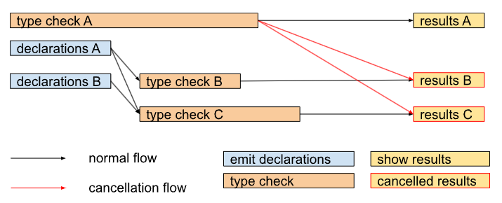

# Local Inferences for `isolatedDeclarations`

An initial implementation of `isolatedDeclarations` did not perform any type of inference.
This _"pure approach"_ was simple to implement but was not ergonomic due to the number of explicit type annotations it demanded.
To improve the developer experience, inferences were added and are described in this document.

These inferences are implemented in [the reference ***Declaration Type Emitter (DTE)***](../src/compiler) and are verified by [the conformance tests](../tests).
None of these inferences rely on the type-checker or multi-file analysis.
Third-party DTEs are expected to implement these inferences without undue effort.

---

## Declaration Type Inferences

Each inference is described with these criteria.

|Term|Meaning|
|----|-------|
|***Optimistic***|Does this inference rely on [optimistic emit](#p2-optimistic-emit)? (`Yes`/`No`)|
|***User complexity<br>if not provided***|Complexity of the explicit types in the source code that would be needed if this inference did not exist.<br>This refers to the burden of a single instance and is ***not*** a measure of how often this inference pattern may occur. (`Low`, `Medium`, `High`)|
|***Emitter complexity***|Complexity of code needed in the emitter to implement this inference (`Low`, `Medium`, `High`)|

### INF01: Primitive literal (widening and non widening)

<table><th>Source</th><th>Inferred declaration</th><tbody><td>

```ts
let n = 1;
let s = "a";
let b = true;
const nc = 1;
const sc = "a";
const bc = true;
```

</td><td>

```ts
let n: number;
let s: string;
let b: boolean;
const nc: 1;
const sc: "a";
const bc: true;
```

</td></tbody></table>

- **Optimistic:** No
- **User complexity if not provided:** Low
- **Emitter complexity:** Low

### INF02: null (widening and non widening)

This is useful in the context of other inferences.

<table><th>Source</th><th>Inferred declaration</th><tbody><td>

```ts
const n = null
let nc = null
```

</td><td>

```ts
const n: null
let nc: any
```

</td></tbody></table>

- **Optimistic:** No
- **User complexity if not provided:** Low
- **Emitter complexity:** Low

### INF03: undefined (widening and non widening)

This is useful in the context of other inferences.

<table><th>Source</th><th>Inferred declaration</th><tbody><td>

```ts
const u = undefined
let uc = undefined
```

</td><td>

```ts
const u: undefined
let uc: any
```

</td></tbody></table>

- **Optimistic:** No
- **User complexity if not provided:** Low
- **Emitter complexity:** Low

### INF04: Symbols (widening and non widening)

<table><th>Source</th><th>Inferred declaration</th><tbody><td>

```ts
let sym = Symbol();
const uniqueSym = Symbol();
```

</td><td>

```ts
let sym: symbol
const uniqueSym: unique symbol
```

</td></tbody></table>

- **Optimistic:** No
- **User complexity if not provided:** Low
- **Emitter complexity:** Low

### INF05: Identifiers and dotted identifiers

While we can’t resolve the actual type of an identifier or an entity name expression (a.b.c) we can use the typeof operator in declarations and let TypeScript resolve the actual type.
There are [cases where this optimistic inference fails](#identifiers-and-dotted-identifiers-inf05), when the type of a variable is widened.

<table><th>Source</th><th>Inferred declaration</th><tbody><td>

```ts
const e = E.A;
export const foo = imported.foo;
let VALUE = NORTH;
```

</td><td>

```ts
const e: typeof E.A;
export const foo: typeof imported.foo;
let VALUE: typeof NORTH;
```

</td></tbody></table>

- **Optimistic:** Yes
- **User complexity if not provided:** High
- **Emitter complexity:** Medium

### INF06: Type assertions

Since TypeScript uses the asserted type as the type of the expression it is safe to use it as the type of expression in isolated declarations

<table><th>Source</th><th>Inferred declaration</th><tbody><td>

```ts
let x = "1" as "1" | "2"
let p = {} as Point
```

</td><td>

```ts
let x: "1" | "2"
let p: Point
```

</td></tbody></table>

- **Optimistic:** No
- **User complexity if not provided:** Low
- **Emitter complexity:** Low

### INF07: Const assertions on primitives

<table><th>Source</th><th>Inferred declaration</th><tbody><td>

```ts
let x = "1" as const
```

</td><td>

```ts
let x: "1"
```

</td></tbody></table>

- **Optimistic:** No
- **User complexity if not provided:** Low
- **Emitter complexity:** Low

### INF08: Function expressions

This helps deal with the common pattern of initializing a variable or member with a function expression.

<table><th>Source</th><th>Inferred declaration</th><tbody><td>

```ts
let fn = (a: number): void => { }
let fn2 = function (b: string): string {
  return b.toLowerCase()
}
```

</td><td>

```ts
let fn: (a: number) => void
let fn2: (b: string) => string
 
 
```

</td></tbody></table>

- **Optimistic:** No
- **User complexity if not provided:** Medium
- **Emitter complexity:** Low

### INF09: `new` operator

As long as the constructor name is a dotted identifier name, we use it as a type.
This can be wrong if the custom constructor returns something else, but it is usually correct.

Generic type parameters must be explicitly specified.

<table><th>Source</th><th>Inferred declaration</th><tbody><td>

```ts
let x = new Dog()
let p2 = new Promise(...)
```

</td><td>

```ts
let x: Dog
let p: Promise
```

</td></tbody></table>

- **Optimistic:** Yes
- **User complexity if not provided:** Low
- **Emitter complexity:** Low

### INF10: JSX elements ***(TODO: Still under investigation)***

We can’t fully emulate the JSX namespace resolution TypeScript does, but we can make a reasonable guess.

<table><th>Source</th><th>Inferred declaration</th><tbody><td>

```tsx
let jsx = <div />
```

</td><td>

```ts
let jsx: React.JSX.Element
```

</td></tbody></table>

- **Optimistic:** Yes
- **User complexity if not provided:** Medium
- **Emitter complexity:** Low

### INF11: Object literals in non-const contexts

We apply all inference rules to property values and create an object type from them.
While this form of local inference is not itself optimistic, if any of the inferred members have optimistic inferences, the object type itself becomes optimistic.

<table><th>Source</th><th>Inferred declaration</th><tbody><td>

```ts
let o = {
  prop: 1,
  method(p: number): string {
    return p.toString()
  },
  value
}
```

</td><td>

```ts
let o: {
  prop: number;
  method(p: number): string;


  value: typeof value;
};
```

</td></tbody></table>

- **Optimistic:** Maybe
- **User complexity if not provided:** High
- **Emitter complexity:** Medium

### INF12: Object literals in const contexts

We apply all inference rules to property values and create an object type from them.
May be optimistic if constituents are optimistic.

<table><th>Source</th><th>Inferred declaration</th><tbody><td>

```ts
let o = {
  prop: 1,
  method(p: number): string {
    return p.toString()
  },
  value
} as const
```

</td><td>

```ts
let o: {
  readonly prop: 1;
  readonly method: (p: number) => string;


  readonly value: typeof value;
};
```

</td></tbody></table>

- **Optimistic:** Maybe
- **User complexity if not provided:** High
- **Emitter complexity:** Medium

### INF13: Array Literals in const contexts

We apply all inference rules to array items and create a tuple type from the items.
May be optimistic if constituents are optimistic.

<table><th>Source</th><th>Inferred declaration</th><tbody><td>

```ts
let values = [value, "A", 1] as const;
```

</td><td>

```ts
let values: readonly [typeof value, "A", 1];
```

</td></tbody></table>

- **Optimistic:** Maybe
- **User complexity if not provided:** High
- **Emitter complexity:** Medium

### INF14: Array literals in non-const contexts

We apply all inference rules to array items and create a union from the results.

This requires union reduction, which we can’t ever fully emulate with just local information. We do a best effort to synthesize the appropriate union.

<table><th>Source</th><th>Inferred declaration</th><tbody><td>

```ts
export let values = [value, "A", 1]

export let arrNestedObjects = [{
  bar: {
    baz: 1
  }
}, {
  bar: {
    bat: 1
  }
}];
 
 
```

</td><td>

```ts
let values: (string | number | typeof value)[];

let arrNestedObjects: ({
  bar: {
    baz: number;
    bat?: undefined;
  };
} | {
  bar: {
    baz?: undefined;
    bat: number;
  };
})[];
```

</td></tbody></table>

- **Optimistic:** Yes
- **User complexity if not provided:** High
- **Emitter complexity:** High

### INF15: Return Type Inference

We apply all inference rules to return statements and yield expressions.
We synthesize the appropriate return type based on the if the function is async and is a generator.
This requires union reduction - similar to mutable arrays.
This kind of inference should be done for function declarations, method declarations, function expressions and arrow functions.

<table><th>Source</th><th>Inferred declaration</th><tbody><td>

```ts
async function* asyncGen() {
  const input: string = yield 10;
  return 123n;
}

function returnsObjectUnion() {
  if (Math.random() > 0) {
    return {
      foo: "",
      bar: 1
    };
  }
  return {
    foo: ""
  };
}
```

</td><td>

```ts
function asyncGen(): AsyncGenerator<number, bigint, string>


function returnsObjectUnion(): {
  foo: string;
  bar: number;
} | {
  foo: string;
  bar?: undefined;
};
 
 
 
 
```

</td></tbody></table>

- **Optimistic:** Yes
- **User complexity if not provided:** High
- **Emitter complexity:** High

### INF16: Conditional expressions

We apply all inference rules to the branches of the conditional and union the result.
This requires union reduction - similar to mutable arrays.

<table><th>Source</th><th>Inferred declaration</th><tbody><td>

```ts
let x = Math.random() ? 0 : 1;
```

</td><td>

```ts
let x: number
```

</td></tbody></table>

- **Optimistic:** yes
- **User complexity if not provided:** Medium
- **Emitter complexity:** High

### INF17: `satisfies` expression

We apply all inference rules to the value operand of satisfies.
Sometimes satisfies changes inference for the operand.
We don’t emulate this behavior, hence this is optimistic.

<table><th>Source</th><th>Inferred declaration</th><tbody><td>

```ts
export const satisfied = {
  save: () => {},
  close: () => {},
} as const satisfies Record<string, () => void>
```

</td><td>

```ts
const satisfied: {
  readonly save: () => void;
  readonly close: () => void;
};
```

</td></tbody></table>

- **Optimistic:** Yes
- **User complexity if not provided:** Medium
- **Emitter complexity:** Low

### INF18: Template literals in non-const contexts

In non const contexts template literals are inferred as strings

<table><th>Source</th><th>Inferred declaration</th><tbody><td>

```ts
let t2 = `A${1}`;
```

</td><td>

```ts
let t2: string;
```

</td></tbody></table>

- **Optimistic:** No
- **User complexity if not provided:** Low
- **Emitter complexity:** Low

### INF19: Template literals in const contexts

In non-const context template literal types can be generated, but we don’t exhaustively expand the template to a union.

<table><th>Source</th><th>Inferred declaration</th><tbody><td>

```ts
let t1 = `number=${1 as 1|2}` as const;
let t2 = `mixed=${"1" as "1" | number}` as const;
```

</td><td>

```ts
let t1: `number=${1 | 2}`;
let t2: `mixed=${"1" | number}`;
```

</td></tbody></table>

- **Optimistic:** Maybe
- **User complexity if not provided:** Medium
- **Emitter complexity:** Low

### INF20: Spread elements in objects (in const and non-const contexts)

We infer the type of the spread, and create an intersection between the inferred spread type and the rest of the object properties.
This does not exactly emulate the property overwriting of spread, but it gives good results in most cases.

<table><th>Source</th><th>Inferred declaration</th><tbody><td>

```ts
const LogLevel = {
  ...HappyLogLevel,
  ...UnhappyLogLevel,
  UNDEFINED: "UNDEFINED",
} as const;
 
```

</td><td>

```ts
const LogLevel:
  typeof HappyLogLevel
& typeof UnhappyLogLevel
& {
  readonly UNDEFINED: "UNDEFINED";
};
```

</td></tbody></table>

- **Optimistic:** Yes
- **User complexity if not provided:** High
- **Emitter complexity:** Medium

### INF21: Rest elements within arrays in const contexts

We infer the type of the rest element and create a tuple spread element for that position in the resulting tuple.
While the spread operation should yield a semantically equivalent type it will not be exactly the same as the TS inferred type.
We should assume the type might be wrong and check it, at least for now.

<table><th>Source</th><th>Inferred declaration</th><tbody><td>

```ts
let tuple = [1, 2, 3] as const
const composedTuple = [0, ...tuple] as const
```

</td><td>

```ts
 
const composedTuple: readonly [0, ...typeof tuple];
```

</td></tbody></table>

- **Optimistic:** Yes
- **User complexity if not provided:** High
- **Emitter complexity:** Medium

### INF22: Rest elements in within arrays in non-const contexts

We infer the type of the rest element and create a `[number]` index access for the type and add it to the union.
While the index access should yield a semantically equivalent type it will not be exactly the same as the TS inferred type.
We should assume the type might be wrong and check it, at least for now.

<table><th>Source</th><th>Inferred declaration</th><tbody><td>

```ts
const a = [false, ...nrs, ...strs]
```

</td><td>

```ts
const a: (boolean | (typeof nrs)[number] | (typeof strs)[number])[];
```

</td></tbody></table>

- **Optimistic:** Yes
- **User complexity if not provided:** High
- **Emitter complexity:** Medium

### INF23: Properties on function-typed variables _(“expando function expressions”)_

We can infer the types added on to function variables using the same inference we use for other initializers.
This is optimistic if any inferred property types are optimistic.

<table><th>Source</th><th>Inferred declaration</th><tbody><td>

```ts
export const x = () => {}
x.test = 1;
 
 
```

</td><td>

```ts
export declare const x: {
  (): void;
  test: number;
};
```

</td></tbody></table>

- **Optimistic:** Maybe
- **User complexity if not provided:** High
- **Emitter complexity:** Medium

---

## Design principles

The following design principles guided the inferences listed above.

### P1. Local inference

All inference should only happen based on the currently analyzed statement.
There is no cross-file analysis (this keeps declaration emit parallelizable) and no in-file analysis beyond the current expression.
While some in-file analysis might help, it would require replicating a lot of TypeScript machinery and so is avoided.

### P2. Optimistic emit

Sometimes a DTE may not have enough information to determine if the naturally emitted declaration is correct.
In such cases declaration emit can proceed with a deterministic inference and rely on the user to run the type-checker to detect the error.
Meaning the emitter may complete its output but we have to wait for the type-checker to be sure the declarations are valid.

Optimistic emit should only happen in cases where we deem that the likelihood is high that the type is correct. Some examples:

```ts
const dog = new Dog(1);
```

Optimistically we can assume that the type of `dog` has the same name as the constructor.
In the common case this is true.
However, we can easily construct a scenario where this is not so.
Either through the use of inferred generics...

```ts
class Dog<T> { constructor(public v: T) {}}
const dog = new Dog(1)
// we could infer from the following
const dog2 = new Dog<number>(1)
```

...or `Dog` might be a custom constructor signature...

```ts
declare const Dog: new (v: number)  => { value: number }
const dog = new Dog(1)
```

While both scenarios exist in real code, emitting the constructor name as the type helps the majority of cases.

#### Consequences of optimistic emit on parallel build tools

Any monorepo build tools that would use a DTE must be prepared for the eventuality that the TypeScript type-checker might fail and thus any work done based on the emitted declarations would need to be discarded.

Consider the following project structure:


##### Type-checking for project A fails

Declaration emit for projects A & B can start and finish quickly by running the DTE in parallel.
Type-checking for projects B & C can optimistically start as soon as declarations are available, even if type-checking for project A has not yet completed.

If project A fails to type-check correctly, the results for projects B & C should be discarded, even if the type checking for B & C was successful.
Projects B & C may have used invalid declarations, so the results of the type-check are invalid.



### P3. Performant declarations

While some deviations from the classicly-generated declaration emit are inevitable, ideally there should not be a lot of extra work involved for the compiler to resolve the type.
For example, we aim to avoid conditional types.

## Additional details on specific inferences

### Identifiers and dotted identifiers (INF05)

Whilst the DTE cannot resolve the actual type of an identifier or an entity name expression (`a.b.c`), it can use the `typeof` operator in declarations and let TypeScript resolve the actual type.

There are cases where this optimistic inference fails, when the type of a variable is widened.

<table><th>Succeeds</th><th>Fails</th><tbody><td>

```ts
let x = 1;
let y = x; // y: typeof x ✅

enum E { A, B, C }
const o = E.A // typeof E.A ✅
```

</td><td>

```ts
const x = 1;
let y = x; // y: typeof x ❌

enum E { A, B, C }
let o = E.A // typeof E.A ❌
```

</td></tbody></table>

#### Motivation for using `typeof`

There are a lot of scenarios unlocked by allowing the use of `typeof` as the result of an inference.
Some examples:

* Enums and enum like objects
* Re-exports
* Object/array literals that contain spread expressions

There are some advantages to using `typeof`:

* Preserves the original intent of code
* Easier to type constructs mentioned above

Arguments against using `typeof`:

* May decrease performance - though we have not seen this in practice

### Inferences that use union subtype reduction (INF14, INF15, INF16)

There are several inferences that use subtype reduction:

* [INF14: Array literals in non-const contexts](#inf14-array-literals-in-non-const-contexts)
* [INF15: Return Type Inference](#inf15-return-type-inference)
* [INF16: Conditional expressions](#inf16-conditional-expressions)

#### Implementation of subtype reduction

Any inference that relies on subtype reduction will be optimistic because:

* The necessary information to reduce subtypes isn't always available locally.
* Even if all the information exists locally, implementing full subtype reduction is a lot of complexity for not a lot of gain.

The following kinds of reduction are implemented:

* Primitive literal type to primitive base type reduction - Ex: `1 | number` is reduced to `number`.
* Object union normalization - If we have several object types inferred we normalize all the properties to get a common set of properties.
  * Example: `[{ foo: 1 }, { bar: 2 }]` is inferred as `({ foo: number; bar?: undefined; } | { bar: number; foo?: undefined;})[]`
* Duplicate type removal - If the types are identical we only keep one copy. This applies to the following common types that can commonly occur in a locally inferred expression
  * Type references - `Point | Point` is reduced to `Point`
  * Keyword types - `number | number` is reduced to `number`
  * Literal types - `1 | 1` is reduced to `1`
  * Array types - `number[] | number[]` is reduced to `number[]`
  * Literal types - `{ foo: string } | { foo: string }` is reduced to `{ foo: string }`
  * Function  types - `(foo: string) => void | (foo: string) => void` is reduced to `(foo: string) => void`
  * Constructor  types - `new (foo: string) => T | new (foo: string) => T` is reduced to `new (foo: string) => T`
  * Type Queries - `typeof p | typeof p` is reduced to `typeof p`

This could be extended to more complicated types, such as mapped conditional types, but in practice these would appear exceedingly rare in a local inference context.
They would only appear if someone were to explicitly write a conditional or mapped type inline in a type assertion.

#### Limitations of this approach

Only primitive and literal types can be reduced to base types.
Consider the following example:

```ts
type Id = { id: string, foo?: string }

// TS: let a: Id[]
let a = [
    { id: "" } as Id,
    { id:"", foo: "" },
]
```

TypeScript can reduce the type of the array element from `Id | { id: string, foo: string }` to just `Id`.
Local inference does not have the information about `Id` or the implementation complexity to determine that this reduction is possible.

Possible outcomes:

1. The local inference reduced type is the same as the TypeScript reduced type (true for a vast majority of cases we encountered in practice)
2. The local inference reduced type is equivalent to the TypeScript one, but written with redundant terms. In the example above `Id | { id: string, foo: string }` and `Id` are equivalent. We have not in practice found this to occur.
3. The locally inferred type is semantically different from TypeScript one. We have not in practice found this to occur. Example:
  ```ts
  type Id = { id: string }
  // TS: let a: Id[]
  // LI: let a: (Id | { id: string, foo?: string })[]
  let a = [
      { id: "" } as Id,
      { id:"", foo: "" } as { id: string, foo?: string },
  ]
  ```

The implementation errors today on 3 but does not error on 1 or 2.

While it is possible to contrive examples of 2 and 3, they generally require type assertions to happen, as a way to introduce external type information.
While the chances of this occurring are non-zero, they don’t usually seem to be the way such code is actually written.

#### Motivation for using this approach

Unlocking [the three types of inference](#inferences-that-use-union-subtype-reduction-inf14-inf15-inf16) that use the union subtype reduction described above is a big win for developer experience - especially for return types and arrays.
Once you have the machinery for union reduction, conditional expressions come almost for free.
As described above a complete solution is not possible given the constraints of local inference.
Having a solution that works in most cases seems preferable to forcing people to write type annotations.

Some examples:

```ts
let m = Math.random() > 0.5? "OPTION 1": "OPTION 2";

import * as React from 'react';

export function Component() {
    const { isLoading } = useQuery(/* */);
    if(isLoading) return <></>

    return <div>
        We have data!
    </div>
}
```

### Rest elements and spread assignments (INF20, INF21, INF22)

#### Motivation for implementation

Our findings suggest that composing objects and arrays from other objects and arrays is not uncommon. Supporting local inference for such cases greatly reduces the amount of verbose types developers have to write.
Example:

```ts
let defaultConfig = {
    port: 80
}
// TS: { host: string; port: number; }
// LI: typeof defaultConfig & { host: string; }
let config = {
    ...defaultConfig,
    host: "localhost"
}
```

## Future: Further possible inferences

These inferences are not implemented.  Further discussion is needed to decide if they should be included.

### Unimplemented: Support for relational operators

Relational operators always produce boolean results, so we can always type the results of  the operators `<`, `>`, `>=`, `<=`, `!=`, `==`, `!==`, `===` as `boolean`.

Boolean operator can also be sometimes typed as `boolean`
* `!` always produces a boolean result so it can be typed safely as boolean.
* `&&` produces a boolean if the operands are boolean, so we can type it in this case
* `||` can be typed the same as `&&`

Examples:

```ts
let r1 =  a > 0 && b < 0 // ✅ Always boolean
let r2 =  a < 0 || b < 0 // ✅ Always boolean
let r3 =  !!xx && !!yy // ✅ Always boolean
let r4 =  x && y // ❌ Can’t be sure result is boolean
```

These operators commonly appear in the return statements of functions so it would be useful to infer their types

### Unimplemented: IIFE support

If the return type of the IIFE can be determined, we can type the result of the function call.

<table><th>Source</th><th>Inferred declaration</th><tbody><td>

```ts
let service = (function() {
  return {
    request() {
      return 0;
    }
  };
})()
```

</td><td>

```ts
declare let service: {
  request(): number;
};
 
 
 
 
```

</td></tbody></table>

### Unimplemented: Inference from local variables

We could add support for inference from local variables/parameters within a function given that symbol tables are already required.
This would help reduce the amount of typeof needed to only places where the variable was not defined in the local scope.

<table><th>Source</th><th>Inferred declaration</th><tbody><td>

```ts
function test() {
  let p: number = 1;
  return () => p;
}
```

</td><td>

```ts
declare function test(p: number): () => number
 
 
 
```

</td></tbody></table>

## Open issues

### ISS01: Validate type equivalence approach

We would like to test if the local inference type is equivalent to the type TypeScript would infer in that scenario.
We initially used `checkTypeRelatedTo` with `identityRelation`.
This however proved too restrictive as it did not consider object types equivalent to a type that produces the same properties from an intersection type.
We are currently using the `strictSubtypeRelation` and checking the relationship both ways, i.e. that the locally inferred type is a strict subtype of the TS inferred type, and that the TS inferred type is a strict subtype of the locally inferred type.

We are unsure if this is the best approach for this task.

We would also like to validate that the way we performed type-checking for the synthetic type does is the best way we could do it.
We took several steps to type-check the synthetic types:

1. Parent the synthetic type to the node that it will be used on.
  1. For function return types due to the way symbol visibility works, we had to create an extra fake parameter to keep the type in the scope of the function signature
2. Invoke the binder for the synthetic type node. This required some changes to the binder to allow the binding of arbitrary nodes on demand. Without this binding step, it would not be possible to type check object types that contain members for example as the type checker relies on the symbol tables built during binding.
3. Get the types of the synthetic type node and the source and compare them as described above.

### ISS02: Investigate JSX namespace resolution

Currently we just use `React.JSX.Element` as the type of any JSX element.
While we probably can’t emulate the whole TS algorithm for resolving the namespace, we can probably do better based on compiler settings and pragmas.

### ISS03: Inference of expando function properties for function declarations

Local inference does not currently support adding properties to function declarations.
It only supports variables that have a function type assigned to them.
This inference is possible to implement and should be implemented.

### ISS04: Better support for binding patterns

Currently we don’t support local inference for binding patterns.
We could emit in local declarations the binding patterns itself instead of separating out the variables as declaration emit currently does.
Supported example:

<table><th>Source</th><th>Inferred declaration</th><tbody><td>

```ts
export let { x, y } = p;
```

</td><td>

```ts
export let { x, y }: typeof p;
```

</td></tbody></table>

### ISS05: Accessor inference for classes

We currently don’t consider the type of the related accessor in local inference in classes.
Whereas we do for object literals.

### ISS06: Incorrect visibility for parameters of function in return clause

We are currently facing an error where when we try to synthesize a `typeof` type query for a function parameter in a protected method, we get an error saying that the parameter is not accessible.
We think this error is probably a bit too eager.
The `typeof parameter`  does not leak beyond where the method is visible anyway.

Example:

```ts
class X {
    // Return type of public method from exported class has or is using private name 'p'.(4055)
    protected m(p: string): typeof p {
        return ""
    }
}
```

### ISS07: Add better errors for optimistic inference failures

Currently if optimistic local inference fails, we emit a generic error related to `isolatedDeclarations` and report the incompatibility of the synthetic vs actual type.
This approach provides useful information to the user but it seems a bit strange to report such information between two types TypeScript itself creates.
We will look for better DX in this area.
